# Design Document: Comprehensive Testing & Quality Assurance System

## Overview

This design document outlines a phased approach to implementing comprehensive testing and quality assurance for the high-performance news website. The system prioritizes early detection of AI-generated code issues, data consistency problems, and complex system integration failures while maintaining realistic implementation timelines.

### Implementation Priority Framework

#### Phase 1: Critical Foundation (Weeks 1-4)
- **Priority 1**: AI-Generated Code Validation (Requirement 15)
- **Priority 1**: Data Consistency Validation (Requirement 16) 
- **Priority 1**: Advanced Performance Testing (Requirement 8)
- **Priority 2**: Unit Testing Framework (Requirement 3)

#### Phase 2: Production Readiness (Weeks 5-8)
- **Priority 1**: Integration Testing (Requirement 4)
- **Priority 2**: Security Testing (Requirement 9)
- **Priority 2**: SEO Deep Validation (Requirement 17)

#### Phase 3: Advanced Validation (Weeks 9-12)
- **Priority 2**: Cross-System Integration Testing (Requirement 18)
- **Priority 3**: Chaos Engineering (Requirement 6)
- **Priority 3**: Property-Based Testing (Requirement 5)

#### Phase 4: Optimization & Enhancement (Weeks 13-16)
- **Priority 3**: Mutation Testing (Requirement 19)
- **Priority 3**: Synthetic Monitoring (Requirement 7)
- **Priority 3**: AI-Powered Testing (Requirement 2)

## Architecture

### High-Level Testing Architecture

```mermaid
graph TB
    subgraph "Phase 1: Critical Foundation"
        A[AI Code Validator] --> B[Static Analysis Engine]
        C[Data Consistency Checker] --> D[Cross-Partition Validator]
        E[Performance Test Suite] --> F[Load Test Framework]
        G[Unit Test Framework] --> H[Coverage Engine]
    end
    
    subgraph "Phase 2: Production Readiness"
        I[Integration Test Suite] --> J[Database Test Framework]
        K[Security Scanner] --> L[Vulnerability Assessment]
        M[SEO Validator] --> N[Schema Markup Checker]
    end
    
    subgraph "Phase 3: Advanced Validation"
        O[Cross-System Tester] --> P[Dependency Monitor]
        Q[Chaos Engineering] --> R[Fault Injection]
        S[Property-Based Tests] --> T[Invariant Checker]
    end
    
    subgraph "Phase 4: Optimization"
        U[Mutation Tester] --> V[Test Quality Analyzer]
        W[Synthetic Monitor] --> X[User Journey Validator]
        Y[AI Test Generator] --> Z[Edge Case Creator]
    end
    
    subgraph "Shared Infrastructure"
        AA[Test Data Manager]
        BB[Test Environment Manager]
        CC[Reporting Dashboard]
        DD[CI/CD Integration]
    end
    
    A --> AA
    C --> AA
    E --> BB
    I --> BB
    O --> CC
    U --> CC
    B --> DD
    J --> DD
```



## Phase 1: Critical Foundation Components

### AI-Generated Code Validation System

#### Practical Static Analysis Approach
```go
type AICodeValidator struct {
    linters       []Linter          // golangci-lint, gosec, staticcheck
    ruleEngine    *RuleEngine       // Custom rules for AI code patterns
    codeReviewer  *CodeReviewer     // Manual review queue for complex cases
}

type ValidationResult struct {
    Severity     ValidationSeverity `json:"severity"`
    Category     string            `json:"category"`
    Message      string            `json:"message"`
    File         string            `json:"file"`
    Line         int               `json:"line"`
    Suggestion   string            `json:"suggestion"`
    RuleName     string            `json:"rule_name"`
}

// Practical AI code validation using existing tools
func (v *AICodeValidator) ValidateFile(filePath string) []ValidationResult {
    var results []ValidationResult
    
    // Run standard Go linters
    lintResults := v.runStandardLinters(filePath)
    results = append(results, lintResults...)
    
    // Apply AI-specific rules
    aiResults := v.applyAISpecificRules(filePath)
    results = append(results, aiResults...)
    
    // Flag for manual review if complex patterns detected
    if v.requiresManualReview(filePath) {
        results = append(results, ValidationResult{
            Severity: SeverityHigh,
            Category: "manual-review",
            Message:  "Complex AI-generated code requires manual review",
            RuleName: "ai-manual-review",
        })
    }
    
    return results
}

// AI-specific rules using regex and AST patterns
func (v *AICodeValidator) applyAISpecificRules(filePath string) []ValidationResult {
    var results []ValidationResult
    
    content, err := os.ReadFile(filePath)
    if err != nil {
        return results
    }
    
    // Rule 1: Check for missing error handling (common AI issue)
    if v.hasMissingErrorHandling(string(content)) {
        results = append(results, ValidationResult{
            Severity: SeverityCritical,
            Category: "error-handling",
            Message:  "Function call without error handling detected",
            RuleName: "missing-error-check",
            Suggestion: "Add proper error handling for all function calls that return errors",
        })
    }
    
    // Rule 2: Check for hardcoded values (AI often generates these)
    if hardcoded := v.findHardcodedValues(string(content)); len(hardcoded) > 0 {
        results = append(results, ValidationResult{
            Severity: SeverityMedium,
            Category: "maintainability",
            Message:  fmt.Sprintf("Hardcoded values found: %v", hardcoded),
            RuleName: "hardcoded-values",
            Suggestion: "Move hardcoded values to configuration",
        })
    }
    
    // Rule 3: Check for inefficient database patterns
    if v.hasInefficiientDBPattern(string(content)) {
        results = append(results, ValidationResult{
            Severity: SeverityHigh,
            Category: "performance",
            Message:  "Potential inefficient database query pattern",
            RuleName: "inefficient-db-query",
            Suggestion: "Review query patterns for N+1 issues or missing indexes",
        })
    }
    
    return results
}
```

### Data Consistency Validation System

#### Scalable Consistency Checking
```go
type DataConsistencyChecker struct {
    db           *sql.DB
    cache        CacheService
    partitionMgr *PartitionManager
    scheduler    *CheckScheduler
}

type ConsistencyCheck struct {
    Name        string                 `json:"name"`
    Type        ConsistencyCheckType   `json:"type"`
    Status      CheckStatus           `json:"status"`
    Issues      []ConsistencyIssue    `json:"issues"`
    ExecutedAt  time.Time             `json:"executed_at"`
    Duration    time.Duration         `json:"duration"`
    SampleSize  int                   `json:"sample_size"`
}

// Practical approach: Sample-based consistency checking
func (c *DataConsistencyChecker) ValidateDataConsistency() ConsistencyCheck {
    check := ConsistencyCheck{
        Name:       "Sample-Based Data Consistency Check",
        Type:       CheckTypeSample,
        ExecutedAt: time.Now(),
        SampleSize: 1000, // Check 1000 random articles, not all
    }
    
    start := time.Now()
    
    // Sample recent articles for consistency checking
    sampleArticles := c.getSampleArticles(1000)
    
    for _, article := range sampleArticles {
        // Check basic referential integrity
        if !c.validateArticleReferences(article) {
            check.Issues = append(check.Issues, ConsistencyIssue{
                Type:        "broken_reference",
                Description: fmt.Sprintf("Article %d has broken references", article.ID),
                Severity:    "medium",
                ArticleID:   article.ID,
            })
        }
        
        // Check multilingual consistency (if applicable)
        if article.HasTranslations() {
            if !c.validateTranslationConsistency(article) {
                check.Issues = append(check.Issues, ConsistencyIssue{
                    Type:        "translation_inconsistency",
                    Description: fmt.Sprintf("Article %d has translation inconsistencies", article.ID),
                    Severity:    "low",
                    ArticleID:   article.ID,
                })
            }
        }
        
        // Check SEO metadata consistency
        if !c.validateSEOMetadata(article) {
            check.Issues = append(check.Issues, ConsistencyIssue{
                Type:        "seo_metadata_issue",
                Description: fmt.Sprintf("Article %d has SEO metadata issues", article.ID),
                Severity:    "medium",
                ArticleID:   article.ID,
            })
        }
    }
    
    check.Duration = time.Since(start)
    check.Status = c.determineCheckStatus(check.Issues)
    
    return check
}

// Efficient sample-based approach instead of full table scans
func (c *DataConsistencyChecker) getSampleArticles(count int) []Article {
    // Use TABLESAMPLE for efficient random sampling
    query := `
        SELECT id, title, slug, author_id, category_id, published_at, 
               meta_title, meta_description, canonical_url
        FROM articles TABLESAMPLE SYSTEM (1) -- Sample ~1% of rows
        WHERE status = 'published' 
        AND published_at > NOW() - INTERVAL '7 days'
        LIMIT $1
    `
    
    rows, err := c.db.Query(query, count)
    if err != nil {
        log.Printf("Error sampling articles: %v", err)
        return nil
    }
    defer rows.Close()
    
    var articles []Article
    for rows.Next() {
        var article Article
        err := rows.Scan(&article.ID, &article.Title, &article.Slug, 
                        &article.AuthorID, &article.CategoryID, &article.PublishedAt,
                        &article.MetaTitle, &article.MetaDescription, &article.CanonicalURL)
        if err != nil {
            continue
        }
        articles = append(articles, article)
    }
    
    return articles
}
```

### Realistic Performance Testing Framework

#### Practical Load Testing Approach
```go
type PerformanceTestSuite struct {
    testDB       *sql.DB
    testCache    CacheService
    testApp      *gin.Engine
    k6Runner     *K6TestRunner  // Use k6 for load testing
}

type PerformanceTest struct {
    Name            string        `json:"name"`
    TestScript      string        `json:"test_script"`
    Duration        time.Duration `json:"duration"`
    VirtualUsers    int           `json:"virtual_users"`
    Thresholds      map[string]string `json:"thresholds"`
}

// Realistic article publishing test with burst patterns
func (p *PerformanceTestSuite) TestArticlePublishingLoad() TestResult {
    // Create k6 test script for realistic publishing patterns
    testScript := `
        import http from 'k6/http';
        import { check } from 'k6';
        
        export let options = {
            stages: [
                { duration: '5m', target: 5 },   // Normal load
                { duration: '2m', target: 20 },  // Breaking news spike
                { duration: '5m', target: 20 },  // Sustained high load
                { duration: '2m', target: 5 },   // Back to normal
            ],
            thresholds: {
                http_req_duration: ['p(95)<1000'], // 95% under 1s
                http_req_failed: ['rate<0.01'],    // <1% errors
            },
        };
        
        export default function() {
            let article = {
                title: 'Test Article ' + Math.random(),
                content: 'Test content...',
                author_id: 1,
                category_id: 1,
            };
            
            let response = http.post('http://localhost:8080/api/v1/articles', 
                JSON.stringify(article), {
                headers: { 'Content-Type': 'application/json' },
            });
            
            check(response, {
                'status is 201': (r) => r.status === 201,
                'response time < 1s': (r) => r.timings.duration < 1000,
            });
        }
    `
    
    return p.k6Runner.RunTest(testScript)
}

// Database-specific performance tests
func (p *PerformanceTestSuite) TestDatabasePerformance() TestResult {
    results := TestResult{Name: "Database Performance Tests"}
    
    // Test 1: Query performance on partitioned tables
    queryTest := p.testPartitionedQueries()
    results.AddSubTest(queryTest)
    
    // Test 2: Connection pool under load
    poolTest := p.testConnectionPoolStress()
    results.AddSubTest(poolTest)
    
    // Test 3: Cache performance
    cacheTest := p.testCachePerformance()
    results.AddSubTest(cacheTest)
    
    return results
}

// Practical partition query testing
func (p *PerformanceTestSuite) testPartitionedQueries() TestResult {
    test := TestResult{Name: "Partitioned Query Performance"}
    
    queries := []struct {
        name  string
        query string
        threshold time.Duration
    }{
        {
            name: "Recent articles by date",
            query: `SELECT id, title FROM articles 
                   WHERE published_at >= $1 AND published_at < $2 
                   ORDER BY published_at DESC LIMIT 20`,
            threshold: 10 * time.Millisecond,
        },
        {
            name: "Article by slug",
            query: `SELECT * FROM articles WHERE slug = $1 AND status = 'published'`,
            threshold: 5 * time.Millisecond,
        },
        {
            name: "Articles by category",
            query: `SELECT id, title FROM articles 
                   WHERE category_id = $1 AND status = 'published' 
                   ORDER BY published_at DESC LIMIT 20`,
            threshold: 15 * time.Millisecond,
        },
    }
    
    for _, q := range queries {
        start := time.Now()
        
        // Run query multiple times to get average
        var totalDuration time.Duration
        iterations := 100
        
        for i := 0; i < iterations; i++ {
            queryStart := time.Now()
            _, err := p.testDB.Query(q.query, time.Now().Add(-24*time.Hour), time.Now())
            queryDuration := time.Since(queryStart)
            totalDuration += queryDuration
            
            if err != nil {
                test.AddFailure(fmt.Sprintf("Query failed: %v", err))
                break
            }
        }
        
        avgDuration := totalDuration / time.Duration(iterations)
        
        if avgDuration > q.threshold {
            test.AddFailure(fmt.Sprintf("%s: avg %v exceeds threshold %v", 
                q.name, avgDuration, q.threshold))
        } else {
            test.AddSuccess(fmt.Sprintf("%s: avg %v within threshold", 
                q.name, avgDuration))
        }
    }
    
    return test
}
```

## Phase 2: Production Readiness Components

### SEO Deep Validation System

#### Schema Markup Cross-Validation
```go
type SEOValidator struct {
    schemaValidator   *SchemaValidator
    canonicalChecker  *CanonicalChainChecker
    sitemapValidator  *SitemapValidator
    googleNewsChecker *GoogleNewsChecker
}

type SEOValidationResult struct {
    URL           string              `json:"url"`
    SchemaIssues  []SchemaIssue      `json:"schema_issues"`
    CanonicalIssues []CanonicalIssue `json:"canonical_issues"`
    SitemapIssues []SitemapIssue     `json:"sitemap_issues"`
    GoogleNewsIssues []GoogleNewsIssue `json:"google_news_issues"`
    OverallScore  float64            `json:"overall_score"`
}

// Schema markup cross-validation
func (s *SEOValidator) ValidateSchemaMarkup(article *Article) []SchemaIssue {
    var issues []SchemaIssue
    
    // Validate NewsArticle schema
    newsSchema := s.generateNewsArticleSchema(article)
    if err := s.validateAgainstGoogleGuidelines(newsSchema, "NewsArticle"); err != nil {
        issues = append(issues, SchemaIssue{
            Type:        "invalid_news_schema",
            Description: err.Error(),
            Severity:    "critical",
        })
    }
    
    // Check schema consistency across variants
    if article.HasMultipleLanguages() {
        for _, lang := range article.Languages {
            langSchema := s.generateSchemaForLanguage(article, lang)
            if !s.schemasAreConsistent(newsSchema, langSchema) {
                issues = append(issues, SchemaIssue{
                    Type:        "inconsistent_multilingual_schema",
                    Description: fmt.Sprintf("Schema inconsistent for language %s", lang),
                    Severity:    "high",
                })
            }
        }
    }
    
    return issues
}

// Canonical chain detection and validation
func (s *SEOValidator) ValidateCanonicalChains(article *Article) []CanonicalIssue {
    var issues []CanonicalIssue
    
    // Build canonical chain
    chain := s.buildCanonicalChain(article.URL)
    
    // Check for circular references
    if s.hasCircularReference(chain) {
        issues = append(issues, CanonicalIssue{
            Type:        "circular_canonical",
            Description: "Circular canonical reference detected",
            Chain:       chain,
            Severity:    "critical",
        })
    }
    
    // Check chain length (should be ≤ 3 hops)
    if len(chain) > 3 {
        issues = append(issues, CanonicalIssue{
            Type:        "long_canonical_chain",
            Description: fmt.Sprintf("Canonical chain too long (%d hops)", len(chain)),
            Chain:       chain,
            Severity:    "medium",
        })
    }
    
    return issues
}
```

## Testing Infrastructure

### Test Data Management
```go
type TestDataManager struct {
    db           *sql.DB
    fixtures     map[string]interface{}
    cleanup      []func() error
}

// Generate realistic test data for 50K articles/day scenario
func (t *TestDataManager) GenerateHighVolumeTestData() error {
    // Create test partitions
    if err := t.createTestPartitions(); err != nil {
        return err
    }
    
    // Generate 100K test articles across multiple partitions
    articles := t.generateTestArticles(100000)
    
    // Create multilingual relationships
    if err := t.createMultilingualRelationships(articles); err != nil {
        return err
    }
    
    // Generate realistic tag and category relationships
    if err := t.createTagCategoryRelationships(articles); err != nil {
        return err
    }
    
    // Create realistic user data with different roles
    users := t.generateTestUsers(1000)
    if err := t.insertTestUsers(users); err != nil {
        return err
    }
    
    return nil
}

// Cleanup test data efficiently
func (t *TestDataManager) Cleanup() error {
    // Execute cleanup functions in reverse order
    for i := len(t.cleanup) - 1; i >= 0; i-- {
        if err := t.cleanup[i](); err != nil {
            log.Printf("Cleanup error: %v", err)
        }
    }
    
    // Drop test partitions
    return t.dropTestPartitions()
}
```

### CI/CD Integration
```go
type CICDIntegration struct {
    testSuite    *TestSuite
    validator    *AICodeValidator
    performance  *PerformanceTestSuite
    security     *SecurityScanner
}

// Pre-commit validation
func (c *CICDIntegration) PreCommitValidation(changes []string) ValidationReport {
    report := ValidationReport{
        Timestamp: time.Now(),
        Phase:     "pre-commit",
    }
    
    // Run AI code validation on changed files
    for _, file := range changes {
        if strings.HasSuffix(file, ".go") {
            results := c.validator.ValidateFile(file)
            report.AddResults("ai-validation", results)
        }
    }
    
    // Run affected unit tests
    affectedTests := c.findAffectedTests(changes)
    testResults := c.testSuite.RunTests(affectedTests)
    report.AddResults("unit-tests", testResults)
    
    // Quick security scan
    secResults := c.security.QuickScan(changes)
    report.AddResults("security", secResults)
    
    return report
}

// Pre-deployment validation
func (c *CICDIntegration) PreDeploymentValidation() ValidationReport {
    report := ValidationReport{
        Timestamp: time.Now(),
        Phase:     "pre-deployment",
    }
    
    // Full test suite
    testResults := c.testSuite.RunFullSuite()
    report.AddResults("full-tests", testResults)
    
    // Performance regression tests
    perfResults := c.performance.RunRegressionTests()
    report.AddResults("performance", perfResults)
    
    // Security scan
    secResults := c.security.FullScan()
    report.AddResults("security", secResults)
    
    // Data consistency checks
    consistencyResults := c.runDataConsistencyChecks()
    report.AddResults("data-consistency", consistencyResults)
    
    return report
}
```

## Implementation Guidelines

### Phase 1 Success Criteria
- AI code validation catches >90% of common AI-generated code issues
- Data consistency checks run in <5 minutes for full database
- Performance tests validate 50K articles/day capacity
- Unit test coverage >95% for core modules

### Phase 2 Success Criteria  
- Integration tests cover all major system interactions
- Security scans detect OWASP Top 10 vulnerabilities
- SEO validation catches schema and canonical issues
- All tests integrated into CI/CD pipeline

### Phase 3 Success Criteria
- Cross-system integration tests prevent cascade failures
- Chaos engineering validates system resilience
- Property-based tests catch edge cases missed by traditional testing

### Phase 4 Success Criteria
- Mutation testing validates test suite quality (>90% mutation score)
- Synthetic monitoring provides continuous validation
- AI-powered testing generates comprehensive edge cases

## Critical Gaps Addressed - Enhanced Architecture

### Test Environment Isolation & Management System

#### Docker-Based Environment Isolation
```go
type TestEnvironmentManager struct {
    docker          *DockerClient
    environments    map[string]*IsolatedEnvironment
    resourcePool    *ResourcePool
    healthMonitor   *EnvironmentHealthMonitor
}

type IsolatedEnvironment struct {
    ID              string                 `json:"id"`
    ContainerID     string                 `json:"container_id"`
    DatabaseURL     string                 `json:"database_url"`
    CacheURL        string                 `json:"cache_url"`
    Status          EnvironmentStatus      `json:"status"`
    Resources       ResourceAllocation     `json:"resources"`
    TestSuite       string                 `json:"test_suite"`
    CreatedAt       time.Time             `json:"created_at"`
    LastHealthCheck time.Time             `json:"last_health_check"`
}

// Create isolated test environment with dedicated resources
func (t *TestEnvironmentManager) CreateIsolatedEnvironment(testSuite string) (*IsolatedEnvironment, error) {
    // Create dedicated Docker container
    containerConfig := &container.Config{
        Image: "postgres:15-alpine",
        Env: []string{
            "POSTGRES_DB=test_" + generateUniqueID(),
            "POSTGRES_USER=testuser",
            "POSTGRES_PASSWORD=testpass",
        },
        ExposedPorts: nat.PortSet{
            "5432/tcp": struct{}{},
        },
    }
    
    hostConfig := &container.HostConfig{
        PortBindings: nat.PortMap{
            "5432/tcp": []nat.PortBinding{
                {
                    HostIP:   "127.0.0.1",
                    HostPort: t.getAvailablePort(),
                },
            },
        },
        Memory:    512 * 1024 * 1024, // 512MB
        CPUQuota:  50000,              // 50% CPU
        AutoRemove: true,
    }
    
    container, err := t.docker.ContainerCreate(context.Background(), containerConfig, hostConfig, nil, nil, "")
    if err != nil {
        return nil, fmt.Errorf("failed to create container: %w", err)
    }
    
    if err := t.docker.ContainerStart(context.Background(), container.ID, types.ContainerStartOptions{}); err != nil {
        return nil, fmt.Errorf("failed to start container: %w", err)
    }
    
    // Wait for database to be ready
    if err := t.waitForDatabaseReady(container.ID); err != nil {
        t.docker.ContainerRemove(context.Background(), container.ID, types.ContainerRemoveOptions{Force: true})
        return nil, fmt.Errorf("database failed to start: %w", err)
    }
    
    env := &IsolatedEnvironment{
        ID:          generateUniqueID(),
        ContainerID: container.ID,
        DatabaseURL: t.buildDatabaseURL(container.ID),
        Status:      EnvironmentStatusReady,
        TestSuite:   testSuite,
        CreatedAt:   time.Now(),
    }
    
    t.environments[env.ID] = env
    
    // Start health monitoring
    go t.monitorEnvironmentHealth(env)
    
    return env, nil
}

// Cleanup environment and release resources
func (t *TestEnvironmentManager) CleanupEnvironment(envID string) error {
    env, exists := t.environments[envID]
    if !exists {
        return fmt.Errorf("environment %s not found", envID)
    }
    
    // Stop and remove container
    if err := t.docker.ContainerStop(context.Background(), env.ContainerID, container.StopOptions{}); err != nil {
        log.Printf("Warning: failed to stop container %s: %v", env.ContainerID, err)
    }
    
    if err := t.docker.ContainerRemove(context.Background(), env.ContainerID, types.ContainerRemoveOptions{Force: true}); err != nil {
        log.Printf("Warning: failed to remove container %s: %v", env.ContainerID, err)
    }
    
    // Release resources
    t.resourcePool.ReleaseResources(env.Resources)
    
    // Remove from tracking
    delete(t.environments, envID)
    
    return nil
}
```

### Advanced Test Data Lifecycle Management

#### Realistic Multilingual Test Data Generation
```go
type TestDataGenerator struct {
    languages       []Language
    contentTemplates map[string]ContentTemplate
    dataVersions    *DataVersionManager
    anonymizer      *DataAnonymizer
}

type Language struct {
    Code        string   `json:"code"`
    Name        string   `json:"name"`
    Direction   string   `json:"direction"` // "ltr" or "rtl"
    CharacterSet string  `json:"character_set"`
    Fonts       []string `json:"fonts"`
}

// Generate realistic multilingual test data
func (t *TestDataGenerator) GenerateMultilingualTestData(count int) ([]TestArticle, error) {
    var articles []TestArticle
    
    languages := []Language{
        {Code: "en", Name: "English", Direction: "ltr", CharacterSet: "latin"},
        {Code: "fa", Name: "Persian", Direction: "rtl", CharacterSet: "persian"},
        {Code: "ar", Name: "Arabic", Direction: "rtl", CharacterSet: "arabic"},
    }
    
    for i := 0; i < count; i++ {
        for _, lang := range languages {
            article := TestArticle{
                ID:       generateSequentialID(),
                Language: lang.Code,
                Title:    t.generateRealisticTitle(lang),
                Content:  t.generateRealisticContent(lang, 500+rand.Intn(2000)),
                Slug:     t.generateSlug(lang),
                Author:   t.selectRandomAuthor(),
                Category: t.selectRandomCategory(),
                Tags:     t.generateRandomTags(lang, 3+rand.Intn(5)),
                SEOMetadata: SEOMetadata{
                    MetaTitle:       t.generateMetaTitle(lang),
                    MetaDescription: t.generateMetaDescription(lang),
                    Keywords:        t.generateKeywords(lang),
                    SchemaMarkup:    t.generateSchemaMarkup(lang),
                },
                PublishedAt: time.Now().Add(-time.Duration(rand.Intn(30)) * 24 * time.Hour),
                CreatedAt:   time.Now().Add(-time.Duration(rand.Intn(35)) * 24 * time.Hour),
            }
            
            // Add realistic relationships
            if i > 0 && rand.Float32() < 0.3 { // 30% chance of translation relationship
                article.TranslationOf = articles[len(articles)-len(languages)].ID
            }
            
            articles = append(articles, article)
        }
    }
    
    return articles, nil
}

// Generate realistic Persian content
func (t *TestDataGenerator) generatePersianContent(length int) string {
    persianWords := []string{
        "سلام", "دنیا", "ایران", "تهران", "کتاب", "مطالعه", "دانشگاه", "علم",
        "فناوری", "کامپیوتر", "برنامه", "نویسی", "وب", "سایت", "اینترنت",
        "شبکه", "اطلاعات", "داده", "پایگاه", "سیستم", "نرم‌افزار", "سخت‌افزار",
    }
    
    var content strings.Builder
    wordsNeeded := length / 8 // Average Persian word length
    
    for i := 0; i < wordsNeeded; i++ {
        if i > 0 {
            content.WriteString(" ")
        }
        content.WriteString(persianWords[rand.Intn(len(persianWords))])
        
        // Add punctuation occasionally
        if rand.Float32() < 0.1 {
            content.WriteString("،")
        } else if rand.Float32() < 0.05 {
            content.WriteString(".")
        }
    }
    
    return content.String()
}

// Generate realistic Arabic content
func (t *TestDataGenerator) generateArabicContent(length int) string {
    arabicWords := []string{
        "السلام", "العالم", "الكتاب", "الدراسة", "الجامعة", "العلم",
        "التكنولوجيا", "الحاسوب", "البرمجة", "الموقع", "الإنترنت",
        "الشبكة", "المعلومات", "البيانات", "قاعدة", "النظام", "البرمجيات",
    }
    
    var content strings.Builder
    wordsNeeded := length / 7 // Average Arabic word length
    
    for i := 0; i < wordsNeeded; i++ {
        if i > 0 {
            content.WriteString(" ")
        }
        content.WriteString(arabicWords[rand.Intn(len(arabicWords))])
        
        // Add punctuation occasionally
        if rand.Float32() < 0.1 {
            content.WriteString("،")
        } else if rand.Float32() < 0.05 {
            content.WriteString(".")
        }
    }
    
    return content.String()
}
```

### Flaky Test Detection & Management System

#### Intelligent Test Reliability Tracking
```go
type FlakyTestDetector struct {
    testHistory     *TestHistoryStore
    reliabilityCalc *ReliabilityCalculator
    quarantine      *TestQuarantine
    alerting        *AlertingSystem
}

type TestReliabilityMetrics struct {
    TestName        string    `json:"test_name"`
    TotalRuns       int       `json:"total_runs"`
    Failures        int       `json:"failures"`
    Successes       int       `json:"successes"`
    ReliabilityScore float64  `json:"reliability_score"`
    LastFailure     time.Time `json:"last_failure"`
    FailurePattern  string    `json:"failure_pattern"`
    IsQuarantined   bool      `json:"is_quarantined"`
}

// Analyze test reliability and detect flaky tests
func (f *FlakyTestDetector) AnalyzeTestReliability(testName string, result TestResult) {
    // Record test result
    f.testHistory.RecordResult(testName, result)
    
    // Get recent test history (last 50 runs)
    history := f.testHistory.GetRecentHistory(testName, 50)
    
    // Calculate reliability metrics
    metrics := f.calculateReliabilityMetrics(testName, history)
    
    // Check for flaky behavior patterns
    if f.isTestFlaky(metrics) {
        f.handleFlakyTest(testName, metrics)
    }
    
    // Update reliability score
    f.reliabilityCalc.UpdateScore(testName, metrics)
}

// Detect flaky test patterns
func (f *FlakyTestDetector) isTestFlaky(metrics TestReliabilityMetrics) bool {
    // Pattern 1: Intermittent failures (reliability between 20% and 80%)
    if metrics.ReliabilityScore > 0.2 && metrics.ReliabilityScore < 0.8 {
        return true
    }
    
    // Pattern 2: Recent degradation (was reliable, now failing)
    recentHistory := f.testHistory.GetRecentHistory(metrics.TestName, 10)
    oldHistory := f.testHistory.GetHistoryRange(metrics.TestName, 50, 10)
    
    recentReliability := f.calculateReliability(recentHistory)
    oldReliability := f.calculateReliability(oldHistory)
    
    if oldReliability > 0.9 && recentReliability < 0.7 {
        return true
    }
    
    // Pattern 3: Timing-based failures (fails at specific times)
    if f.hasTimingPattern(metrics.TestName) {
        return true
    }
    
    return false
}

// Handle flaky test detection
func (f *FlakyTestDetector) handleFlakyTest(testName string, metrics TestReliabilityMetrics) {
    log.Printf("Flaky test detected: %s (reliability: %.2f)", testName, metrics.ReliabilityScore)
    
    // Quarantine the test
    f.quarantine.QuarantineTest(testName, "Flaky behavior detected", metrics)
    
    // Alert development team
    alert := Alert{
        Type:        AlertTypeFlaky,
        TestName:    testName,
        Severity:    SeverityMedium,
        Message:     fmt.Sprintf("Test %s has been quarantined due to flaky behavior", testName),
        Metrics:     metrics,
        Timestamp:   time.Now(),
    }
    
    f.alerting.SendAlert(alert)
    
    // Provide remediation suggestions
    suggestions := f.generateRemediationSuggestions(testName, metrics)
    f.alerting.SendRemediationSuggestions(testName, suggestions)
}
```

### Performance Baseline Management System

#### Automated Performance Regression Detection
```go
type PerformanceBaselineManager struct {
    storage         *BaselineStorage
    analyzer        *PerformanceAnalyzer
    regressionDetector *RegressionDetector
    alerting        *AlertingSystem
}

type PerformanceBaseline struct {
    TestName        string                 `json:"test_name"`
    Metrics         map[string]float64     `json:"metrics"`
    Timestamp       time.Time              `json:"timestamp"`
    Environment     string                 `json:"environment"`
    Version         string                 `json:"version"`
    SampleSize      int                    `json:"sample_size"`
    Confidence      float64                `json:"confidence"`
    Percentiles     map[string]float64     `json:"percentiles"`
}

// Establish performance baseline automatically
func (p *PerformanceBaselineManager) EstablishBaseline(testName string, results []PerformanceResult) error {
    if len(results) < 10 {
        return fmt.Errorf("insufficient data points for baseline (need at least 10, got %d)", len(results))
    }
    
    // Calculate statistical metrics
    metrics := p.calculateStatisticalMetrics(results)
    
    // Calculate percentiles
    percentiles := p.calculatePercentiles(results, []float64{50, 90, 95, 99})
    
    baseline := PerformanceBaseline{
        TestName:    testName,
        Metrics:     metrics,
        Timestamp:   time.Now(),
        Environment: p.getCurrentEnvironment(),
        Version:     p.getCurrentVersion(),
        SampleSize:  len(results),
        Confidence:  p.calculateConfidence(results),
        Percentiles: percentiles,
    }
    
    // Store baseline
    if err := p.storage.StoreBaseline(baseline); err != nil {
        return fmt.Errorf("failed to store baseline: %w", err)
    }
    
    log.Printf("Performance baseline established for %s: p95=%.2fms, confidence=%.2f", 
        testName, percentiles["95"], baseline.Confidence)
    
    return nil
}

// Detect performance regressions
func (p *PerformanceBaselineManager) DetectRegression(testName string, currentResults []PerformanceResult) (*RegressionAnalysis, error) {
    // Get current baseline
    baseline, err := p.storage.GetLatestBaseline(testName)
    if err != nil {
        return nil, fmt.Errorf("no baseline found for test %s", testName)
    }
    
    // Calculate current metrics
    currentMetrics := p.calculateStatisticalMetrics(currentResults)
    currentPercentiles := p.calculatePercentiles(currentResults, []float64{50, 90, 95, 99})
    
    analysis := &RegressionAnalysis{
        TestName:           testName,
        BaselineMetrics:    baseline.Metrics,
        CurrentMetrics:     currentMetrics,
        BaselinePercentiles: baseline.Percentiles,
        CurrentPercentiles:  currentPercentiles,
        Timestamp:          time.Now(),
    }
    
    // Check for significant regressions
    for metric, currentValue := range currentMetrics {
        baselineValue, exists := baseline.Metrics[metric]
        if !exists {
            continue
        }
        
        // Calculate percentage change
        percentageChange := ((currentValue - baselineValue) / baselineValue) * 100
        
        // Check regression thresholds
        if percentageChange > 10 { // 10% regression threshold
            regression := Regression{
                Metric:           metric,
                BaselineValue:    baselineValue,
                CurrentValue:     currentValue,
                PercentageChange: percentageChange,
                Severity:         p.calculateRegressionSeverity(percentageChange),
            }
            analysis.Regressions = append(analysis.Regressions, regression)
        }
    }
    
    // Alert if significant regressions found
    if len(analysis.Regressions) > 0 {
        p.alerting.SendRegressionAlert(analysis)
    }
    
    return analysis, nil
}
```

## Enhanced Success Criteria

### Phase 1 Enhanced Success Criteria
- AI code validation catches >90% of common AI-generated code issues
- Data consistency checks run in <5 minutes with sample-based approach
- Performance tests validate 50K articles/day capacity with automated baselines
- Unit test coverage >95% with flaky test detection and quarantine
- **Test environment isolation provides 99.9% reliability with Docker containers**
- **Test data generation creates realistic multilingual content with proper character sets**

### Phase 2 Enhanced Success Criteria  
- Integration tests cover all major system interactions with environment isolation
- Security scans detect OWASP Top 10 vulnerabilities with compliance validation
- SEO validation catches schema and canonical issues with automated remediation
- All tests integrated into CI/CD pipeline with intelligent execution optimization
- **Flaky test detection maintains <5% false positive rate with automatic quarantine**
- **Performance regression detection provides <2% variance with trend analysis**

### Phase 3 Enhanced Success Criteria
- Cross-system integration tests prevent cascade failures with resilience mechanisms
- Chaos engineering validates system resilience with automated recovery
- Property-based tests catch edge cases with comprehensive invariant validation
- **Test infrastructure resilience provides 99.5% uptime with automatic recovery**
- **Development ecosystem integration supports 95% of existing tools and workflows**

### Phase 4 Enhanced Success Criteria
- Mutation testing validates test suite quality (>90% mutation score)
- Synthetic monitoring provides continuous validation with real-time alerting
- AI-powered testing generates comprehensive edge cases with intelligent optimization
- **Test maintenance automation reduces manual effort by >80%**
- **Comprehensive monitoring provides real-time visibility with predictive analytics**

This enhanced architecture addresses all critical gaps while maintaining practical implementation approaches and realistic timelines.