# Design Document: Frontend Integration Testing System

## Overview

This design document outlines a comprehensive frontend integration testing system for the high-performance news website. The system focuses on detecting admin panel connectivity issues, template rendering failures, JavaScript integration problems, and other frontend corruptions that backend testing cannot catch. The design prioritizes practical, reliable testing approaches using existing tools and frameworks.

### Implementation Priority Framework

#### Phase 1: Critical Frontend Issues (Weeks 1-4)
- **Priority 1**: Admin Panel Integration Testing (Requirement 1)
- **Priority 1**: Template Rendering & Content Display Testing (Requirement 2)
- **Priority 1**: JavaScript & Alpine.js Integration Testing (Requirement 3)
- **Priority 2**: Form Functionality & Validation Testing (Requirement 9)

#### Phase 2: Cross-Platform & Performance (Weeks 5-8)
- **Priority 1**: Cross-Browser & Device Compatibility Testing (Requirement 4)
- **Priority 1**: Performance & Core Web Vitals Testing (Requirement 6)
- **Priority 2**: User Interface Corruption Detection (Requirement 5)
- **Priority 2**: Static File & Asset Testing (Requirement 21)

#### Phase 3: User Experience & Security (Weeks 9-12)
- **Priority 1**: User Journey & Workflow Testing (Requirement 19)
- **Priority 1**: Data Validation & Sanitization Testing (Requirement 24)
- **Priority 2**: Accessibility & WCAG Compliance Testing (Requirement 7)
- **Priority 2**: Security Frontend Testing (Requirement 17)

#### Phase 4: Advanced Features & Integration (Weeks 13-16)
- **Priority 2**: SEO Frontend Validation (Requirement 8)
- **Priority 2**: Third-Party Integration Testing (Requirement 23)
- **Priority 3**: Email & Notification Frontend Testing (Requirement 22)
- **Priority 3**: Automated Testing Integration (Requirement 20)

## Architecture

### High-Level Testing Architecture

```mermaid
graph TB
    subgraph "Phase 1: Critical Frontend"
        A[Admin Panel Tester] --> B[API Connection Validator]
        C[Template Renderer Tester] --> D[Content Display Validator]
        E[JavaScript Tester] --> F[Alpine.js Component Validator]
        G[Form Tester] --> H[Validation Flow Checker]
    end
    
    subgraph "Phase 2: Cross-Platform & Performance"
        I[Browser Compatibility Tester] --> J[Multi-Browser Runner]
        K[Performance Monitor] --> L[Core Web Vitals Tracker]
        M[UI Corruption Detector] --> N[Layout Shift Monitor]
        O[Asset Tester] --> P[Static File Validator]
    end
    
    subgraph "Phase 3: UX & Security"
        Q[User Journey Tester] --> R[Workflow Validator]
        S[Data Sanitization Tester] --> T[XSS Prevention Validator]
        U[Accessibility Tester] --> V[WCAG Compliance Checker]
        W[Security Tester] --> X[Frontend Vulnerability Scanner]
    end
    
    subgraph "Phase 4: Advanced Integration"
        Y[SEO Validator] --> Z[Meta Tag Checker]
        AA[Third-Party Tester] --> BB[External Service Monitor]
        CC[Email Interface Tester] --> DD[Notification Validator]
        EE[CI/CD Integration] --> FF[Automated Test Runner]
    end
    
    subgraph "Testing Infrastructure"
        GG[Test Data Manager]
        HH[Browser Driver Manager]
        II[Report Generator]
        JJ[Screenshot Capture]
    end
    
    A --> GG
    I --> HH
    Q --> II
    M --> JJ
```



## Phase 1: Critical Frontend Components

### Admin Panel Integration Tester

#### Practical Admin Panel Testing Approach
```go
type AdminPanelTester struct {
    browser      *selenium.WebDriver
    apiClient    *http.Client
    testData     *AdminTestData
    screenshots  *ScreenshotCapture
}

type AdminTestResult struct {
    TestName     string            `json:"test_name"`
    Status       TestStatus        `json:"status"`
    Issues       []AdminIssue      `json:"issues"`
    Screenshots  []string          `json:"screenshots"`
    APIResponses []APIResponse     `json:"api_responses"`
    Duration     time.Duration     `json:"duration"`
}

type AdminIssue struct {
    Type        AdminIssueType `json:"type"`
    Element     string         `json:"element"`
    Expected    string         `json:"expected"`
    Actual      string         `json:"actual"`
    Severity    IssueSeverity  `json:"severity"`
    Screenshot  string         `json:"screenshot"`
}

// Test admin panel dashboard connectivity
func (a *AdminPanelTester) TestDashboardConnectivity() AdminTestResult {
    result := AdminTestResult{
        TestName: "Admin Dashboard Connectivity",
        Status:   TestStatusRunning,
    }
    
    start := time.Now()
    
    // Step 1: Login to admin panel
    if err := a.loginToAdmin(); err != nil {
        result.Issues = append(result.Issues, AdminIssue{
            Type:     AdminIssueTypeLogin,
            Element:  "login-form",
            Expected: "Successful login",
            Actual:   err.Error(),
            Severity: SeverityCritical,
        })
        result.Status = TestStatusFailed
        return result
    }
    
    // Step 2: Navigate to dashboard
    if err := a.browser.Get("http://localhost:8080/admin/dashboard"); err != nil {
        result.Issues = append(result.Issues, AdminIssue{
            Type:     AdminIssueTypeNavigation,
            Element:  "dashboard-url",
            Expected: "Dashboard page loads",
            Actual:   err.Error(),
            Severity: SeverityCritical,
        })
        result.Status = TestStatusFailed
        return result
    }
    
    // Step 3: Validate dashboard widgets load data
    widgets := []string{"stats-widget", "recent-articles", "user-activity", "system-health"}
    
    for _, widgetID := range widgets {
        if err := a.validateWidgetData(widgetID); err != nil {
            result.Issues = append(result.Issues, AdminIssue{
                Type:     AdminIssueTypeDataLoading,
                Element:  widgetID,
                Expected: "Widget displays data from API",
                Actual:   err.Error(),
                Severity: SeverityHigh,
            })
        }
    }
    
    // Step 4: Test API endpoints directly
    apiEndpoints := []string{
        "/api/v1/admin/dashboard/metrics",
        "/api/v1/admin/dashboard/stats",
        "/api/v1/admin/system/health",
    }
    
    for _, endpoint := range apiEndpoints {
        if response, err := a.testAPIEndpoint(endpoint); err != nil {
            result.Issues = append(result.Issues, AdminIssue{
                Type:     AdminIssueTypeAPIConnection,
                Element:  endpoint,
                Expected: "API returns valid response",
                Actual:   err.Error(),
                Severity: SeverityHigh,
            })
        } else {
            result.APIResponses = append(result.APIResponses, response)
        }
    }
    
    // Step 5: Test critical admin workflows
    workflowTests := []AdminWorkflowTest{
        {Name: "form-submission-persistence", TestFunc: a.testFormSubmissionPersistence},
        {Name: "file-upload-validation", TestFunc: a.testFileUploadValidation},
        {Name: "pagination-large-datasets", TestFunc: a.testPaginationWithLargeDatasets},
        {Name: "search-functionality", TestFunc: a.testAdminSearchFunctionality},
        {Name: "role-based-permissions", TestFunc: a.testRoleBasedPermissions},
        {Name: "session-timeout-handling", TestFunc: a.testSessionTimeoutHandling},
        {Name: "concurrent-user-conflicts", TestFunc: a.testConcurrentUserConflicts},
        {Name: "browser-navigation-behavior", TestFunc: a.testBrowserNavigationBehavior},
    }
    
    for _, workflowTest := range workflowTests {
        if workflowIssues := workflowTest.TestFunc(); len(workflowIssues) > 0 {
            result.Issues = append(result.Issues, workflowIssues...)
        }
    }
    
    result.Duration = time.Since(start)
    result.Status = a.determineTestStatus(result.Issues)
    
    return result
}

// Validate that a dashboard widget displays real data
func (a *AdminPanelTester) validateWidgetData(widgetID string) error {
    // Find the widget element
    widget, err := a.browser.FindElement(selenium.ByID, widgetID)
    if err != nil {
        return fmt.Errorf("widget %s not found: %w", widgetID, err)
    }
    
    // Check if widget has loading state
    classes, err := widget.GetAttribute("class")
    if err != nil {
        return fmt.Errorf("cannot get widget classes: %w", err)
    }
    
    if strings.Contains(classes, "loading") {
        // Wait for loading to complete
        time.Sleep(3 * time.Second)
    }
    
    // Check for error states
    if strings.Contains(classes, "error") {
        return fmt.Errorf("widget %s is in error state", widgetID)
    }
    
    // Validate widget has content
    text, err := widget.Text()
    if err != nil {
        return fmt.Errorf("cannot get widget text: %w", err)
    }
    
    if strings.TrimSpace(text) == "" {
        return fmt.Errorf("widget %s is empty", widgetID)
    }
    
    // Check for placeholder text that indicates no data
    placeholders := []string{"No data", "Loading...", "Error", "N/A", "0"}
    for _, placeholder := range placeholders {
        if strings.Contains(text, placeholder) {
            return fmt.Errorf("widget %s shows placeholder: %s", widgetID, placeholder)
        }
    }
    
    return nil
}

// Test API endpoint directly
func (a *AdminPanelTester) testAPIEndpoint(endpoint string) (APIResponse, error) {
    // Get auth token from browser cookies
    cookies, err := a.browser.GetCookies()
    if err != nil {
        return APIResponse{}, fmt.Errorf("cannot get cookies: %w", err)
    }
    
    var authToken string
    for _, cookie := range cookies {
        if cookie.Name == "auth_token" || cookie.Name == "jwt" {
            authToken = cookie.Value
            break
        }
    }
    
    // Make API request
    req, err := http.NewRequest("GET", "http://localhost:8080"+endpoint, nil)
    if err != nil {
        return APIResponse{}, err
    }
    
    if authToken != "" {
        req.Header.Set("Authorization", "Bearer "+authToken)
    }
    
    resp, err := a.apiClient.Do(req)
    if err != nil {
        return APIResponse{}, err
    }
    defer resp.Body.Close()
    
    body, err := io.ReadAll(resp.Body)
    if err != nil {
        return APIResponse{}, err
    }
    
    apiResponse := APIResponse{
        Endpoint:   endpoint,
        StatusCode: resp.StatusCode,
        Body:       string(body),
        Headers:    resp.Header,
    }
    
    if resp.StatusCode >= 400 {
        return apiResponse, fmt.Errorf("API error: %d", resp.StatusCode)
    }
    
    return apiResponse, nil
}

// Test form submission persistence (forms that submit but don't save data)
func (a *AdminPanelTester) testFormSubmissionPersistence() []AdminIssue {
    var issues []AdminIssue
    
    // Test article creation form
    err := a.browser.Get("http://localhost:8080/admin/articles/new")
    if err != nil {
        issues = append(issues, AdminIssue{
            Type:     AdminIssueTypeNavigation,
            Element:  "article-creation-form",
            Expected: "Article creation page loads",
            Actual:   err.Error(),
            Severity: SeverityCritical,
        })
        return issues
    }
    
    // Fill form with test data
    testData := map[string]string{
        "title":   "Test Article " + time.Now().Format("20060102150405"),
        "content": "This is test content for persistence validation",
        "author":  "Test Author",
    }
    
    for field, value := range testData {
        element, err := a.browser.FindElement(selenium.ByName, field)
        if err != nil {
            continue
        }
        element.Clear()
        element.SendKeys(value)
    }
    
    // Submit form
    submitButton, err := a.browser.FindElement(selenium.ByCSSSelector, "button[type='submit'], input[type='submit']")
    if err != nil {
        issues = append(issues, AdminIssue{
            Type:     AdminIssueTypeFormSubmission,
            Element:  "submit-button",
            Expected: "Submit button exists",
            Actual:   "Submit button not found",
            Severity: SeverityHigh,
        })
        return issues
    }
    
    submitButton.Click()
    
    // Wait for submission to complete
    time.Sleep(2 * time.Second)
    
    // Verify data was actually saved by checking if we're redirected or see success message
    currentURL, _ := a.browser.CurrentURL()
    pageSource, _ := a.browser.PageSource()
    
    successIndicators := []string{"success", "created", "saved", "published"}
    hasSuccessIndicator := false
    for _, indicator := range successIndicators {
        if strings.Contains(strings.ToLower(pageSource), indicator) {
            hasSuccessIndicator = true
            break
        }
    }
    
    // Check if we were redirected (indicating successful submission)
    wasRedirected := !strings.Contains(currentURL, "/new")
    
    if !hasSuccessIndicator && !wasRedirected {
        issues = append(issues, AdminIssue{
            Type:     AdminIssueTypeDataPersistence,
            Element:  "form-submission",
            Expected: "Form submission saves data and shows success feedback",
            Actual:   "No success indicator or redirect detected",
            Severity: SeverityHigh,
        })
    }
    
    // Additional verification: try to find the created article
    if wasRedirected {
        // Extract article ID from URL or search for the article
        if !a.verifyArticleWasCreated(testData["title"]) {
            issues = append(issues, AdminIssue{
                Type:     AdminIssueTypeDataPersistence,
                Element:  "article-creation",
                Expected: "Created article exists in database",
                Actual:   "Article not found after creation",
                Severity: SeverityCritical,
            })
        }
    }
    
    return issues
}

// Test file upload validation (uploads that appear successful but fail)
func (a *AdminPanelTester) testFileUploadValidation() []AdminIssue {
    var issues []AdminIssue
    
    // Navigate to file upload area (e.g., media management)
    err := a.browser.Get("http://localhost:8080/admin/media/upload")
    if err != nil {
        return issues // Skip if upload page doesn't exist
    }
    
    // Find file upload input
    fileInput, err := a.browser.FindElement(selenium.ByCSSSelector, "input[type='file']")
    if err != nil {
        return issues // Skip if no file upload
    }
    
    // Create a test file
    testFilePath := a.createTestImageFile()
    defer os.Remove(testFilePath)
    
    // Upload file
    fileInput.SendKeys(testFilePath)
    
    // Find and click upload button
    uploadButton, err := a.browser.FindElement(selenium.ByCSSSelector, "button[type='submit'], .upload-button")
    if err == nil {
        uploadButton.Click()
        
        // Wait for upload to complete
        time.Sleep(3 * time.Second)
        
        // Check for upload success indicators
        pageSource, _ := a.browser.PageSource()
        
        // Look for error messages that indicate failed upload
        errorIndicators := []string{
            "upload failed",
            "error uploading",
            "file too large",
            "invalid file type",
            "upload error",
        }
        
        for _, errorIndicator := range errorIndicators {
            if strings.Contains(strings.ToLower(pageSource), errorIndicator) {
                issues = append(issues, AdminIssue{
                    Type:     AdminIssueTypeFileUpload,
                    Element:  "file-upload",
                    Expected: "File upload succeeds",
                    Actual:   fmt.Sprintf("Upload error detected: %s", errorIndicator),
                    Severity: SeverityMedium,
                })
                break
            }
        }
        
        // Verify file actually exists on server
        if !a.verifyUploadedFileExists(testFilePath) {
            issues = append(issues, AdminIssue{
                Type:     AdminIssueTypeFileUpload,
                Element:  "file-upload-persistence",
                Expected: "Uploaded file exists on server",
                Actual:   "File not found on server after upload",
                Severity: SeverityHigh,
            })
        }
    }
    
    return issues
}

// Test pagination with large datasets
func (a *AdminPanelTester) testPaginationWithLargeDatasets() []AdminIssue {
    var issues []AdminIssue
    
    // Navigate to articles list (likely to have pagination)
    err := a.browser.Get("http://localhost:8080/admin/articles")
    if err != nil {
        return issues
    }
    
    // Check if pagination exists
    paginationElements, err := a.browser.FindElements(selenium.ByCSSSelector, ".pagination, .page-nav, [data-pagination]")
    if err != nil || len(paginationElements) == 0 {
        return issues // No pagination to test
    }
    
    // Test pagination navigation
    nextButtons, err := a.browser.FindElements(selenium.ByCSSSelector, ".next, [data-next], .page-next")
    if err == nil && len(nextButtons) > 0 {
        // Click next page
        nextButtons[0].Click()
        time.Sleep(2 * time.Second)
        
        // Check if page actually changed
        currentURL, _ := a.browser.CurrentURL()
        if !strings.Contains(currentURL, "page=") && !strings.Contains(currentURL, "offset=") {
            issues = append(issues, AdminIssue{
                Type:     AdminIssueTypePagination,
                Element:  "pagination-next",
                Expected: "Pagination changes URL parameters",
                Actual:   "URL doesn't reflect page change",
                Severity: SeverityMedium,
            })
        }
        
        // Check if content actually changed
        pageSource, _ := a.browser.PageSource()
        if strings.Contains(pageSource, "No results") || strings.Contains(pageSource, "No articles") {
            issues = append(issues, AdminIssue{
                Type:     AdminIssueTypePagination,
                Element:  "pagination-content",
                Expected: "Pagination shows different content",
                Actual:   "Pagination shows empty results",
                Severity: SeverityHigh,
            })
        }
    }
    
    return issues
}

// Test admin search functionality
func (a *AdminPanelTester) testAdminSearchFunctionality() []AdminIssue {
    var issues []AdminIssue
    
    // Navigate to admin area with search
    err := a.browser.Get("http://localhost:8080/admin/articles")
    if err != nil {
        return issues
    }
    
    // Find search input
    searchInputs, err := a.browser.FindElements(selenium.ByCSSSelector, "input[type='search'], .search-input, [data-search]")
    if err != nil || len(searchInputs) == 0 {
        return issues // No search to test
    }
    
    searchInput := searchInputs[0]
    
    // Perform search with known term
    searchInput.Clear()
    searchInput.SendKeys("test")
    
    // Submit search (either by pressing Enter or clicking search button)
    searchInput.SendKeys(selenium.EnterKey)
    time.Sleep(2 * time.Second)
    
    // Check search results
    pageSource, _ := a.browser.PageSource()
    
    // Look for empty results indicators
    emptyResultsIndicators := []string{
        "no results found",
        "no articles found",
        "0 results",
        "search returned no results",
    }
    
    for _, indicator := range emptyResultsIndicators {
        if strings.Contains(strings.ToLower(pageSource), indicator) {
            issues = append(issues, AdminIssue{
                Type:     AdminIssueTypeSearch,
                Element:  "search-results",
                Expected: "Search returns relevant results",
                Actual:   "Search returns empty results",
                Severity: SeverityMedium,
            })
            break
        }
    }
    
    return issues
}

// Test session timeout handling during form submission
func (a *AdminPanelTester) testSessionTimeoutHandling() []AdminIssue {
    var issues []AdminIssue
    
    // Navigate to a form page
    err := a.browser.Get("http://localhost:8080/admin/articles/new")
    if err != nil {
        return issues
    }
    
    // Fill out form
    titleInput, err := a.browser.FindElement(selenium.ByName, "title")
    if err != nil {
        return issues
    }
    
    titleInput.SendKeys("Test Article for Session Timeout")
    
    // Simulate session timeout by clearing cookies
    a.browser.DeleteAllCookies()
    
    // Try to submit form
    submitButton, err := a.browser.FindElement(selenium.ByCSSSelector, "button[type='submit']")
    if err == nil {
        submitButton.Click()
        time.Sleep(2 * time.Second)
        
        // Check if we're redirected to login or get proper error message
        currentURL, _ := a.browser.CurrentURL()
        pageSource, _ := a.browser.PageSource()
        
        isRedirectedToLogin := strings.Contains(currentURL, "/login")
        hasSessionError := strings.Contains(strings.ToLower(pageSource), "session") && 
                          (strings.Contains(strings.ToLower(pageSource), "expired") || 
                           strings.Contains(strings.ToLower(pageSource), "timeout"))
        
        if !isRedirectedToLogin && !hasSessionError {
            issues = append(issues, AdminIssue{
                Type:     AdminIssueTypeSessionTimeout,
                Element:  "session-handling",
                Expected: "Session timeout redirects to login or shows error message",
                Actual:   "No proper session timeout handling detected",
                Severity: SeverityMedium,
            })
        }
    }
    
    return issues
}

// Test browser navigation behavior in admin area
func (a *AdminPanelTester) testBrowserNavigationBehavior() []AdminIssue {
    var issues []AdminIssue
    
    // Navigate through several admin pages
    pages := []string{
        "http://localhost:8080/admin/dashboard",
        "http://localhost:8080/admin/articles",
        "http://localhost:8080/admin/users",
    }
    
    for _, page := range pages {
        a.browser.Get(page)
        time.Sleep(1 * time.Second)
    }
    
    // Test back button
    a.browser.Back()
    time.Sleep(1 * time.Second)
    
    currentURL, _ := a.browser.CurrentURL()
    if !strings.Contains(currentURL, "/admin/") {
        issues = append(issues, AdminIssue{
            Type:     AdminIssueTypeBrowserNavigation,
            Element:  "back-button",
            Expected: "Back button keeps user in admin area",
            Actual:   "Back button navigated outside admin area",
            Severity: SeverityLow,
        })
    }
    
    // Test forward button
    a.browser.Forward()
    time.Sleep(1 * time.Second)
    
    // Check if page loads correctly after forward navigation
    pageSource, _ := a.browser.PageSource()
    if strings.Contains(pageSource, "error") || strings.Contains(pageSource, "404") {
        issues = append(issues, AdminIssue{
            Type:     AdminIssueTypeBrowserNavigation,
            Element:  "forward-button",
            Expected: "Forward button loads page correctly",
            Actual:   "Forward button results in error page",
            Severity: SeverityLow,
        })
    }
    
    return issues
}

// Helper functions
func (a *AdminPanelTester) verifyArticleWasCreated(title string) bool {
    // Navigate to articles list and search for the created article
    a.browser.Get("http://localhost:8080/admin/articles")
    time.Sleep(1 * time.Second)
    
    pageSource, _ := a.browser.PageSource()
    return strings.Contains(pageSource, title)
}

func (a *AdminPanelTester) createTestImageFile() string {
    // Create a small test image file
    testFile := "/tmp/test_upload.jpg"
    // Create minimal JPEG file content (simplified)
    content := []byte{0xFF, 0xD8, 0xFF, 0xE0, 0x00, 0x10, 0x4A, 0x46, 0x49, 0x46} // JPEG header
    os.WriteFile(testFile, content, 0644)
    return testFile
}

func (a *AdminPanelTester) verifyUploadedFileExists(originalPath string) bool {
    // This would check if the file exists in the upload directory
    // Implementation depends on your file upload structure
    return true // Simplified for example
}

func (a *AdminPanelTester) testRoleBasedPermissions() []AdminIssue {
    var issues []AdminIssue
    
    // Test accessing admin-only features with different roles
    // This would require creating test users with different roles
    // and testing access restrictions
    
    return issues
}

func (a *AdminPanelTester) testConcurrentUserConflicts() []AdminIssue {
    var issues []AdminIssue
    
    // Test what happens when two users edit the same content
    // This would require multiple browser sessions
    // and coordinated editing attempts
    
    return issues
}
```

### Template Rendering Tester

#### Comprehensive Template Validation
```go
type TemplateRenderTester struct {
    browser     *selenium.WebDriver
    testArticles []TestArticle
    languages   []string
}

type TemplateTestResult struct {
    URL          string              `json:"url"`
    TemplateName string              `json:"template_name"`
    Status       TestStatus          `json:"status"`
    Issues       []TemplateIssue     `json:"issues"`
    RenderTime   time.Duration       `json:"render_time"`
    ContentCheck TemplateContentCheck `json:"content_check"`
}

type TemplateIssue struct {
    Type        TemplateIssueType `json:"type"`
    Element     string            `json:"element"`
    Expected    string            `json:"expected"`
    Actual      string            `json:"actual"`
    Severity    IssueSeverity     `json:"severity"`
}

// Test article template rendering with real data
func (t *TemplateRenderTester) TestArticleTemplateRendering() []TemplateTestResult {
    var results []TemplateTestResult
    
    for _, article := range t.testArticles {
        for _, lang := range t.languages {
            result := t.testSingleArticleTemplate(article, lang)
            results = append(results, result)
        }
    }
    
    return results
}

func (t *TemplateRenderTester) testSingleArticleTemplate(article TestArticle, language string) TemplateTestResult {
    result := TemplateTestResult{
        URL:          fmt.Sprintf("http://localhost:8080/%s/articles/%s", language, article.Slug),
        TemplateName: "article.html",
        Status:       TestStatusRunning,
    }
    
    start := time.Now()
    
    // Navigate to article page
    if err := t.browser.Get(result.URL); err != nil {
        result.Issues = append(result.Issues, TemplateIssue{
            Type:     TemplateIssueTypeNavigation,
            Element:  "page",
            Expected: "Page loads successfully",
            Actual:   err.Error(),
            Severity: SeverityCritical,
        })
        result.Status = TestStatusFailed
        return result
    }
    
    // Check for template error messages
    if t.hasTemplateError() {
        result.Issues = append(result.Issues, TemplateIssue{
            Type:     TemplateIssueTypeCompilation,
            Element:  "template",
            Expected: "Template compiles without errors",
            Actual:   "Template compilation error detected",
            Severity: SeverityCritical,
        })
        result.Status = TestStatusFailed
        return result
    }
    
    // Validate essential elements are present
    essentialElements := map[string]string{
        "article-title":   "h1",
        "article-content": ".content, .article-body",
        "article-meta":    ".meta, .article-meta",
        "article-author":  ".author",
    }
    
    for elementName, selector := range essentialElements {
        if !t.elementExists(selector) {
            result.Issues = append(result.Issues, TemplateIssue{
                Type:     TemplateIssueTypeMissingElement,
                Element:  elementName,
                Expected: fmt.Sprintf("Element with selector '%s' exists", selector),
                Actual:   "Element not found",
                Severity: SeverityHigh,
            })
        }
    }
    
    // Validate content is populated (not empty or placeholder)
    result.ContentCheck = t.validateContentPopulation(article)
    
    // Check for proper RTL/LTR handling
    if language == "fa" || language == "ar" {
        if !t.validateRTLLayout() {
            result.Issues = append(result.Issues, TemplateIssue{
                Type:     TemplateIssueTypeRTLLayout,
                Element:  "body",
                Expected: "Proper RTL layout and text direction",
                Actual:   "RTL layout issues detected",
                Severity: SeverityMedium,
            })
        }
    }
    
    // Validate SEO metadata
    if !t.validateSEOMetadata(article) {
        result.Issues = append(result.Issues, TemplateIssue{
            Type:     TemplateIssueTypeSEO,
            Element:  "head",
            Expected: "Proper SEO metadata",
            Actual:   "Missing or incorrect SEO metadata",
            Severity: SeverityMedium,
        })
    }
    
    result.RenderTime = time.Since(start)
    result.Status = t.determineTestStatus(result.Issues)
    
    return result
}

// Check if page shows template error
func (t *TemplateRenderTester) hasTemplateError() bool {
    errorIndicators := []string{
        "Template not available",
        "template: no template",
        "template execution error",
        "500 Internal Server Error",
    }
    
    pageSource, err := t.browser.PageSource()
    if err != nil {
        return true // If we can't get page source, assume error
    }
    
    for _, indicator := range errorIndicators {
        if strings.Contains(pageSource, indicator) {
            return true
        }
    }
    
    return false
}

// Validate that content is properly populated
func (t *TemplateRenderTester) validateContentPopulation(article TestArticle) TemplateContentCheck {
    check := TemplateContentCheck{}
    
    // Check title
    titleElement, err := t.browser.FindElement(selenium.ByTagName, "h1")
    if err == nil {
        titleText, _ := titleElement.Text()
        check.TitlePopulated = titleText != "" && titleText != "{{.Title}}" && titleText == article.Title
    }
    
    // Check content
    contentSelectors := []string{".content", ".article-body", "main"}
    for _, selector := range contentSelectors {
        if element, err := t.browser.FindElement(selenium.ByCSSSelector, selector); err == nil {
            contentText, _ := element.Text()
            if contentText != "" && !strings.Contains(contentText, "{{") {
                check.ContentPopulated = true
                break
            }
        }
    }
    
    // Check author
    authorSelectors := []string{".author", ".byline", "[data-author]"}
    for _, selector := range authorSelectors {
        if element, err := t.browser.FindElement(selenium.ByCSSSelector, selector); err == nil {
            authorText, _ := element.Text()
            if authorText != "" && authorText != "{{.Author}}" {
                check.AuthorPopulated = true
                break
            }
        }
    }
    
    return check
}
```

### JavaScript & Alpine.js Integration Tester

#### Alpine.js Component Testing
```go
type JavaScriptTester struct {
    browser       *selenium.WebDriver
    consoleErrors []ConsoleError
}

type JSTestResult struct {
    ComponentName string           `json:"component_name"`
    Status        TestStatus       `json:"status"`
    Issues        []JSIssue        `json:"issues"`
    ConsoleErrors []ConsoleError   `json:"console_errors"`
    Interactions  []InteractionTest `json:"interactions"`
}

type JSIssue struct {
    Type        JSIssueType   `json:"type"`
    Element     string        `json:"element"`
    Expected    string        `json:"expected"`
    Actual      string        `json:"actual"`
    Severity    IssueSeverity `json:"severity"`
    JSError     string        `json:"js_error,omitempty"`
}

// Test Alpine.js components functionality
func (j *JavaScriptTester) TestAlpineJSComponents() []JSTestResult {
    var results []JSTestResult
    
    // Test common Alpine.js components
    components := []AlpineComponent{
        {Name: "search-component", Selector: "[x-data*='search']"},
        {Name: "navigation-menu", Selector: "[x-data*='menu']"},
        {Name: "article-actions", Selector: "[x-data*='article']"},
        {Name: "comment-form", Selector: "[x-data*='comment']"},
        {Name: "theme-switcher", Selector: "[x-data*='theme']"},
    }
    
    for _, component := range components {
        result := j.testAlpineComponent(component)
        results = append(results, result)
    }
    
    return results
}

func (j *JavaScriptTester) testAlpineComponent(component AlpineComponent) JSTestResult {
    result := JSTestResult{
        ComponentName: component.Name,
        Status:        TestStatusRunning,
    }
    
    // Clear console errors
    j.consoleErrors = []ConsoleError{}
    
    // Find component element
    elements, err := j.browser.FindElements(selenium.ByCSSSelector, component.Selector)
    if err != nil || len(elements) == 0 {
        result.Issues = append(result.Issues, JSIssue{
            Type:     JSIssueTypeElementNotFound,
            Element:  component.Selector,
            Expected: "Alpine.js component element exists",
            Actual:   "Element not found",
            Severity: SeverityHigh,
        })
        result.Status = TestStatusFailed
        return result
    }
    
    element := elements[0]
    
    // Test x-data initialization
    if !j.testXDataInitialization(element, component) {
        result.Issues = append(result.Issues, JSIssue{
            Type:     JSIssueTypeDataInitialization,
            Element:  component.Selector,
            Expected: "x-data initializes correctly",
            Actual:   "x-data initialization failed",
            Severity: SeverityHigh,
        })
    }
    
    // Test interactive elements
    interactiveElements := j.findInteractiveElements(element)
    for _, interactive := range interactiveElements {
        interactionResult := j.testInteractiveElement(interactive)
        result.Interactions = append(result.Interactions, interactionResult)
        
        if !interactionResult.Success {
            result.Issues = append(result.Issues, JSIssue{
                Type:     JSIssueTypeInteraction,
                Element:  interactive.Selector,
                Expected: interactive.ExpectedBehavior,
                Actual:   interactionResult.ActualBehavior,
                Severity: SeverityMedium,
            })
        }
    }
    
    // Check for console errors
    result.ConsoleErrors = j.getConsoleErrors()
    for _, consoleError := range result.ConsoleErrors {
        result.Issues = append(result.Issues, JSIssue{
            Type:     JSIssueTypeConsoleError,
            Element:  "console",
            Expected: "No JavaScript errors",
            Actual:   consoleError.Message,
            Severity: j.getErrorSeverity(consoleError),
            JSError:  consoleError.Stack,
        })
    }
    
    result.Status = j.determineTestStatus(result.Issues)
    return result
}

// Test x-data initialization
func (j *JavaScriptTester) testXDataInitialization(element selenium.WebElement, component AlpineComponent) bool {
    // Execute JavaScript to check if Alpine.js data is initialized
    script := fmt.Sprintf(`
        const element = arguments[0];
        if (element._x_dataStack && element._x_dataStack.length > 0) {
            return true;
        }
        return false;
    `)
    
    result, err := j.browser.ExecuteScript(script, []interface{}{element})
    if err != nil {
        return false
    }
    
    if initialized, ok := result.(bool); ok {
        return initialized
    }
    
    return false
}

// Test interactive element behavior
func (j *JavaScriptTester) testInteractiveElement(interactive InteractiveElement) InteractionTest {
    test := InteractionTest{
        Element:          interactive.Selector,
        Action:           interactive.Action,
        ExpectedBehavior: interactive.ExpectedBehavior,
        Success:          false,
    }
    
    element, err := j.browser.FindElement(selenium.ByCSSSelector, interactive.Selector)
    if err != nil {
        test.ActualBehavior = "Element not found"
        return test
    }
    
    // Record initial state
    initialState := j.captureElementState(element)
    
    // Perform interaction
    switch interactive.Action {
    case "click":
        err = element.Click()
    case "hover":
        err = j.browser.MoveTo(element, 0, 0)
    case "focus":
        err = element.SendKeys("")
    }
    
    if err != nil {
        test.ActualBehavior = fmt.Sprintf("Action failed: %v", err)
        return test
    }
    
    // Wait for potential state changes
    time.Sleep(500 * time.Millisecond)
    
    // Record final state
    finalState := j.captureElementState(element)
    
    // Validate expected behavior
    test.Success = j.validateStateChange(initialState, finalState, interactive.ExpectedBehavior)
    if test.Success {
        test.ActualBehavior = "Behavior matched expectations"
    } else {
        test.ActualBehavior = fmt.Sprintf("State change: %v -> %v", initialState, finalState)
    }
    
    return test
}

// Get console errors from browser
func (j *JavaScriptTester) getConsoleErrors() []ConsoleError {
    // Execute JavaScript to get console errors
    script := `
        return window.consoleErrors || [];
    `
    
    result, err := j.browser.ExecuteScript(script, nil)
    if err != nil {
        return []ConsoleError{}
    }
    
    // Parse console errors (implementation depends on how errors are captured)
    var errors []ConsoleError
    // ... parsing logic ...
    
    return errors
}
```

## Phase 2: Cross-Platform & Performance Components

### Browser Compatibility Tester

#### Multi-Browser Testing Framework
```go
type BrowserCompatibilityTester struct {
    browsers    []BrowserConfig
    testSuite   []CompatibilityTest
    screenshots *ScreenshotManager
}

type BrowserConfig struct {
    Name     string            `json:"name"`
    Version  string            `json:"version"`
    Platform string            `json:"platform"`
    Options  map[string]string `json:"options"`
}

type CompatibilityTestResult struct {
    Browser     BrowserConfig      `json:"browser"`
    TestName    string            `json:"test_name"`
    Status      TestStatus        `json:"status"`
    Issues      []CompatibilityIssue `json:"issues"`
    Screenshots []string          `json:"screenshots"`
    Performance PerformanceMetrics `json:"performance"`
}

// Test across multiple browsers
func (b *BrowserCompatibilityTester) RunCrossBrowserTests() []CompatibilityTestResult {
    var results []CompatibilityTestResult
    
    browsers := []BrowserConfig{
        {Name: "chrome", Version: "latest", Platform: "windows"},
        {Name: "firefox", Version: "latest", Platform: "windows"},
        {Name: "edge", Version: "latest", Platform: "windows"},
        {Name: "safari", Version: "latest", Platform: "macos"}, // If available
    }
    
    for _, browser := range browsers {
        driver := b.createBrowserDriver(browser)
        defer driver.Quit()
        
        for _, test := range b.testSuite {
            result := b.runCompatibilityTest(driver, browser, test)
            results = append(results, result)
        }
    }
    
    return results
}

// Test RTL language support across browsers
func (b *BrowserCompatibilityTester) testRTLSupport(driver *selenium.WebDriver, browser BrowserConfig) CompatibilityTestResult {
    result := CompatibilityTestResult{
        Browser:  browser,
        TestName: "RTL Language Support",
        Status:   TestStatusRunning,
    }
    
    // Test Persian article page
    err := driver.Get("http://localhost:8080/fa/articles/test-persian-article")
    if err != nil {
        result.Issues = append(result.Issues, CompatibilityIssue{
            Type:     CompatibilityIssueTypeNavigation,
            Expected: "Persian article page loads",
            Actual:   err.Error(),
            Severity: SeverityCritical,
        })
        result.Status = TestStatusFailed
        return result
    }
    
    // Check text direction
    bodyElement, err := driver.FindElement(selenium.ByTagName, "body")
    if err == nil {
        dir, _ := bodyElement.GetAttribute("dir")
        if dir != "rtl" {
            result.Issues = append(result.Issues, CompatibilityIssue{
                Type:     CompatibilityIssueTypeRTL,
                Expected: "Body has dir='rtl'",
                Actual:   fmt.Sprintf("Body dir='%s'", dir),
                Severity: SeverityHigh,
            })
        }
    }
    
    // Check font rendering
    if !b.validatePersianFontRendering(driver) {
        result.Issues = append(result.Issues, CompatibilityIssue{
            Type:     CompatibilityIssueTypeFontRendering,
            Expected: "Persian fonts render correctly",
            Actual:   "Font rendering issues detected",
            Severity: SeverityMedium,
        })
    }
    
    // Take screenshot for visual verification
    screenshot := b.screenshots.CaptureScreenshot(driver, fmt.Sprintf("rtl_%s_%s", browser.Name, browser.Version))
    result.Screenshots = append(result.Screenshots, screenshot)
    
    result.Status = b.determineTestStatus(result.Issues)
    return result
}
```

### Performance & Core Web Vitals Tester

#### Real Performance Measurement
```go
type PerformanceTester struct {
    browser     *selenium.WebDriver
    lighthouse  *LighthouseRunner
    metrics     *MetricsCollector
}

type PerformanceTestResult struct {
    URL              string                 `json:"url"`
    CoreWebVitals    CoreWebVitalsMetrics  `json:"core_web_vitals"`
    LoadingMetrics   LoadingMetrics        `json:"loading_metrics"`
    ResourceMetrics  ResourceMetrics       `json:"resource_metrics"`
    Issues           []PerformanceIssue    `json:"issues"`
    Recommendations  []string              `json:"recommendations"`
    LighthouseScore  int                   `json:"lighthouse_score"`
}

type CoreWebVitalsMetrics struct {
    LCP float64 `json:"lcp"` // Largest Contentful Paint
    FID float64 `json:"fid"` // First Input Delay
    CLS float64 `json:"cls"` // Cumulative Layout Shift
}

// Measure Core Web Vitals using browser APIs
func (p *PerformanceTester) MeasureCoreWebVitals(url string) PerformanceTestResult {
    result := PerformanceTestResult{
        URL: url,
    }
    
    // Navigate to page
    err := p.browser.Get(url)
    if err != nil {
        result.Issues = append(result.Issues, PerformanceIssue{
            Type:     PerformanceIssueTypeNavigation,
            Message:  fmt.Sprintf("Failed to load page: %v", err),
            Severity: SeverityCritical,
        })
        return result
    }
    
    // Wait for page to fully load
    time.Sleep(3 * time.Second)
    
    // Measure LCP using Performance Observer API
    lcpScript := `
        return new Promise((resolve) => {
            new PerformanceObserver((entryList) => {
                const entries = entryList.getEntries();
                const lastEntry = entries[entries.length - 1];
                resolve(lastEntry.startTime);
            }).observe({entryTypes: ['largest-contentful-paint']});
            
            // Fallback timeout
            setTimeout(() => resolve(-1), 5000);
        });
    `
    
    lcpResult, err := p.browser.ExecuteAsyncScript(lcpScript, nil)
    if err == nil {
        if lcp, ok := lcpResult.(float64); ok && lcp > 0 {
            result.CoreWebVitals.LCP = lcp
        }
    }
    
    // Measure CLS using Layout Shift API
    clsScript := `
        return new Promise((resolve) => {
            let clsValue = 0;
            new PerformanceObserver((entryList) => {
                for (const entry of entryList.getEntries()) {
                    if (!entry.hadRecentInput) {
                        clsValue += entry.value;
                    }
                }
            }).observe({entryTypes: ['layout-shift']});
            
            // Resolve after collecting shifts for 3 seconds
            setTimeout(() => resolve(clsValue), 3000);
        });
    `
    
    clsResult, err := p.browser.ExecuteAsyncScript(clsScript, nil)
    if err == nil {
        if cls, ok := clsResult.(float64); ok {
            result.CoreWebVitals.CLS = cls
        }
    }
    
    // Measure FID (First Input Delay) - simulate user interaction
    fidScript := `
        return new Promise((resolve) => {
            new PerformanceObserver((entryList) => {
                const firstEntry = entryList.getEntries()[0];
                resolve(firstEntry.processingStart - firstEntry.startTime);
            }).observe({entryTypes: ['first-input']});
            
            // Simulate click to trigger FID measurement
            setTimeout(() => {
                document.body.click();
            }, 1000);
            
            // Fallback timeout
            setTimeout(() => resolve(-1), 5000);
        });
    `
    
    fidResult, err := p.browser.ExecuteAsyncScript(fidScript, nil)
    if err == nil {
        if fid, ok := fidResult.(float64); ok && fid > 0 {
            result.CoreWebVitals.FID = fid
        }
    }
    
    // Validate against thresholds
    result.Issues = p.validateCoreWebVitals(result.CoreWebVitals)
    
    // Get additional performance metrics
    result.LoadingMetrics = p.getLoadingMetrics()
    result.ResourceMetrics = p.getResourceMetrics()
    
    // Generate recommendations
    result.Recommendations = p.generatePerformanceRecommendations(result)
    
    return result
}

// Validate Core Web Vitals against Google thresholds
func (p *PerformanceTester) validateCoreWebVitals(metrics CoreWebVitalsMetrics) []PerformanceIssue {
    var issues []PerformanceIssue
    
    // LCP should be < 2.5s (2500ms)
    if metrics.LCP > 2500 {
        issues = append(issues, PerformanceIssue{
            Type:     PerformanceIssueTypeLCP,
            Message:  fmt.Sprintf("LCP %.2fms exceeds 2.5s threshold", metrics.LCP),
            Severity: SeverityHigh,
            Value:    metrics.LCP,
            Threshold: 2500,
        })
    }
    
    // FID should be < 100ms
    if metrics.FID > 100 {
        issues = append(issues, PerformanceIssue{
            Type:     PerformanceIssueTypeFID,
            Message:  fmt.Sprintf("FID %.2fms exceeds 100ms threshold", metrics.FID),
            Severity: SeverityHigh,
            Value:    metrics.FID,
            Threshold: 100,
        })
    }
    
    // CLS should be < 0.1
    if metrics.CLS > 0.1 {
        issues = append(issues, PerformanceIssue{
            Type:     PerformanceIssueTypeCLS,
            Message:  fmt.Sprintf("CLS %.3f exceeds 0.1 threshold", metrics.CLS),
            Severity: SeverityHigh,
            Value:    metrics.CLS,
            Threshold: 0.1,
        })
    }
    
    return issues
}
```

## Implementation Guidelines

### Phase 1 Success Criteria
- Admin panel connectivity tests catch 100% of API connection failures
- Template rendering tests detect all "Template not available" errors
- JavaScript tests validate Alpine.js component functionality
- Form tests verify client-server validation integration

### Phase 2 Success Criteria
- Cross-browser tests validate functionality in Chrome, Firefox, Edge, Safari
- Performance tests measure actual Core Web Vitals metrics
- UI corruption detection catches layout shifts and broken styling
- Asset tests verify CSS, JS, and image loading

### Phase 3 Success Criteria
- User journey tests validate end-to-end workflows
- Data sanitization tests prevent XSS and injection attacks
- Accessibility tests ensure WCAG 2.1 AA compliance
- Security tests validate frontend vulnerability prevention

### Phase 4 Success Criteria
- SEO tests validate meta tags and structured data
- Third-party integration tests verify external service functionality
- Email interface tests validate subscription and notification forms
- CI/CD integration provides automated frontend testing

## Critical Design Gaps Identified and Addressed

### Missing Infrastructure Components

#### Test Environment Management
```go
type TestEnvironmentManager struct {
    environments map[string]*TestEnvironment
    dataSeeder   *TestDataSeeder
    cleanup      *CleanupManager
}

type TestEnvironment struct {
    Name        string            `json:"name"`
    BaseURL     string            `json:"base_url"`
    Database    *TestDatabase     `json:"database"`
    TestUsers   []TestUser        `json:"test_users"`
    TestContent []TestContent     `json:"test_content"`
    Status      EnvironmentStatus `json:"status"`
}

// Ensure consistent test data across all test runs
func (t *TestEnvironmentManager) PrepareTestEnvironment(envName string) error {
    env := t.environments[envName]
    
    // Seed database with consistent test data
    if err := t.dataSeeder.SeedTestData(env.Database); err != nil {
        return fmt.Errorf("failed to seed test data: %w", err)
    }
    
    // Create test users with known credentials
    if err := t.createTestUsers(env); err != nil {
        return fmt.Errorf("failed to create test users: %w", err)
    }
    
    // Create test articles and content
    if err := t.createTestContent(env); err != nil {
        return fmt.Errorf("failed to create test content: %w", err)
    }
    
    return nil
}
```

#### Parallel Test Execution Manager
```go
type ParallelTestManager struct {
    maxConcurrency int
    testQueue      chan TestJob
    results        chan TestResult
    browsers       *BrowserPool
}

// Prevent test interference and resource conflicts
func (p *ParallelTestManager) ExecuteTestSuite(tests []FrontendTest) []TestResult {
    // Distribute tests across available browsers
    // Ensure tests don't interfere with each other
    // Handle browser crashes and recovery
    
    var results []TestResult
    semaphore := make(chan struct{}, p.maxConcurrency)
    
    for _, test := range tests {
        go func(t FrontendTest) {
            semaphore <- struct{}{} // Acquire
            defer func() { <-semaphore }() // Release
            
            browser := p.browsers.AcquireBrowser()
            defer p.browsers.ReleaseBrowser(browser)
            
            result := t.Execute(browser)
            p.results <- result
        }(test)
    }
    
    // Collect results
    for i := 0; i < len(tests); i++ {
        results = append(results, <-p.results)
    }
    
    return results
}
```

### Missing Error Recovery and Resilience

#### Browser Crash Recovery
```go
type BrowserRecoveryManager struct {
    maxRetries    int
    retryDelay    time.Duration
    crashDetector *CrashDetector
}

func (b *BrowserRecoveryManager) ExecuteWithRecovery(test FrontendTest, browser *selenium.WebDriver) TestResult {
    for attempt := 0; attempt < b.maxRetries; attempt++ {
        result := test.Execute(browser)
        
        if result.Status != TestStatusBrowserCrash {
            return result
        }
        
        // Browser crashed, attempt recovery
        log.Printf("Browser crash detected, attempt %d/%d", attempt+1, b.maxRetries)
        
        // Clean up crashed browser
        browser.Quit()
        
        // Wait before retry
        time.Sleep(b.retryDelay * time.Duration(attempt+1))
        
        // Create new browser instance
        newBrowser, err := b.createNewBrowser()
        if err != nil {
            continue
        }
        browser = newBrowser
    }
    
    return TestResult{Status: TestStatusFailed, Error: "Max retries exceeded due to browser crashes"}
}
```

### Missing Test Data Management

#### Dynamic Test Data Generation
```go
type TestDataGenerator struct {
    articleGenerator *ArticleGenerator
    userGenerator    *UserGenerator
    mediaGenerator   *MediaGenerator
}

// Generate realistic test data that matches production patterns
func (t *TestDataGenerator) GenerateTestArticles(count int, languages []string) []TestArticle {
    var articles []TestArticle
    
    for i := 0; i < count; i++ {
        for _, lang := range languages {
            article := TestArticle{
                ID:       i + 1,
                Title:    t.generateRealisticTitle(lang),
                Content:  t.generateRealisticContent(lang, 500+rand.Intn(2000)), // Varying lengths
                Slug:     t.generateSlug(lang),
                Language: lang,
                Author:   t.selectRandomAuthor(),
                Category: t.selectRandomCategory(),
                Tags:     t.generateRandomTags(3 + rand.Intn(5)),
                PublishedAt: time.Now().Add(-time.Duration(rand.Intn(30)) * 24 * time.Hour),
                SEOMetadata: t.generateSEOMetadata(lang),
            }
            articles = append(articles, article)
        }
    }
    
    return articles
}
```

### Missing Monitoring and Alerting

#### Real-time Test Monitoring
```go
type TestMonitoringSystem struct {
    metrics     *MetricsCollector
    alerting    *AlertingSystem
    dashboard   *TestDashboard
    healthCheck *HealthChecker
}

func (t *TestMonitoringSystem) MonitorTestExecution(testRun *TestRun) {
    // Monitor test execution in real-time
    go t.trackTestProgress(testRun)
    go t.monitorResourceUsage(testRun)
    go t.detectTestFailurePatterns(testRun)
    
    // Alert on critical issues
    if testRun.CriticalFailureRate > 0.1 { // 10% critical failures
        t.alerting.SendCriticalAlert("High critical failure rate detected", testRun)
    }
    
    if testRun.Duration > testRun.ExpectedDuration*2 {
        t.alerting.SendWarningAlert("Test execution taking longer than expected", testRun)
    }
}
```

### Missing Integration Points

#### CI/CD Pipeline Integration Details
```go
type CICDIntegration struct {
    gitHooks     *GitHookManager
    buildTrigger *BuildTriggerManager
    deployment   *DeploymentGate
    reporting    *TestReportManager
}

// Integrate with existing CI/CD pipeline
func (c *CICDIntegration) SetupPipelineIntegration() error {
    // Pre-commit hooks for quick frontend validation
    c.gitHooks.RegisterPreCommitHook("frontend-lint", c.runQuickFrontendLint)
    
    // Pre-push hooks for critical path testing
    c.gitHooks.RegisterPrePushHook("critical-frontend-tests", c.runCriticalFrontendTests)
    
    // Build pipeline integration
    c.buildTrigger.RegisterBuildStep("frontend-integration-tests", c.runFullFrontendTestSuite)
    
    // Deployment gate
    c.deployment.RegisterDeploymentGate("frontend-smoke-tests", c.runSmokeTests)
    
    return nil
}
```

### Enhanced Success Criteria

### Phase 1 Success Criteria
- Admin panel connectivity tests catch 100% of API connection failures
- Template rendering tests detect all "Template not available" errors  
- JavaScript tests validate Alpine.js component functionality
- Form tests verify client-server validation integration
- **Test environment setup completes in <2 minutes**
- **Browser crash recovery succeeds in >95% of cases**
- **Test data generation creates realistic multilingual content**

### Phase 2 Success Criteria
- Cross-browser tests validate functionality in Chrome, Firefox, Edge, Safari
- Performance tests measure actual Core Web Vitals metrics
- UI corruption detection catches layout shifts and broken styling
- Asset tests verify CSS, JS, and image loading
- **Parallel test execution reduces total runtime by >60%**
- **Cross-browser compatibility issues detected with >90% accuracy**

### Phase 3 Success Criteria
- User journey tests validate end-to-end workflows
- Data sanitization tests prevent XSS and injection attacks
- Accessibility tests ensure WCAG 2.1 AA compliance
- Security tests validate frontend vulnerability prevention
- **End-to-end user workflows complete successfully in >95% of test runs**
- **Security vulnerability detection has <5% false positive rate**

### Phase 4 Success Criteria
- SEO tests validate meta tags and structured data
- Third-party integration tests verify external service functionality
- Email interface tests validate subscription and notification forms
- CI/CD integration provides automated frontend testing
- **CI/CD integration adds <10% to total build time**
- **Test monitoring provides real-time visibility into test health**
- **Automated test reporting provides actionable insights for developers**

## Risk Mitigation Strategies

### Technical Risks
1. **Browser Driver Instability**: Implement robust retry mechanisms and browser pool management
2. **Test Data Inconsistency**: Use database transactions and cleanup procedures
3. **Network Flakiness**: Implement intelligent wait strategies and network condition simulation
4. **Resource Contention**: Use resource pooling and test isolation techniques

### Operational Risks
1. **Test Maintenance Overhead**: Implement self-healing tests and automated test updates
2. **False Positive Alerts**: Use statistical analysis and trend detection for alerting
3. **Performance Impact**: Optimize test execution and use efficient resource management
4. **Team Adoption**: Provide comprehensive documentation and training materials

This comprehensive frontend integration testing system ensures that all user-facing functionality works correctly, catching issues that traditional backend testing cannot detect, while providing robust infrastructure for reliable, scalable test execution.