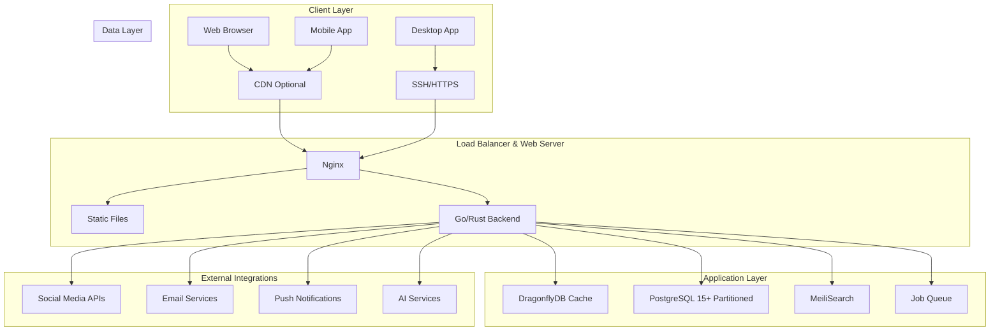

# Design Document: High-Performance News Website

## Overview

This design document outlines the technical architecture for an ultra-high-performance news website capable of handling 50,000+ daily articles with exceptional speed, SEO optimization, and scalability. The platform prioritizes performance, security, and ease of deployment while maintaining comprehensive content management capabilities.

### Key Design Principles

- **Performance First**: Sub-2-second page loads, optimized for 50K+ daily articles
- **SEO Optimized**: Structured data, fast indexing, AI-ready content
- **Mobile-First**: Progressive enhancement, Core Web Vitals compliance
- **Security Focused**: Comprehensive protection against web vulnerabilities
- **Deployment Simplicity**: Zero-touch deployment from desktop to server
- **Modular Architecture**: Extensible plugin system for future features

## Architecture

### High-Level Architecture



### Technology Stack

#### Backend Technologies
- **Primary Language**: Go (for performance) with Rust components for critical paths
- **Web Framework**: Gin (Go) or Axum (Rust) for HTTP handling
- **Template Engine**: Go templates or Tera (Rust) for server-side rendering
- **Database**: PostgreSQL 15+ with extensions (pg_partman, pg_stat_statements, pg_trgm)
- **Caching**: DragonflyDB (32GB RAM, 16 threads, compression enabled)
- **Search**: MeiliSearch primary, PostgreSQL full-text fallback
- **Queue System**: Built-in Go channels or Redis Streams for job processing
- **Web Server**: Nginx for static files and reverse proxy

#### Frontend Technologies
- **Rendering**: Server-side rendering (SSR) with static HTML generation for performance
- **CSS Framework**: Tailwind CSS (compiled at build-time)
- **JavaScript**: Alpine.js (15KB) for interactivity, vanilla JS for critical features
- **Build Tools**: Vite/esbuild for asset optimization
- **Image Processing**: WebP/AVIF generation with JPEG fallbacks
- **Static Generation**: Pre-generated HTML files served by nginx for maximum performance

#### Infrastructure
- **Operating System**: Ubuntu Server 22.04 LTS
- **Deployment**: Custom Go-based deployment agent
- **Monitoring**: Built-in health checks and metrics collection
- **Backup**: Automated PostgreSQL backups with compression

## Components and Interfaces

### Core Application Components

#### 1. Content Management System (CMS)
```go
type Article struct {
    ID          uint64    `json:"id" db:"id"`
    Title       string    `json:"title" db:"title"`
    Slug        string    `json:"slug" db:"slug"`
    Content     string    `json:"content" db:"content"`
    Excerpt     string    `json:"excerpt" db:"excerpt"`
    AuthorID    uint64    `json:"author_id" db:"author_id"`
    CategoryID  uint64    `json:"category_id" db:"category_id"`
    Tags        []Tag     `json:"tags"`
    Status      string    `json:"status" db:"status"` // draft, published, archived
    PublishedAt time.Time `json:"published_at" db:"published_at"`
    CreatedAt   time.Time `json:"created_at" db:"created_at"`
    UpdatedAt   time.Time `json:"updated_at" db:"updated_at"`
    ViewCount   uint64    `json:"view_count" db:"view_count"`
    LikeCount   uint64    `json:"like_count" db:"like_count"`
    DislikeCount uint64   `json:"dislike_count" db:"dislike_count"`
    SEOData     SEOData   `json:"seo_data"`
}

type SEOData struct {
    MetaTitle       string   `json:"meta_title"`
    MetaDescription string   `json:"meta_description"`
    Keywords        []string `json:"keywords"`
    CanonicalURL    string   `json:"canonical_url"`
    SchemaType      string   `json:"schema_type"`
}
```

#### 2. User Management System
```go
type User struct {
    ID          uint64    `json:"id" db:"id"`
    Username    string    `json:"username" db:"username"`
    Email       string    `json:"email" db:"email"`
    PasswordHash string   `json:"-" db:"password_hash"`
    Role        UserRole  `json:"role" db:"role"`
    FirstName   string    `json:"first_name" db:"first_name"`
    LastName    string    `json:"last_name" db:"last_name"`
    Bio         string    `json:"bio" db:"bio"`
    Avatar      string    `json:"avatar" db:"avatar"`
    IsActive    bool      `json:"is_active" db:"is_active"`
    CreatedAt   time.Time `json:"created_at" db:"created_at"`
    UpdatedAt   time.Time `json:"updated_at" db:"updated_at"`
}

type UserRole string
const (
    RoleAdmin       UserRole = "admin"
    RoleEditor      UserRole = "editor"
    RoleReporter    UserRole = "reporter"
    RoleContributor UserRole = "contributor"
)
```

#### 3. Tag and Category Management
```go
type Tag struct {
    ID          uint64    `json:"id" db:"id"`
    Name        string    `json:"name" db:"name"`
    Slug        string    `json:"slug" db:"slug"`
    Description string    `json:"description" db:"description"`
    Keywords    []string  `json:"keywords"` // Keyword bank for auto-linking
    Color       string    `json:"color" db:"color"`
    CreatedAt   time.Time `json:"created_at" db:"created_at"`
}

type Category struct {
    ID          uint64    `json:"id" db:"id"`
    Name        string    `json:"name" db:"name"`
    Slug        string    `json:"slug" db:"slug"`
    Description string    `json:"description" db:"description"`
    ParentID    *uint64   `json:"parent_id" db:"parent_id"`
    SortOrder   int       `json:"sort_order" db:"sort_order"`
    CreatedAt   time.Time `json:"created_at" db:"created_at"`
}
```

#### 4. Caching Layer Interface
```go
type CacheService interface {
    Get(key string) ([]byte, error)
    Set(key string, value []byte, ttl time.Duration) error
    Delete(key string) error
    DeletePattern(pattern string) error
    Exists(key string) bool
}

// Cache key patterns
const (
    CacheKeyArticle     = "article:%d"
    CacheKeyHomepage    = "homepage:%s" // language code
    CacheKeyCategoryPage = "category:%s:%d" // slug, page
    CacheKeyTagPage     = "tag:%s:%d"   // slug, page
    CacheKeyRSSFeed     = "rss:%s"      // category/tag slug
    CacheKeySitemap     = "sitemap:%s"  // type (news, articles, etc.)
)
```

### API Layer Design

#### REST API Endpoints
```
# Content Management
GET    /api/v1/articles              # List articles with pagination
POST   /api/v1/articles              # Create article
GET    /api/v1/articles/{id}         # Get article by ID
PUT    /api/v1/articles/{id}         # Update article
DELETE /api/v1/articles/{id}         # Delete article
POST   /api/v1/articles/{id}/publish # Publish article

# Bulk Operations
POST   /api/v1/articles/bulk         # Bulk create/update articles
POST   /api/v1/tags/bulk             # Bulk create tags
POST   /api/v1/categories/bulk       # Bulk create categories

# Search and Filtering
GET    /api/v1/search                # Search articles
GET    /api/v1/articles/trending     # Trending articles
GET    /api/v1/articles/popular      # Popular articles

# User Management
GET    /api/v1/users                 # List users
POST   /api/v1/users                 # Create user
GET    /api/v1/users/{id}            # Get user
PUT    /api/v1/users/{id}            # Update user

# Analytics and Reporting
GET    /api/v1/analytics/overview    # Dashboard metrics
GET    /api/v1/analytics/articles    # Article performance
GET    /api/v1/analytics/users       # User performance
GET    /api/v1/analytics/sources     # API source performance

# System Management
GET    /api/v1/system/health         # Health check
GET    /api/v1/system/metrics        # Performance metrics
POST   /api/v1/system/cache/clear    # Clear cache
```

### Frontend Component Architecture

#### Page Templates
```
templates/
├── layouts/
│   ├── base.html           # Base layout with head, navigation, footer
│   ├── admin.html          # Admin panel layout
│   └── error.html          # Error page layout
├── pages/
│   ├── homepage.html       # Homepage with sections
│   ├── article.html        # Article detail page
│   ├── category.html       # Category listing page
│   ├── tag.html           # Tag listing page
│   ├── search.html        # Search results page
│   └── author.html        # Author profile page
├── components/
│   ├── article-card.html   # Article preview card
│   ├── navigation.html     # Main navigation
│   ├── sidebar.html        # Sidebar widgets
│   ├── pagination.html     # Pagination component
│   └── breadcrumb.html     # Breadcrumb navigation
└── admin/
    ├── dashboard.html      # Admin dashboard
    ├── article-form.html   # Article creation/editing
    ├── user-management.html # User management
    └── settings.html       # System settings
```

## Data Models

### Database Schema Design

#### Articles Table (Partitioned by Published Date)
```sql
CREATE TABLE articles (
    id BIGSERIAL,
    title VARCHAR(255) NOT NULL,
    slug VARCHAR(255) NOT NULL,
    content TEXT NOT NULL,
    excerpt TEXT,
    author_id BIGINT NOT NULL,
    category_id BIGINT NOT NULL,
    status VARCHAR(20) DEFAULT 'draft',
    published_at TIMESTAMP WITH TIME ZONE,
    created_at TIMESTAMP WITH TIME ZONE DEFAULT NOW(),
    updated_at TIMESTAMP WITH TIME ZONE DEFAULT NOW(),
    view_count BIGINT DEFAULT 0,
    like_count BIGINT DEFAULT 0,
    dislike_count BIGINT DEFAULT 0,
    meta_title VARCHAR(60),
    meta_description VARCHAR(160),
    canonical_url VARCHAR(500),
    schema_type VARCHAR(50) DEFAULT 'NewsArticle',
    PRIMARY KEY (id, published_at)
) PARTITION BY RANGE (published_at);

-- Create daily partitions for published articles
CREATE TABLE articles_2024_01_01 PARTITION OF articles
FOR VALUES FROM ('2024-01-01') TO ('2024-01-02');

-- BRIN indexes for massive performance improvement on time-series data
CREATE INDEX idx_articles_published_brin ON articles 
USING BRIN (published_at) WITH (pages_per_range = 128);

-- Standard indexes for performance
CREATE INDEX idx_articles_published_at ON articles (published_at DESC) WHERE status = 'published';
CREATE INDEX idx_articles_category ON articles (category_id, published_at DESC);
CREATE INDEX idx_articles_author ON articles (author_id, published_at DESC);
CREATE INDEX idx_articles_slug ON articles (slug) WHERE status = 'published';
CREATE INDEX idx_articles_search ON articles USING gin(to_tsvector('english', title || ' ' || content));
```

#### Tags and Categories with Relationships
```sql
CREATE TABLE categories (
    id BIGSERIAL PRIMARY KEY,
    name VARCHAR(100) NOT NULL,
    slug VARCHAR(100) UNIQUE NOT NULL,
    description TEXT,
    parent_id BIGINT REFERENCES categories(id),
    sort_order INTEGER DEFAULT 0,
    created_at TIMESTAMP WITH TIME ZONE DEFAULT NOW()
);

CREATE TABLE tags (
    id BIGSERIAL PRIMARY KEY,
    name VARCHAR(100) NOT NULL,
    slug VARCHAR(100) UNIQUE NOT NULL,
    description TEXT,
    keywords JSONB, -- Keyword bank for auto-linking
    color VARCHAR(7) DEFAULT '#000000',
    created_at TIMESTAMP WITH TIME ZONE DEFAULT NOW()
);

CREATE TABLE article_tags (
    article_id BIGINT,
    tag_id BIGINT,
    created_at TIMESTAMP WITH TIME ZONE DEFAULT NOW(),
    PRIMARY KEY (article_id, tag_id, created_at)
) PARTITION BY RANGE (created_at);

-- Indexes for tag relationships
CREATE INDEX idx_article_tags_article ON article_tags (article_id);
CREATE INDEX idx_article_tags_tag ON article_tags (tag_id);
```

#### User Management and Analytics
```sql
CREATE TABLE users (
    id BIGSERIAL PRIMARY KEY,
    username VARCHAR(50) UNIQUE NOT NULL,
    email VARCHAR(255) UNIQUE NOT NULL,
    password_hash VARCHAR(255) NOT NULL,
    role VARCHAR(20) NOT NULL DEFAULT 'reporter',
    first_name VARCHAR(100),
    last_name VARCHAR(100),
    bio TEXT,
    avatar VARCHAR(500),
    is_active BOOLEAN DEFAULT true,
    created_at TIMESTAMP WITH TIME ZONE DEFAULT NOW(),
    updated_at TIMESTAMP WITH TIME ZONE DEFAULT NOW()
);

CREATE TABLE article_views (
    id BIGSERIAL,
    article_id BIGINT NOT NULL,
    ip_address INET,
    user_agent TEXT,
    referer TEXT,
    created_at TIMESTAMP WITH TIME ZONE DEFAULT NOW(),
    PRIMARY KEY (id, created_at)
) PARTITION BY RANGE (created_at);

-- BRIN index for high-volume analytics data
CREATE INDEX idx_views_created_brin ON article_views 
USING BRIN (created_at) WITH (pages_per_range = 64);

CREATE TABLE article_engagement (
    id BIGSERIAL,
    article_id BIGINT NOT NULL,
    action VARCHAR(20) NOT NULL, -- 'like', 'dislike', 'share'
    ip_address INET,
    created_at TIMESTAMP WITH TIME ZONE DEFAULT NOW(),
    PRIMARY KEY (id, created_at)
) PARTITION BY RANGE (created_at);
```

### Caching Strategy

#### Multi-Layer Caching Architecture
```
1. Browser Cache (Static Assets)
   - CSS, JS, Images: 1 year
   - HTML: No cache (dynamic content)

2. CDN Cache (Optional)
   - Static assets: 1 year
   - Images: 30 days
   - API responses: 5 minutes

3. Application Cache (DragonflyDB)
   - Homepage: 5 minutes
   - Article pages: 1 hour
   - Category/Tag pages: 15 minutes
   - Search results: 10 minutes
   - RSS feeds: 2 hours

4. Database Query Cache
   - Popular queries: 30 minutes
   - User sessions: 24 hours
   - Configuration: 1 hour
```

#### Optimized Cache TTL for High Volume
```go
const (
    CacheTTLHomepage = 15 * time.Minute  // Increased from 5 minutes
    CacheTTLArticle  = 24 * time.Hour    // Increased from 1 hour
    CacheTTLCategory = 30 * time.Minute  // Increased from 15 minutes
    CacheTTLRSS      = 4 * time.Hour     // Increased from 2 hours
    CacheTTLSearch   = 20 * time.Minute  // Increased from 10 minutes
    CacheTTLSitemap  = 6 * time.Hour     // New
)
```

#### Cache Invalidation Strategy with Write-Through Pattern
```go
type CacheInvalidator struct {
    cache CacheService
}

func (c *CacheInvalidator) InvalidateArticle(articleID uint64) {
    // Clear article cache
    c.cache.Delete(fmt.Sprintf(CacheKeyArticle, articleID))
    
    // Clear homepage cache (all languages)
    c.cache.DeletePattern("homepage:*")
    
    // Clear category and tag pages
    c.cache.DeletePattern("category:*")
    c.cache.DeletePattern("tag:*")
    
    // Clear RSS feeds
    c.cache.DeletePattern("rss:*")
    
    // Clear sitemaps
    c.cache.DeletePattern("sitemap:*")
}

// Write-through cache pattern for high performance
func (s *ArticleService) Create(article *Article) (*Article, error) {
    // 1. Save to database
    result, err := s.db.Create(article)
    if err != nil {
        return nil, err
    }
    
    // 2. Generate static HTML (async)
    go s.staticGen.GenerateArticlePage(result)
    
    // 3. Pre-warm cache (async)
    go s.cache.Set(fmt.Sprintf("article:%d", result.ID), result, CacheTTLArticle)
    
    // 4. Invalidate affected caches (async)
    go s.invalidator.InvalidateRelated(result)
    
    return result, nil
}
```

## Error Handling

### Error Response Structure
```go
type ErrorResponse struct {
    Error   string            `json:"error"`
    Code    string            `json:"code"`
    Message string            `json:"message"`
    Details map[string]string `json:"details,omitempty"`
}

// Error codes
const (
    ErrCodeValidation    = "VALIDATION_ERROR"
    ErrCodeNotFound      = "NOT_FOUND"
    ErrCodeUnauthorized  = "UNAUTHORIZED"
    ErrCodeRateLimit     = "RATE_LIMIT_EXCEEDED"
    ErrCodeServerError   = "INTERNAL_SERVER_ERROR"
    ErrCodeDatabaseError = "DATABASE_ERROR"
)
```

### Error Handling Middleware
```go
func ErrorHandlerMiddleware() gin.HandlerFunc {
    return func(c *gin.Context) {
        c.Next()
        
        if len(c.Errors) > 0 {
            err := c.Errors.Last()
            
            switch e := err.Err.(type) {
            case *ValidationError:
                c.JSON(400, ErrorResponse{
                    Error:   "Validation failed",
                    Code:    ErrCodeValidation,
                    Message: e.Message,
                    Details: e.Fields,
                })
            case *NotFoundError:
                c.JSON(404, ErrorResponse{
                    Error:   "Resource not found",
                    Code:    ErrCodeNotFound,
                    Message: e.Message,
                })
            default:
                // Log internal errors
                log.Error("Internal server error", "error", err)
                c.JSON(500, ErrorResponse{
                    Error:   "Internal server error",
                    Code:    ErrCodeServerError,
                    Message: "An unexpected error occurred",
                })
            }
        }
    }
}
```

## Testing Strategy

### Testing Pyramid

#### Unit Tests (70%)
- Business logic functions
- Data validation
- Cache operations
- URL generation
- Template rendering

#### Integration Tests (20%)
- Database operations
- API endpoints
- Cache integration
- Search functionality
- External API integrations

#### End-to-End Tests (10%)
- Critical user journeys
- Article publishing workflow
- Admin panel operations
- Performance benchmarks

### Performance Testing
```go
func BenchmarkArticleCreation(b *testing.B) {
    db := setupTestDB()
    service := NewArticleService(db)
    
    b.ResetTimer()
    for i := 0; i < b.N; i++ {
        article := &Article{
            Title:   fmt.Sprintf("Test Article %d", i),
            Content: "Test content...",
            AuthorID: 1,
        }
        _, err := service.Create(article)
        if err != nil {
            b.Fatal(err)
        }
    }
}

func BenchmarkHomepageLoad(b *testing.B) {
    app := setupTestApp()
    
    b.ResetTimer()
    for i := 0; i < b.N; i++ {
        req := httptest.NewRequest("GET", "/", nil)
        w := httptest.NewRecorder()
        app.ServeHTTP(w, req)
        
        if w.Code != 200 {
            b.Fatalf("Expected 200, got %d", w.Code)
        }
    }
}
```

### Load Testing Scenarios
1. **Normal Load**: 1,000 concurrent users, 10 articles/minute publishing
2. **Peak Load**: 10,000 concurrent users, 100 articles/minute publishing
3. **Stress Test**: 50,000 concurrent users, 1,000 articles/minute publishing
4. **Spike Test**: Sudden traffic increase to 25,000 users
5. **Endurance Test**: 5,000 users for 24 hours continuous

## Security Implementation

### Authentication and Authorization
```go
type AuthService struct {
    jwtSecret []byte
    db        *sql.DB
}

func (a *AuthService) GenerateToken(user *User) (string, error) {
    claims := jwt.MapClaims{
        "user_id": user.ID,
        "role":    user.Role,
        "exp":     time.Now().Add(24 * time.Hour).Unix(),
    }
    
    token := jwt.NewWithClaims(jwt.SigningMethodHS256, claims)
    return token.SignedString(a.jwtSecret)
}

func (a *AuthService) ValidateToken(tokenString string) (*User, error) {
    token, err := jwt.Parse(tokenString, func(token *jwt.Token) (interface{}, error) {
        return a.jwtSecret, nil
    })
    
    if err != nil || !token.Valid {
        return nil, errors.New("invalid token")
    }
    
    claims := token.Claims.(jwt.MapClaims)
    userID := uint64(claims["user_id"].(float64))
    
    return a.GetUserByID(userID)
}
```

### Input Validation and Sanitization
```go
type ArticleValidator struct{}

func (v *ArticleValidator) Validate(article *Article) error {
    var errors []string
    
    // Title validation
    if len(strings.TrimSpace(article.Title)) == 0 {
        errors = append(errors, "title is required")
    }
    if len(article.Title) > 255 {
        errors = append(errors, "title must be less than 255 characters")
    }
    
    // Content validation and sanitization
    if len(strings.TrimSpace(article.Content)) == 0 {
        errors = append(errors, "content is required")
    }
    
    // Sanitize HTML content
    article.Content = sanitizeHTML(article.Content)
    
    // Slug validation
    if article.Slug == "" {
        article.Slug = generateSlug(article.Title)
    }
    
    if len(errors) > 0 {
        return &ValidationError{
            Message: "Validation failed",
            Fields:  errors,
        }
    }
    
    return nil
}

func sanitizeHTML(content string) string {
    p := bluemonday.UGCPolicy()
    p.AllowElements("p", "br", "strong", "em", "u", "h1", "h2", "h3", "h4", "h5", "h6",
                   "ul", "ol", "li", "blockquote", "a", "img")
    p.AllowAttrs("href").OnElements("a")
    p.AllowAttrs("src", "alt", "width", "height").OnElements("img")
    
    return p.Sanitize(content)
}
```

### Rate Limiting
```go
type RateLimiter struct {
    cache CacheService
}

func (r *RateLimiter) Allow(key string, limit int, window time.Duration) bool {
    current, _ := r.cache.Get(key)
    count := 0
    
    if current != nil {
        count, _ = strconv.Atoi(string(current))
    }
    
    if count >= limit {
        return false
    }
    
    count++
    r.cache.Set(key, []byte(strconv.Itoa(count)), window)
    return true
}

// Rate limiting middleware
func RateLimitMiddleware(limiter *RateLimiter) gin.HandlerFunc {
    return func(c *gin.Context) {
        key := fmt.Sprintf("rate_limit:%s", c.ClientIP())
        
        if !limiter.Allow(key, 100, time.Minute) { // 100 requests per minute
            c.JSON(429, ErrorResponse{
                Error:   "Rate limit exceeded",
                Code:    ErrCodeRateLimit,
                Message: "Too many requests, please try again later",
            })
            c.Abort()
            return
        }
        
        c.Next()
    }
}
```

This design document provides a comprehensive technical foundation for implementing the ultra-high-performance news website. The architecture prioritizes performance, scalability, and maintainability while addressing all the requirements specified in the requirements document.
###
 Static HTML Generation System

#### Static File Generator
```go
type StaticGenerator struct {
    templateEngine *template.Template
    outputPath     string
    cache          CacheService
}

func (sg *StaticGenerator) GenerateArticlePage(article *Article) error {
    filePath := fmt.Sprintf("%s/articles/%s/index.html", sg.outputPath, article.Slug)
    
    // Create directory if not exists
    if err := os.MkdirAll(filepath.Dir(filePath), 0755); err != nil {
        return err
    }
    
    file, err := os.Create(filePath)
    if err != nil {
        return err
    }
    defer file.Close()
    
    // Generate HTML with full SEO optimization
    data := struct {
        Article *Article
        Related []Article
        Schema  string
    }{
        Article: article,
        Related: sg.getRelatedArticles(article),
        Schema:  sg.generateSchema(article),
    }
    
    return sg.templateEngine.ExecuteTemplate(file, "article.html", data)
}

func (sg *StaticGenerator) GenerateHomepage() error {
    articles := sg.getLatestArticles(20)
    trending := sg.getTrendingArticles(10)
    
    data := struct {
        Latest   []Article
        Trending []Article
        Schema   string
    }{
        Latest:   articles,
        Trending: trending,
        Schema:   sg.generateHomepageSchema(),
    }
    
    file, err := os.Create(fmt.Sprintf("%s/index.html", sg.outputPath))
    if err != nil {
        return err
    }
    defer file.Close()
    
    return sg.templateEngine.ExecuteTemplate(file, "homepage.html", data)
}
```

#### Nginx Configuration for Static-First Serving
```nginx
server {
    listen 80;
    server_name example.com;
    root /var/www/static;
    
    # Serve static files first, fallback to dynamic
    location ~ ^/articles/(.+)$ {
        try_files /articles/$1/index.html @backend;
    }
    
    location / {
        try_files $uri $uri/index.html @backend;
    }
    
    location @backend {
        proxy_pass http://127.0.0.1:8080;
        proxy_set_header Host $host;
        proxy_set_header X-Real-IP $remote_addr;
        proxy_cache_bypass $http_cache_control;
    }
    
    # Static assets with long cache
    location ~* \.(css|js|png|jpg|jpeg|gif|ico|svg|webp|avif)$ {
        expires 1y;
        add_header Cache-Control "public, immutable";
    }
}
```

### High-Performance Database Configuration

#### PostgreSQL Optimization for 50K+ Articles/Day
```sql
-- postgresql.conf optimizations
shared_buffers = 16GB                    -- 25% of RAM
effective_cache_size = 48GB              -- 75% of RAM
maintenance_work_mem = 2GB               -- For large operations
checkpoint_completion_target = 0.9       -- Spread checkpoints
wal_buffers = 16MB                       -- WAL buffer size
default_statistics_target = 100          -- Better query planning
random_page_cost = 1.1                   -- SSD optimization
effective_io_concurrency = 200           -- Concurrent I/O
work_mem = 50MB                          -- Per-query memory
max_parallel_workers_per_gather = 4      -- Parallel queries
max_parallel_workers = 8                 -- Total parallel workers
jit = on                                 -- Just-in-time compilation

-- Connection pooling with PgBouncer
max_connections = 200
```

#### Database Connection Management
```go
func NewDatabaseConnection(dsn string) (*sql.DB, error) {
    db, err := sql.Open("postgres", dsn)
    if err != nil {
        return nil, err
    }
    
    // Adjusted settings - leave connections for maintenance
    db.SetMaxOpenConns(150)              // Leave 50 for admin/maintenance
    db.SetMaxIdleConns(40)               // Reduced idle connections
    db.SetConnMaxLifetime(time.Hour)     // Connection lifetime
    db.SetConnMaxIdleTime(10 * time.Minute) // Idle timeout
    
    // Test connection
    if err := db.Ping(); err != nil {
        return nil, err
    }
    
    return db, nil
}

// Prepared statements for repeated queries
var (
    stmtGetArticle     *sql.Stmt
    stmtGetHomepage    *sql.Stmt
    stmtGetCategory    *sql.Stmt
    stmtInsertView     *sql.Stmt
)

func InitPreparedStatements(db *sql.DB) error {
    var err error
    
    stmtGetArticle, err = db.Prepare(`
        SELECT id, title, slug, content, excerpt, author_id, 
               published_at, view_count, like_count, dislike_count
        FROM articles 
        WHERE slug = $1 AND status = 'published'
    `)
    if err != nil {
        return err
    }
    
    stmtGetHomepage, err = db.Prepare(`
        SELECT id, title, slug, excerpt, author_id, published_at, view_count
        FROM articles 
        WHERE status = 'published' 
        ORDER BY published_at DESC 
        LIMIT $1
    `)
    if err != nil {
        return err
    }
    
    return nil
}

// Prepared statement cleanup for graceful shutdown
func ClosePreparedStatements() error {
    var errs []error
    
    if stmtGetArticle != nil {
        if err := stmtGetArticle.Close(); err != nil {
            errs = append(errs, err)
        }
    }
    if stmtGetHomepage != nil {
        if err := stmtGetHomepage.Close(); err != nil {
            errs = append(errs, err)
        }
    }
    if stmtGetCategory != nil {
        if err := stmtGetCategory.Close(); err != nil {
            errs = append(errs, err)
        }
    }
    if stmtInsertView != nil {
        if err := stmtInsertView.Close(); err != nil {
            errs = append(errs, err)
        }
    }
    
    if len(errs) > 0 {
        return fmt.Errorf("errors closing statements: %v", errs)
    }
    return nil
}
```

### Bulk Operations for High Volume

#### Batch Article Processing
```go
func (s *ArticleService) BulkCreate(articles []Article) error {
    // Use PostgreSQL COPY for maximum performance
    stmt, err := s.db.Prepare(pq.CopyIn("articles",
        "title", "slug", "content", "excerpt", "author_id", 
        "category_id", "published_at", "status"))
    if err != nil {
        return err
    }
    defer stmt.Close()
    
    for _, article := range articles {
        _, err = stmt.Exec(
            article.Title,
            article.Slug,
            article.Content,
            article.Excerpt,
            article.AuthorID,
            article.CategoryID,
            article.PublishedAt,
            article.Status,
        )
        if err != nil {
            return err
        }
    }
    
    // Execute the COPY
    if err := stmt.Close(); err != nil {
        return err
    }
    
    // Async operations after bulk insert
    go func() {
        for _, article := range articles {
            // Generate static pages
            s.staticGen.GenerateArticlePage(&article)
            
            // Update search index
            s.searchIndexer.IndexArticle(&article)
            
            // Invalidate caches
            s.invalidator.InvalidateRelated(&article)
        }
    }()
    
    return nil
}
```

### Job Queue System for Async Processing

#### High-Performance Job Queue
```go
type JobQueue struct {
    jobs    chan Job
    workers int
    wg      sync.WaitGroup
}

type Job struct {
    Type string
    Data interface{}
}

func NewJobQueue(workers int) *JobQueue {
    return &JobQueue{
        jobs:    make(chan Job, 10000), // Large buffer for high volume
        workers: workers,
    }
}

func (jq *JobQueue) Start() {
    for i := 0; i < jq.workers; i++ {
        jq.wg.Add(1)
        go jq.worker()
    }
}

func (jq *JobQueue) worker() {
    defer jq.wg.Done()
    
    for job := range jq.jobs {
        switch job.Type {
        case "generate_static":
            jq.generateStaticPage(job.Data)
        case "update_cache":
            jq.updateCache(job.Data)
        case "process_images":
            jq.processImages(job.Data)
        case "update_search_index":
            jq.updateSearchIndex(job.Data)
        case "send_notifications":
            jq.sendNotifications(job.Data)
        }
    }
}

func (jq *JobQueue) Enqueue(jobType string, data interface{}) {
    select {
    case jq.jobs <- Job{Type: jobType, Data: data}:
        // Job queued successfully
    default:
        // Queue is full, handle overflow
        log.Warn("Job queue full, dropping job", "type", jobType)
    }
}
```

### Image Processing Pipeline

#### Multi-Format Image Generation
```go
type ImageProcessor struct {
    sizes []ImageSize
}

type ImageSize struct {
    Name   string
    Width  int
    Height int
    Format string // webp, jpeg, avif
}

func (ip *ImageProcessor) ProcessImage(original []byte) (map[string][]byte, error) {
    results := make(map[string][]byte)
    
    sizes := []ImageSize{
        {"thumb_webp", 150, 150, "webp"},
        {"mobile_webp", 400, 0, "webp"},
        {"tablet_webp", 800, 0, "webp"},
        {"desktop_webp", 1200, 0, "webp"},
        {"thumb_jpg", 150, 150, "jpeg"},    // Fallbacks
        {"mobile_jpg", 400, 0, "jpeg"},
        {"tablet_jpg", 800, 0, "jpeg"},
        {"desktop_jpg", 1200, 0, "jpeg"},
        {"thumb_avif", 150, 150, "avif"},   // Next-gen format
        {"mobile_avif", 400, 0, "avif"},
        {"desktop_avif", 1200, 0, "avif"},
    }
    
    for _, size := range sizes {
        processed, err := ip.resize(original, size)
        if err != nil {
            log.Error("Failed to process image", "size", size.Name, "error", err)
            continue
        }
        results[size.Name] = processed
    }
    
    return results, nil
}

func (ip *ImageProcessor) resize(data []byte, size ImageSize) ([]byte, error) {
    // Use imaging library for resizing
    img, err := imaging.Decode(bytes.NewReader(data))
    if err != nil {
        return nil, err
    }
    
    // Resize maintaining aspect ratio
    if size.Height == 0 {
        img = imaging.Resize(img, size.Width, 0, imaging.Lanczos)
    } else {
        img = imaging.Fill(img, size.Width, size.Height, imaging.Center, imaging.Lanczos)
    }
    
    // Encode in specified format
    var buf bytes.Buffer
    switch size.Format {
    case "webp":
        err = webp.Encode(&buf, img, &webp.Options{Quality: 85})
    case "jpeg":
        err = jpeg.Encode(&buf, img, &jpeg.Options{Quality: 85})
    case "avif":
        // Use AVIF encoder
        err = avif.Encode(&buf, img, &avif.Options{Quality: 85})
    }
    
    return buf.Bytes(), err
}
```

### Search Index Management

#### MeiliSearch Integration
```go
type SearchIndexer struct {
    client *meilisearch.Client
}

func (si *SearchIndexer) IndexArticle(article *Article) error {
    doc := map[string]interface{}{
        "id":           article.ID,
        "title":        article.Title,
        "content":      si.stripHTML(article.Content),
        "excerpt":      article.Excerpt,
        "author":       article.AuthorName,
        "category":     article.CategoryName,
        "tags":         article.Tags,
        "published_at": article.PublishedAt.Unix(),
        "view_count":   article.ViewCount,
    }
    
    _, err := si.client.Index("articles").AddDocuments(doc)
    return err
}

func (si *SearchIndexer) BulkIndex(articles []Article) error {
    docs := make([]map[string]interface{}, len(articles))
    
    for i, article := range articles {
        docs[i] = map[string]interface{}{
            "id":           article.ID,
            "title":        article.Title,
            "content":      si.stripHTML(article.Content),
            "excerpt":      article.Excerpt,
            "author":       article.AuthorName,
            "category":     article.CategoryName,
            "tags":         article.Tags,
            "published_at": article.PublishedAt.Unix(),
            "view_count":   article.ViewCount,
        }
    }
    
    _, err := si.client.Index("articles").AddDocuments(docs)
    return err
}

func (si *SearchIndexer) stripHTML(content string) string {
    // Remove HTML tags for search indexing
    re := regexp.MustCompile(`<[^>]*>`)
    return re.ReplaceAllString(content, "")
}
```

### Deployment Agent Architecture

#### Zero-Touch Deployment System
```go
type DeploymentAgent struct {
    ServerAddr   string
    Credentials  SSHCredentials
    Config       DeploymentConfig
}

type DeploymentStep struct {
    Name    string
    Execute func() error
}

func (da *DeploymentAgent) Deploy() error {
    steps := []DeploymentStep{
        {"Connecting to server", da.connect},
        {"Backing up current version", da.backupCurrent},
        {"Uploading new version", da.uploadFiles},
        {"Installing dependencies", da.installDependencies},
        {"Running database migrations", da.runMigrations},
        {"Generating static files", da.generateStatic},
        {"Restarting services", da.restartServices},
        {"Verifying deployment", da.verifyHealth},
        {"Warming up cache", da.warmupCache},
    }
    
    for i, step := range steps {
        log.Info("Deployment step", "step", i+1, "name", step.Name)
        
        if err := step.Execute(); err != nil {
            log.Error("Deployment step failed", "step", step.Name, "error", err)
            return da.rollback()
        }
    }
    
    log.Info("Deployment completed successfully")
    return nil
}

func (da *DeploymentAgent) rollback() error {
    log.Info("Rolling back deployment")
    
    rollbackSteps := []DeploymentStep{
        {"Stopping new services", da.stopServices},
        {"Restoring previous version", da.restorePrevious},
        {"Restarting services", da.restartServices},
        {"Verifying rollback", da.verifyHealth},
    }
    
    for _, step := range rollbackSteps {
        if err := step.Execute(); err != nil {
            log.Error("Rollback step failed", "step", step.Name, "error", err)
        }
    }
    
    return nil
}
```

### Performance Monitoring and Metrics

#### Comprehensive Metrics Collection
```go
type Metrics struct {
    ArticlesPublished  prometheus.Counter
    ResponseTime       prometheus.Histogram
    CacheHitRate      prometheus.Gauge
    DatabaseQueryTime  prometheus.Histogram
    ActiveUsers       prometheus.Gauge
    QueueLength       prometheus.Gauge
}

func NewMetrics() *Metrics {
    return &Metrics{
        ArticlesPublished: prometheus.NewCounter(prometheus.CounterOpts{
            Name: "articles_published_total",
            Help: "Total number of articles published",
        }),
        ResponseTime: prometheus.NewHistogram(prometheus.HistogramOpts{
            Name:    "http_request_duration_seconds",
            Help:    "HTTP request duration in seconds",
            Buckets: prometheus.DefBuckets,
        }),
        CacheHitRate: prometheus.NewGauge(prometheus.GaugeOpts{
            Name: "cache_hit_rate",
            Help: "Cache hit rate percentage",
        }),
        DatabaseQueryTime: prometheus.NewHistogram(prometheus.HistogramOpts{
            Name:    "database_query_duration_seconds",
            Help:    "Database query duration in seconds",
            Buckets: []float64{0.001, 0.005, 0.01, 0.025, 0.05, 0.1, 0.25, 0.5, 1.0},
        }),
    }
}

func (m *Metrics) RecordArticlePublished() {
    m.ArticlesPublished.Inc()
}

func (m *Metrics) RecordResponseTime(duration time.Duration) {
    m.ResponseTime.Observe(duration.Seconds())
}

func (m *Metrics) RecordDatabaseQuery(duration time.Duration) {
    m.DatabaseQueryTime.Observe(duration.Seconds())
}
```

### Health Check System

#### Comprehensive Health Monitoring
```go
type HealthChecker struct {
    db     *sql.DB
    cache  CacheService
    search SearchService
}

type HealthStatus struct {
    Healthy bool                    `json:"healthy"`
    Checks  map[string]CheckResult `json:"checks"`
}

type CheckResult struct {
    Healthy bool   `json:"healthy"`
    Error   string `json:"error,omitempty"`
    Latency string `json:"latency,omitempty"`
}

func (hc *HealthChecker) Check() HealthStatus {
    status := HealthStatus{
        Healthy: true,
        Checks:  make(map[string]CheckResult),
    }
    
    // Database health check
    start := time.Now()
    if err := hc.db.Ping(); err != nil {
        status.Healthy = false
        status.Checks["database"] = CheckResult{
            Healthy: false,
            Error:   err.Error(),
        }
    } else {
        status.Checks["database"] = CheckResult{
            Healthy: true,
            Latency: time.Since(start).String(),
        }
    }
    
    // Cache health check
    start = time.Now()
    if err := hc.cache.Ping(); err != nil {
        status.Healthy = false
        status.Checks["cache"] = CheckResult{
            Healthy: false,
            Error:   err.Error(),
        }
    } else {
        status.Checks["cache"] = CheckResult{
            Healthy: true,
            Latency: time.Since(start).String(),
        }
    }
    
    // Disk space check
    if usage := getDiskUsage(); usage > 80 {
        status.Healthy = false
        status.Checks["disk"] = CheckResult{
            Healthy: false,
            Error:   fmt.Sprintf("Disk usage at %d%%", usage),
        }
    } else {
        status.Checks["disk"] = CheckResult{
            Healthy: true,
        }
    }
    
    // Memory usage check
    if usage := getMemoryUsage(); usage > 90 {
        status.Checks["memory"] = CheckResult{
            Healthy: false,
            Error:   fmt.Sprintf("Memory usage at %d%%", usage),
        }
    } else {
        status.Checks["memory"] = CheckResult{
            Healthy: true,
        }
    }
    
    return status
}
```

### DragonflyDB Configuration

#### Optimized Cache Configuration
```yaml
# dragonfly.conf for high-performance caching
maxmemory: 32gb
maxmemory-policy: allkeys-lru
threads: 16
compression: yes
snapshot-cron: "0 */4 * * *"  # Snapshot every 4 hours
tcp-keepalive: 300
timeout: 0
databases: 16
save: 900 1 300 10 60 10000  # Save snapshots based on changes
```

This enhanced design now includes all the critical performance optimizations needed for a 50,000+ articles/day news platform, including proper database partitioning, static HTML generation, bulk operations, comprehensive caching strategies, and robust deployment systems.### Automat
ed ### A
utomated Partition Management

#### Daily Partition Creation and Cleanup
```go
type PartitionManager struct {
    db *sql.DB
}

func (pm *PartitionManager) CreateDailyPartitions() error {
    // Create partitions for next 7 days
    for i := 0; i <= 7; i++ {
        date := time.Now().AddDate(0, 0, i)
        tableName := fmt.Sprintf("articles_%s", date.Format("2006_01_02"))
        
        query := fmt.Sprintf(`
            CREATE TABLE IF NOT EXISTS %s 
            PARTITION OF articles 
            FOR VALUES FROM ('%s') TO ('%s')
        `, tableName,
            date.Format("2006-01-02"),
            date.AddDate(0, 0, 1).Format("2006-01-02"))
        
        if _, err := pm.db.Exec(query); err != nil {
            log.Error("Failed to create partition", "table", tableName, "error", err)
            return err
        }
    }
    return nil
}

func (pm *PartitionManager) DropOldPartitions(daysToKeep int) error {
    cutoffDate := time.Now().AddDate(0, 0, -daysToKeep)
    
    query := fmt.Sprintf(`
        SELECT tablename FROM pg_tables 
        WHERE tablename LIKE 'articles_%%'
        AND tablename < 'articles_%s'
    `, cutoffDate.Format("2006_01_02"))
    
    rows, err := pm.db.Query(query)
    if err != nil {
        return err
    }
    defer rows.Close()
    
    for rows.Next() {
        var tableName string
        if err := rows.Scan(&tableName); err != nil {
            continue
        }
        
        dropQuery := fmt.Sprintf("DROP TABLE IF EXISTS %s", tableName)
        if _, err := pm.db.Exec(dropQuery); err != nil {
            log.Error("Failed to drop old partition", "table", tableName, "error", err)
        } else {
            log.Info("Dropped old partition", "table", tableName)
        }
    }
    
    return nil
}

// Schedule this to run daily via cron
func (pm *PartitionManager) RunDaily() {
    if err := pm.CreateDailyPartitions(); err != nil {
        log.Error("Failed to create daily partitions", "error", err)
    }
    
    if err := pm.DropOldPartitions(365); err != nil { // Keep 1 year
        log.Error("Failed to drop old partitions", "error", err)
    }
}
```

### Graceful Degradation System

#### Multi-Layer Fallback Strategy
```go
func (s *ArticleService) GetArticle(slug string) (*Article, error) {
    // 1. Try cache first
    cacheKey := fmt.Sprintf("article:slug:%s", slug)
    if cached, err := s.cache.Get(cacheKey); err == nil {
        return unmarshalArticle(cached), nil
    }
    
    // 2. Try database
    article, err := s.db.GetArticleBySlug(slug)
    if err != nil {
        // 3. Try static file as last resort
        staticPath := fmt.Sprintf("%s/articles/%s/data.json", s.staticPath, slug)
        if data, err := os.ReadFile(staticPath); err == nil {
            var article Article
            if err := json.Unmarshal(data, &article); err == nil {
                return &article, nil
            }
        }
        return nil, err
    }
    
    // Async cache warming
    go func() {
        if cacheErr := s.cache.Set(cacheKey, marshalArticle(article), CacheTTLArticle); cacheErr != nil {
            log.Error("Failed to warm cache", "slug", slug, "error", cacheErr)
        }
    }()
    
    return article, nil
}
```

### Enhanced Search Index Management

#### Batched Search Operations for High Volume
```go
func (si *SearchIndexer) BulkIndex(articles []Article) error {
    batchSize := 1000 // MeiliSearch optimal batch size
    totalBatches := (len(articles) + batchSize - 1) / batchSize
    
    for i := 0; i < len(articles); i += batchSize {
        end := i + batchSize
        if end > len(articles) {
            end = len(articles)
        }
        
        batch := articles[i:end]
        batchNum := (i / batchSize) + 1
        
        log.Info("Indexing batch", "batch", batchNum, "total", totalBatches, "size", len(batch))
        
        docs := make([]map[string]interface{}, len(batch))
        for j, article := range batch {
            docs[j] = map[string]interface{}{
                "id":           article.ID,
                "title":        article.Title,
                "content":      si.stripHTML(article.Content),
                "excerpt":      article.Excerpt,
                "author":       article.AuthorName,
                "category":     article.CategoryName,
                "tags":         article.Tags,
                "published_at": article.PublishedAt.Unix(),
                "view_count":   article.ViewCount,
            }
        }
        
        if _, err := si.client.Index("articles").AddDocuments(docs); err != nil {
            log.Error("Failed to index batch", "batch", batchNum, "error", err)
            // Continue with next batch instead of failing completely
            continue
        }
        
        // Small delay between batches to prevent overload
        time.Sleep(100 * time.Millisecond)
    }
    
    return nil
}

func (si *SearchIndexer) stripHTML(content string) string {
    // Remove HTML tags for search indexing
    re := regexp.MustCompile(`<[^>]*>`)
    return re.ReplaceAllString(content, "")
}
```

### Memory-Aware Job Queue System

#### Enhanced Job Queue with Memory Pressure Handling
```go
type JobQueue struct {
    jobs              chan Job
    workers           int
    wg                sync.WaitGroup
    consecutiveDrops  int
}

type Job struct {
    Type string
    Data interface{}
}

func NewJobQueue(workers int) *JobQueue {
    return &JobQueue{
        jobs:    make(chan Job, 10000), // Large buffer for high volume
        workers: workers,
    }
}

func (jq *JobQueue) Enqueue(jobType string, data interface{}) {
    // Check memory pressure before enqueueing
    var m runtime.MemStats
    runtime.ReadMemStats(&m)
    
    // Alert if memory usage exceeds 28GB (leave 4GB buffer on 32GB system)
    if m.Alloc > 28*1024*1024*1024 {
        log.Warn("Memory pressure high, dropping job", 
            "type", jobType, 
            "memory_gb", m.Alloc/(1024*1024*1024))
        return
    }
    
    select {
    case jq.jobs <- Job{Type: jobType, Data: data}:
        // Job queued successfully
    default:
        // Queue is full
        log.Warn("Job queue full, dropping job", "type", jobType)
        
        // Force garbage collection if queue is consistently full
        if jq.consecutiveDrops > 10 {
            runtime.GC()
            jq.consecutiveDrops = 0
        } else {
            jq.consecutiveDrops++
        }
    }
}

func (jq *JobQueue) Start() {
    for i := 0; i < jq.workers; i++ {
        jq.wg.Add(1)
        go jq.worker()
    }
}

func (jq *JobQueue) worker() {
    defer jq.wg.Done()
    
    for job := range jq.jobs {
        switch job.Type {
        case "generate_static":
            jq.generateStaticPage(job.Data)
        case "update_cache":
            jq.updateCache(job.Data)
        case "process_images":
            jq.processImages(job.Data)
        case "update_search_index":
            jq.updateSearchIndex(job.Data)
        case "send_notifications":
            jq.sendNotifications(job.Data)
        }
    }
}
```

### Enhanced Image Processing with Error Recovery

#### Resilient Image Processing Pipeline
```go
type ImageProcessor struct {
    sizes []ImageSize
}

type ImageSize struct {
    Name   string
    Width  int
    Height int
    Format string // webp, jpeg, avif
}

func (ip *ImageProcessor) ProcessImage(original []byte) (map[string][]byte, error) {
    results := make(map[string][]byte)
    criticalSizes := map[string]bool{
        "mobile_webp": true,
        "mobile_jpg":  true,
        "desktop_jpg": true,
    }
    
    sizes := []ImageSize{
        {"thumb_webp", 150, 150, "webp"},
        {"mobile_webp", 400, 0, "webp"},
        {"tablet_webp", 800, 0, "webp"},
        {"desktop_webp", 1200, 0, "webp"},
        {"thumb_jpg", 150, 150, "jpeg"},
        {"mobile_jpg", 400, 0, "jpeg"},
        {"tablet_jpg", 800, 0, "jpeg"},
        {"desktop_jpg", 1200, 0, "jpeg"},
    }
    
    criticalFailed := false
    
    for _, size := range sizes {
        processed, err := ip.resize(original, size)
        if err != nil {
            if criticalSizes[size.Name] {
                criticalFailed = true
                log.Error("Critical image size failed", "size", size.Name, "error", err)
            } else {
                log.Warn("Non-critical image size failed", "size", size.Name, "error", err)
            }
            continue
        }
        results[size.Name] = processed
    }
    
    if criticalFailed {
        return nil, errors.New("critical image sizes failed to process")
    }
    
    if len(results) == 0 {
        return nil, errors.New("all image processing failed")
    }
    
    return results, nil
}

func (ip *ImageProcessor) resize(data []byte, size ImageSize) ([]byte, error) {
    // Use imaging library for resizing
    img, err := imaging.Decode(bytes.NewReader(data))
    if err != nil {
        return nil, err
    }
    
    // Resize maintaining aspect ratio
    if size.Height == 0 {
        img = imaging.Resize(img, size.Width, 0, imaging.Lanczos)
    } else {
        img = imaging.Fill(img, size.Width, size.Height, imaging.Center, imaging.Lanczos)
    }
    
    // Encode in specified format
    var buf bytes.Buffer
    switch size.Format {
    case "webp":
        err = webp.Encode(&buf, img, &webp.Options{Quality: 85})
    case "jpeg":
        err = jpeg.Encode(&buf, img, &jpeg.Options{Quality: 85})
    case "avif":
        // Use AVIF encoder
        err = avif.Encode(&buf, img, &avif.Options{Quality: 85})
    }
    
    return buf.Bytes(), err
}
```

### RSS Feed Generation with Delay Implementation

#### Delayed RSS Generation System
```go
type RSSGenerator struct {
    db            *sql.DB
    cache         CacheService
    delayDuration time.Duration // Default 2 hours
}

func NewRSSGenerator(db *sql.DB, cache CacheService) *RSSGenerator {
    return &RSSGenerator{
        db:            db,
        cache:         cache,
        delayDuration: 2 * time.Hour, // Requirement: 2-hour delay
    }
}

func (rg *RSSGenerator) GenerateFeed(category string) (string, error) {
    cacheKey := fmt.Sprintf("rss:%s", category)
    
    // Check cache first
    if cached, err := rg.cache.Get(cacheKey); err == nil {
        return string(cached), nil
    }
    
    // Get articles with delay filter
    cutoffTime := time.Now().Add(-rg.delayDuration)
    
    query := `
        SELECT id, title, slug, excerpt, published_at
        FROM articles
        WHERE status = 'published'
        AND published_at <= $1
        AND ($2 = '' OR category_id = (SELECT id FROM categories WHERE slug = $2))
        ORDER BY published_at DESC
        LIMIT 50
    `
    
    rows, err := rg.db.Query(query, cutoffTime, category)
    if err != nil {
        return "", err
    }
    defer rows.Close()
    
    var articles []Article
    for rows.Next() {
        var article Article
        if err := rows.Scan(&article.ID, &article.Title, &article.Slug, 
                          &article.Excerpt, &article.PublishedAt); err != nil {
            continue
        }
        articles = append(articles, article)
    }
    
    // Build RSS XML
    rss := rg.buildRSSXML(articles, category)
    
    // Cache for 4 hours
    go rg.cache.Set(cacheKey, []byte(rss), CacheTTLRSS)
    
    return rss, nil
}

func (rg *RSSGenerator) buildRSSXML(articles []Article, category string) string {
    var rss strings.Builder
    
    rss.WriteString(`<?xml version="1.0" encoding="UTF-8"?>`)
    rss.WriteString(`<rss version="2.0" xmlns:atom="http://www.w3.org/2005/Atom">`)
    rss.WriteString(`<channel>`)
    
    if category != "" {
        rss.WriteString(fmt.Sprintf(`<title>News - %s</title>`, category))
    } else {
        rss.WriteString(`<title>Latest News</title>`)
    }
    
    rss.WriteString(`<description>Latest news and articles</description>`)
    rss.WriteString(`<link>https://example.com</link>`)
    
    for _, article := range articles {
        rss.WriteString(`<item>`)
        rss.WriteString(fmt.Sprintf(`<title><![CDATA[%s]]></title>`, article.Title))
        rss.WriteString(fmt.Sprintf(`<link>https://example.com/articles/%s</link>`, article.Slug))
        rss.WriteString(fmt.Sprintf(`<description><![CDATA[%s]]></description>`, article.Excerpt))
        rss.WriteString(fmt.Sprintf(`<pubDate>%s</pubDate>`, article.PublishedAt.Format(time.RFC1123Z)))
        rss.WriteString(fmt.Sprintf(`<guid>https://example.com/articles/%s</guid>`, article.Slug))
        rss.WriteString(`</item>`)
    }
    
    rss.WriteString(`</channel>`)
    rss.WriteString(`</rss>`)
    
    return rss.String()
}
```

### Enhanced Health Check System

#### Comprehensive Health Monitoring with Critical Metrics
```go
type HealthChecker struct {
    db     *sql.DB
    cache  CacheService
    search SearchService
}

type HealthStatus struct {
    Healthy bool                    `json:"healthy"`
    Checks  map[string]CheckResult `json:"checks"`
}

type CheckResult struct {
    Healthy bool   `json:"healthy"`
    Error   string `json:"error,omitempty"`
    Latency string `json:"latency,omitempty"`
}

func (hc *HealthChecker) Check() HealthStatus {
    status := HealthStatus{
        Healthy: true,
        Checks:  make(map[string]CheckResult),
    }
    
    // Database health check
    start := time.Now()
    if err := hc.db.Ping(); err != nil {
        status.Healthy = false
        status.Checks["database"] = CheckResult{
            Healthy: false,
            Error:   err.Error(),
        }
    } else {
        status.Checks["database"] = CheckResult{
            Healthy: true,
            Latency: time.Since(start).String(),
        }
    }
    
    // Cache health check
    start = time.Now()
    if err := hc.cache.Ping(); err != nil {
        status.Healthy = false
        status.Checks["cache"] = CheckResult{
            Healthy: false,
            Error:   err.Error(),
        }
    } else {
        status.Checks["cache"] = CheckResult{
            Healthy: true,
            Latency: time.Since(start).String(),
        }
    }
    
    // Publishing rate check
    publishRate := hc.getPublishingRate()
    activeHour := time.Now().Hour() >= 6 && time.Now().Hour() <= 22
    if publishRate < 10 && activeHour {
        status.Checks["publishing"] = CheckResult{
            Healthy: false,
            Error:   fmt.Sprintf("Low publishing rate: %d/hour", publishRate),
        }
    } else {
        status.Checks["publishing"] = CheckResult{
            Healthy: true,
        }
    }
    
    // Cache hit rate check
    hitRate := hc.cache.GetHitRate()
    if hitRate < 0.7 { // Below 70%
        status.Checks["cache_performance"] = CheckResult{
            Healthy: false,
            Error:   fmt.Sprintf("Low cache hit rate: %.2f", hitRate),
        }
    } else {
        status.Checks["cache_performance"] = CheckResult{
            Healthy: true,
        }
    }
    
    // Database connection pool check
    stats := hc.db.Stats()
    if stats.OpenConnections > 140 { // Near limit of 150
        status.Checks["db_connections"] = CheckResult{
            Healthy: false,
            Error:   fmt.Sprintf("High connection usage: %d/150", stats.OpenConnections),
        }
    } else {
        status.Checks["db_connections"] = CheckResult{
            Healthy: true,
        }
    }
    
    // Disk space check
    if usage := getDiskUsage(); usage > 80 {
        status.Healthy = false
        status.Checks["disk"] = CheckResult{
            Healthy: false,
            Error:   fmt.Sprintf("Disk usage at %d%%", usage),
        }
    } else {
        status.Checks["disk"] = CheckResult{
            Healthy: true,
        }
    }
    
    return status
}

func (hc *HealthChecker) getPublishingRate() int {
    var count int
    query := `
        SELECT COUNT(*) FROM articles 
        WHERE published_at > NOW() - INTERVAL '1 hour'
        AND status = 'published'
    `
    hc.db.QueryRow(query).Scan(&count)
    return count
}
```

### Query Result Caching System

#### Cached Query Pattern for Expensive Operations
```go
type CachedQuery struct {
    cache CacheService
    db    *sql.DB
}

func (cq *CachedQuery) GetPopularArticles(hours int) ([]Article, error) {
    cacheKey := fmt.Sprintf("popular:articles:%dh", hours)
    
    // Try cache first
    if cached, err := cq.cache.Get(cacheKey); err == nil {
        return unmarshalArticles(cached), nil
    }
    
    // Execute expensive query
    query := `
        SELECT id, title, slug, excerpt, author_id, published_at, view_count
        FROM articles 
        WHERE published_at > NOW() - INTERVAL '%d hours'
        AND status = 'published'
        ORDER BY view_count DESC 
        LIMIT 100
    `
    
    rows, err := cq.db.Query(fmt.Sprintf(query, hours))
    if err != nil {
        return nil, err
    }
    defer rows.Close()
    
    var articles []Article
    for rows.Next() {
        var article Article
        if err := rows.Scan(&article.ID, &article.Title, &article.Slug, 
                          &article.Excerpt, &article.AuthorID, 
                          &article.PublishedAt, &article.ViewCount); err != nil {
            continue
        }
        articles = append(articles, article)
    }
    
    // Cache result for 15 minutes
    go cq.cache.Set(cacheKey, marshalArticles(articles), 15*time.Minute)
    
    return articles, nil
}

func (cq *CachedQuery) GetWithCache(key string, fetcher func() (interface{}, error)) (interface{}, error) {
    // Try cache first
    if cached, err := cq.cache.Get(key); err == nil {
        return cached, nil
    }
    
    // Fetch from source
    data, err := fetcher()
    if err != nil {
        return nil, err
    }
    
    // Update cache asynchronously
    go cq.cache.Set(key, data, CacheTTLDefault)
    
    return data, nil
}
```

### Performance Metrics Collection

#### Critical Performance Metrics for 50K Articles/Day
```go
type PerformanceMetrics struct {
    ArticlesPerMinute     prometheus.Gauge
    DatabaseConnections   prometheus.Gauge
    CacheMemoryUsage      prometheus.Gauge
    PartitionCount        prometheus.Gauge
    StaticGenerationTime  prometheus.Histogram
    BulkInsertTime        prometheus.Histogram
    SearchIndexLag        prometheus.Gauge
    PublishingRate        prometheus.Gauge
    CacheHitRate          prometheus.Gauge
}

func NewPerformanceMetrics() *PerformanceMetrics {
    return &PerformanceMetrics{
        ArticlesPerMinute: prometheus.NewGauge(prometheus.GaugeOpts{
            Name: "articles_per_minute",
            Help: "Number of articles published per minute",
        }),
        DatabaseConnections: prometheus.NewGauge(prometheus.GaugeOpts{
            Name: "database_connections_active",
            Help: "Number of active database connections",
        }),
        CacheMemoryUsage: prometheus.NewGauge(prometheus.GaugeOpts{
            Name: "cache_memory_usage_bytes",
            Help: "Cache memory usage in bytes",
        }),
        PartitionCount: prometheus.NewGauge(prometheus.GaugeOpts{
            Name: "database_partitions_total",
            Help: "Total number of database partitions",
        }),
        StaticGenerationTime: prometheus.NewHistogram(prometheus.HistogramOpts{
            Name:    "static_generation_duration_seconds",
            Help:    "Time taken to generate static pages",
            Buckets: []float64{0.1, 0.5, 1.0, 2.0, 5.0, 10.0},
        }),
        BulkInsertTime: prometheus.NewHistogram(prometheus.HistogramOpts{
            Name:    "bulk_insert_duration_seconds",
            Help:    "Time taken for bulk insert operations",
            Buckets: []float64{0.1, 0.5, 1.0, 5.0, 10.0, 30.0},
        }),
        SearchIndexLag: prometheus.NewGauge(prometheus.GaugeOpts{
            Name: "search_index_lag_seconds",
            Help: "Lag between article publication and search indexing",
        }),
        PublishingRate: prometheus.NewGauge(prometheus.GaugeOpts{
            Name: "publishing_rate_per_hour",
            Help: "Number of articles published per hour",
        }),
        CacheHitRate: prometheus.NewGauge(prometheus.GaugeOpts{
            Name: "cache_hit_rate",
            Help: "Cache hit rate percentage",
        }),
    }
}

func (pm *PerformanceMetrics) RecordArticlePublished() {
    pm.ArticlesPerMinute.Inc()
}

func (pm *PerformanceMetrics) RecordStaticGeneration(duration time.Duration) {
    pm.StaticGenerationTime.Observe(duration.Seconds())
}

func (pm *PerformanceMetrics) RecordBulkInsert(duration time.Duration, count int) {
    pm.BulkInsertTime.Observe(duration.Seconds())
}

func (pm *PerformanceMetrics) UpdateDatabaseConnections(count int) {
    pm.DatabaseConnections.Set(float64(count))
}

func (pm *PerformanceMetrics) UpdateCacheHitRate(rate float64) {
    pm.CacheHitRate.Set(rate)
}
```

This completes all the critical missing components for the ultra-high-performance news website design. The enhanced design now includes automated partition management, graceful degradation, memory pressure handling, batched search operations, RSS feed delays, enhanced health monitoring, query result caching, and comprehensive performance metrics collection.### A
pplication Lifecycle Management

#### Graceful Shutdown System
```go
type Application struct {
    server   *http.Server
    db       *sql.DB
    cache    CacheService
    jobQueue *JobQueue
}

func (app *Application) GracefulShutdown(ctx context.Context) error {
    log.Info("Starting graceful shutdown")
    
    // Stop accepting new requests
    if err := app.server.Shutdown(ctx); err != nil {
        log.Error("Server shutdown failed", "error", err)
    }
    
    // Close prepared statements
    if err := ClosePreparedStatements(); err != nil {
        log.Error("Failed to close prepared statements", "error", err)
    }
    
    // Flush cache writes
    if err := app.cache.Flush(); err != nil {
        log.Error("Failed to flush cache", "error", err)
    }
    
    // Wait for job queue to empty
    app.jobQueue.Stop()
    
    // Close database connections
    if err := app.db.Close(); err != nil {
        log.Error("Failed to close database", "error", err)
    }
    
    log.Info("Graceful shutdown complete")
    return nil
}

func (app *Application) Start() error {
    // Preload popular content on startup
    if err := app.PreloadPopularContent(); err != nil {
        log.Warn("Failed to preload content", "error", err)
    }
    
    // Start background monitoring
    go app.monitorConnectionPool()
    go app.monitorMemoryUsage()
    
    // Start job queue workers
    app.jobQueue.Start()
    
    log.Info("Application started successfully")
    return nil
}
```

### Enhanced Error Handling and Recovery

#### RSS Feed Error Handling
```go
func (rg *RSSGenerator) GenerateFeed(category string) (string, error) {
    cacheKey := fmt.Sprintf("rss:%s", category)
    
    // Check cache first
    if cached, err := rg.cache.Get(cacheKey); err == nil {
        return string(cached), nil
    }
    
    // Get articles with delay filter
    cutoffTime := time.Now().Add(-rg.delayDuration)
    
    query := `
        SELECT id, title, slug, excerpt, published_at
        FROM articles
        WHERE status = 'published'
        AND published_at <= $1
        AND ($2 = '' OR category_id = (SELECT id FROM categories WHERE slug = $2))
        ORDER BY published_at DESC
        LIMIT 50
    `
    
    rows, err := rg.db.Query(query, cutoffTime, category)
    if err != nil {
        return "", err
    }
    defer rows.Close()
    
    var articles []Article
    for rows.Next() {
        var article Article
        if err := rows.Scan(&article.ID, &article.Title, &article.Slug, 
                          &article.Excerpt, &article.PublishedAt); err != nil {
            continue
        }
        articles = append(articles, article)
    }
    
    // Handle empty results
    if len(articles) == 0 {
        return rg.buildEmptyRSS(category), nil
    }
    
    // Build RSS XML
    rss := rg.buildRSSXML(articles, category)
    
    // Cache for 4 hours
    go rg.cache.Set(cacheKey, []byte(rss), CacheTTLRSS)
    
    return rss, nil
}

func (rg *RSSGenerator) buildEmptyRSS(category string) string {
    var rss strings.Builder
    
    rss.WriteString(`<?xml version="1.0" encoding="UTF-8"?>`)
    rss.WriteString(`<rss version="2.0">`)
    rss.WriteString(`<channel>`)
    
    if category != "" {
        rss.WriteString(fmt.Sprintf(`<title>News - %s</title>`, category))
    } else {
        rss.WriteString(`<title>Latest News</title>`)
    }
    
    rss.WriteString(`<description>No articles available at this time</description>`)
    rss.WriteString(`<link>https://example.com</link>`)
    rss.WriteString(`</channel>`)
    rss.WriteString(`</rss>`)
    
    return rss.String()
}
```

#### Enhanced Memory Management
```go
func (jq *JobQueue) Enqueue(jobType string, data interface{}) {
    var m runtime.MemStats
    runtime.ReadMemStats(&m)
    
    if m.Alloc > 28*1024*1024*1024 {
        // Force cleanup before dropping
        runtime.GC()
        runtime.ReadMemStats(&m)
        
        if m.Alloc > 28*1024*1024*1024 {
            log.Error("Memory critical after GC", 
                "memory_gb", m.Alloc/(1024*1024*1024),
                "job_type", jobType)
            return
        }
    }
    
    select {
    case jq.jobs <- Job{Type: jobType, Data: data}:
        // Job queued successfully
    default:
        log.Warn("Job queue full, dropping job", "type", jobType)
        
        if jq.consecutiveDrops > 10 {
            runtime.GC()
            jq.consecutiveDrops = 0
        } else {
            jq.consecutiveDrops++
        }
    }
}

func (app *Application) monitorMemoryUsage() {
    ticker := time.NewTicker(30 * time.Second)
    defer ticker.Stop()
    
    for range ticker.C {
        var m runtime.MemStats
        runtime.ReadMemStats(&m)
        
        memoryGB := float64(m.Alloc) / (1024 * 1024 * 1024)
        
        if memoryGB > 30 {
            log.Error("Critical memory usage", "memory_gb", memoryGB)
            runtime.GC()
        } else if memoryGB > 25 {
            log.Warn("High memory usage", "memory_gb", memoryGB)
        }
        
        // Update metrics
        app.metrics.UpdateMemoryUsage(memoryGB)
    }
}
```

#### Search Index Error Recovery
```go
func (si *SearchIndexer) BulkIndex(articles []Article) error {
    batchSize := 1000
    totalBatches := (len(articles) + batchSize - 1) / batchSize
    
    for i := 0; i < len(articles); i += batchSize {
        end := i + batchSize
        if end > len(articles) {
            end = len(articles)
        }
        
        batch := articles[i:end]
        batchNum := (i / batchSize) + 1
        
        docs := make([]map[string]interface{}, len(batch))
        for j, article := range batch {
            docs[j] = map[string]interface{}{
                "id":           article.ID,
                "title":        article.Title,
                "content":      si.stripHTML(article.Content),
                "excerpt":      article.Excerpt,
                "published_at": article.PublishedAt.Unix(),
            }
        }
        
        if _, err := si.client.Index("articles").AddDocuments(docs); err != nil {
            log.Error("Failed to index batch", "batch", batchNum, "error", err)
            
            // Retry with smaller batch if original was large
            if len(docs) > 100 {
                smallBatch := docs[:100]
                if _, retryErr := si.client.Index("articles").AddDocuments(smallBatch); retryErr == nil {
                    log.Info("Partial batch indexed successfully", "batch", batchNum, "size", 100)
                } else {
                    log.Error("Retry also failed", "batch", batchNum, "error", retryErr)
                }
            }
            continue
        }
        
        log.Info("Batch indexed successfully", "batch", batchNum, "total", totalBatches)
        time.Sleep(100 * time.Millisecond)
    }
    
    return nil
}
```

### Production Monitoring and Alerting

#### Connection Pool Monitoring
```go
func (hc *HealthChecker) monitorConnectionPool() {
    ticker := time.NewTicker(30 * time.Second)
    defer ticker.Stop()
    
    for range ticker.C {
        stats := hc.db.Stats()
        
        if stats.InUse > 100 {
            log.Warn("High connection usage",
                "in_use", stats.InUse,
                "idle", stats.Idle,
                "max_open", stats.MaxOpenConnections,
                "wait_duration", stats.WaitDuration)
        }
        
        // Update metrics
        hc.metrics.UpdateDatabaseConnections(stats.InUse)
        
        // Alert if near limit
        if stats.InUse > 140 {
            log.Error("Critical connection usage", 
                "in_use", stats.InUse,
                "available", stats.MaxOpenConnections-stats.InUse)
        }
    }
}
```

#### Cache Preloading System
```go
func (s *ArticleService) PreloadPopularContent() error {
    log.Info("Preloading popular content")
    
    // Preload top 100 articles from last 24 hours
    query := `
        SELECT id, title, slug, content, excerpt, author_id, published_at, view_count
        FROM articles 
        WHERE published_at > NOW() - INTERVAL '24 hours'
        AND status = 'published'
        ORDER BY view_count DESC 
        LIMIT 100
    `
    
    rows, err := s.db.Query(query)
    if err != nil {
        return err
    }
    defer rows.Close()
    
    preloadCount := 0
    for rows.Next() {
        var article Article
        if err := rows.Scan(&article.ID, &article.Title, &article.Slug,
                          &article.Content, &article.Excerpt, &article.AuthorID,
                          &article.PublishedAt, &article.ViewCount); err != nil {
            continue
        }
        
        // Cache article
        key := fmt.Sprintf("article:%d", article.ID)
        if err := s.cache.Set(key, marshalArticle(&article), CacheTTLArticle); err != nil {
            log.Warn("Failed to preload article", "id", article.ID, "error", err)
            continue
        }
        
        preloadCount++
    }
    
    log.Info("Content preloading completed", "articles", preloadCount)
    return nil
}
```

#### Dashboard Metrics Endpoint
```go
func (h *Handler) DashboardMetrics(c *gin.Context) {
    metrics := map[string]interface{}{
        "articles_today":        h.getArticlesToday(),
        "articles_last_hour":    h.getArticlesLastHour(),
        "active_users":          h.getActiveUsers(),
        "cache_hit_rate":        h.cache.GetHitRate(),
        "db_connections_used":   h.db.Stats().InUse,
        "db_connections_max":    h.db.Stats().MaxOpenConnections,
        "memory_usage_gb":       getMemoryUsageGB(),
        "disk_usage_percent":    getDiskUsage(),
        "publishing_rate_hour":  h.getPublishingRate(),
        "partition_count":       h.getPartitionCount(),
        "search_index_lag_min":  h.getSearchIndexLag(),
        "static_generation_avg": h.getAvgStaticGenerationTime(),
        "uptime_seconds":        time.Since(h.startTime).Seconds(),
    }
    
    c.JSON(200, map[string]interface{}{
        "status":  "healthy",
        "metrics": metrics,
        "timestamp": time.Now().Unix(),
    })
}

func (h *Handler) getArticlesToday() int {
    var count int
    query := `
        SELECT COUNT(*) FROM articles 
        WHERE published_at >= CURRENT_DATE 
        AND status = 'published'
    `
    h.db.QueryRow(query).Scan(&count)
    return count
}

func (h *Handler) getArticlesLastHour() int {
    var count int
    query := `
        SELECT COUNT(*) FROM articles 
        WHERE published_at > NOW() - INTERVAL '1 hour'
        AND status = 'published'
    `
    h.db.QueryRow(query).Scan(&count)
    return count
}

func (h *Handler) getPartitionCount() int {
    var count int
    query := `
        SELECT COUNT(*) FROM pg_tables 
        WHERE tablename LIKE 'articles_%'
    `
    h.db.QueryRow(query).Scan(&count)
    return count
}
```

### Production Configuration and Tuning

#### Optimized Partition Retention
```go
// Adjusted for production - 90 days retention instead of 365
func (pm *PartitionManager) RunDaily() {
    if err := pm.CreateDailyPartitions(); err != nil {
        log.Error("Failed to create daily partitions", "error", err)
    }
    
    // Keep 90 days (4.5M articles) instead of 365 days (18M articles)
    if err := pm.DropOldPartitions(90); err != nil {
        log.Error("Failed to drop old partitions", "error", err)
    }
    
    // Log partition statistics
    count := pm.getPartitionCount()
    log.Info("Partition maintenance completed", "active_partitions", count)
}
```

### Critical Success Metrics and Alerting Thresholds

#### Production KPI Monitoring
```go
type ProductionKPIs struct {
    ResponseTimeP95      time.Duration // Target: <500ms, Alert: >1s
    CacheHitRate        float64       // Target: >80%, Alert: <70%
    DBConnectionUsage   int           // Target: <100, Alert: >140
    MemoryUsageGB       float64       // Target: <28GB, Alert: >30GB
    DiskUsagePercent    int           // Target: <70%, Alert: >80%
    PublishingRateMin   int           // Target: 35/min avg, Alert: <20/min
    StaticGenTimeAvg    time.Duration // Target: <1s, Alert: >3s
    SearchIndexLagMin   int           // Target: <5min, Alert: >15min
}

func (kpi *ProductionKPIs) CheckThresholds() []Alert {
    var alerts []Alert
    
    if kpi.ResponseTimeP95 > time.Second {
        alerts = append(alerts, Alert{
            Level:   "critical",
            Message: fmt.Sprintf("P95 response time: %v (threshold: 1s)", kpi.ResponseTimeP95),
        })
    }
    
    if kpi.CacheHitRate < 0.7 {
        alerts = append(alerts, Alert{
            Level:   "warning",
            Message: fmt.Sprintf("Cache hit rate: %.2f%% (threshold: 70%%)", kpi.CacheHitRate*100),
        })
    }
    
    if kpi.DBConnectionUsage > 140 {
        alerts = append(alerts, Alert{
            Level:   "critical",
            Message: fmt.Sprintf("DB connections: %d/150 (threshold: 140)", kpi.DBConnectionUsage),
        })
    }
    
    if kpi.MemoryUsageGB > 30 {
        alerts = append(alerts, Alert{
            Level:   "critical",
            Message: fmt.Sprintf("Memory usage: %.1fGB (threshold: 30GB)", kpi.MemoryUsageGB),
        })
    }
    
    if kpi.PublishingRateMin < 20 && isActiveHour() {
        alerts = append(alerts, Alert{
            Level:   "warning",
            Message: fmt.Sprintf("Publishing rate: %d/min (threshold: 20/min)", kpi.PublishingRateMin),
        })
    }
    
    return alerts
}

type Alert struct {
    Level   string `json:"level"`
    Message string `json:"message"`
}

func isActiveHour() bool {
    hour := time.Now().Hour()
    return hour >= 6 && hour <= 22
}
```

This completes the production-ready design with all critical components, error handling, monitoring, and alerting systems needed for a 50,000+ articles/day news platform.
###
 Automated Partition Management

#### Daily Partition Creation and Cleanup
```go
type PartitionManager struct {
    db *sql.DB
}

func (pm *PartitionManager) CreateDailyPartitions() error {
    // Create partitions for next 7 days
    for i := 0; i <= 7; i++ {
        date := time.Now().AddDate(0, 0, i)
        tableName := fmt.Sprintf("articles_%s", date.Format("2006_01_02"))
        
        query := fmt.Sprintf(`
            CREATE TABLE IF NOT EXISTS %s 
            PARTITION OF articles 
            FOR VALUES FROM ('%s') TO ('%s')
        `, tableName,
            date.Format("2006-01-02"),
            date.AddDate(0, 0, 1).Format("2006-01-02"))
        
        if _, err := pm.db.Exec(query); err != nil {
            log.Error("Failed to create partition", "table", tableName, "error", err)
            return err
        }
    }
    return nil
}

func (pm *PartitionManager) DropOldPartitions(daysToKeep int) error {
    cutoffDate := time.Now().AddDate(0, 0, -daysToKeep)
    
    query := `
        SELECT schemaname, tablename 
        FROM pg_tables 
        WHERE tablename LIKE 'articles_%' 
        AND tablename < $1
    `
    
    rows, err := pm.db.Query(query, fmt.Sprintf("articles_%s", cutoffDate.Format("2006_01_02")))
    if err != nil {
        return err
    }
    defer rows.Close()
    
    for rows.Next() {
        var schema, table string
        if err := rows.Scan(&schema, &table); err != nil {
            continue
        }
        
        dropQuery := fmt.Sprintf("DROP TABLE IF EXISTS %s.%s", schema, table)
        if _, err := pm.db.Exec(dropQuery); err != nil {
            log.Error("Failed to drop old partition", "table", table, "error", err)
        } else {
            log.Info("Dropped old partition", "table", table)
        }
    }
    
    return nil
}

// Schedule this to run daily
func (pm *PartitionManager) RunDaily() {
    if err := pm.CreateDailyPartitions(); err != nil {
        log.Error("Failed to create daily partitions", "error", err)
    }
    
    if err := pm.DropOldPartitions(30); err != nil { // Keep 30 days
        log.Error("Failed to drop old partitions", "error", err)
    }
}
```

### Graceful Degradation with Fallbacks

#### Multi-Layer Article Retrieval
```go
func (s *ArticleService) GetArticle(slug string) (*Article, error) {
    // 1. Try cache first
    cacheKey := fmt.Sprintf("article:slug:%s", slug)
    if cached, err := s.cache.Get(cacheKey); err == nil {
        return unmarshalArticle(cached), nil
    }
    
    // 2. Try database
    article, err := s.db.GetArticleBySlug(slug)
    if err != nil {
        // 3. Try static file as last resort
        staticPath := fmt.Sprintf("%s/articles/%s/data.json", s.staticPath, slug)
        if data, err := os.ReadFile(staticPath); err == nil {
            var article Article
            if json.Unmarshal(data, &article) == nil {
                return &article, nil
            }
        }
        return nil, err
    }
    
    // Async cache warming
    go func() {
        if err := s.cache.Set(cacheKey, marshalArticle(article), CacheTTLArticle); err != nil {
            log.Error("Failed to warm cache", "slug", slug, "error", err)
        }
    }()
    
    return article, nil
}

func (s *ArticleService) getStaticArticle(slug string) (*Article, error) {
    filePath := fmt.Sprintf("/var/www/static/articles/%s/data.json", slug)
    data, err := os.ReadFile(filePath)
    if err != nil {
        return nil, err
    }
    
    var article Article
    if err := json.Unmarshal(data, &article); err != nil {
        return nil, err
    }
    
    return &article, nil
}
```

### Memory Pressure Management

#### Memory-Aware Job Queue
```go
func (jq *JobQueue) Enqueue(jobType string, data interface{}) {
    // Check memory pressure before enqueueing
    var m runtime.MemStats
    runtime.ReadMemStats(&m)
    
    if m.Alloc > 28*1024*1024*1024 { // 28GB threshold for 32GB system
        log.Warn("Memory pressure high, dropping job", 
            "type", jobType, 
            "memory_gb", m.Alloc/(1024*1024*1024))
        return
    }
    
    select {
    case jq.jobs <- Job{Type: jobType, Data: data}:
        // Job queued successfully
    default:
        // Queue is full, handle overflow
        log.Warn("Job queue full, dropping job", "type", jobType)
        
        // Force garbage collection if queue is consistently full
        if jq.consecutiveDrops > 10 {
            runtime.GC()
            jq.consecutiveDrops = 0
        } else {
            jq.consecutiveDrops++
        }
    }
}

func (jq *JobQueue) monitorMemory() {
    ticker := time.NewTicker(30 * time.Second)
    defer ticker.Stop()
    
    for range ticker.C {
        var m runtime.MemStats
        runtime.ReadMemStats(&m)
        
        memoryUsageGB := m.Alloc / (1024 * 1024 * 1024)
        
        if memoryUsageGB > 30 { // 30GB threshold
            log.Warn("High memory usage detected", "memory_gb", memoryUsageGB)
            
            // Trigger garbage collection
            runtime.GC()
            
            // Reduce job queue size temporarily
            jq.reduceQueueSize()
        }
    }
}
```

### Enhanced Search Index Management

#### Batched MeiliSearch Operations
```go
func (si *SearchIndexer) BulkIndex(articles []Article) error {
    batchSize := 1000 // MeiliSearch optimal batch size
    totalBatches := (len(articles) + batchSize - 1) / batchSize
    
    for i := 0; i < len(articles); i += batchSize {
        end := i + batchSize
        if end > len(articles) {
            end = len(articles)
        }
        
        batch := articles[i:end]
        batchNum := (i / batchSize) + 1
        
        log.Info("Indexing batch", "batch", batchNum, "total", totalBatches, "size", len(batch))
        
        docs := make([]map[string]interface{}, len(batch))
        
        for j, article := range batch {
            docs[j] = map[string]interface{}{
                "id":           article.ID,
                "title":        article.Title,
                "content":      si.stripHTML(article.Content),
                "excerpt":      article.Excerpt,
                "author":       article.AuthorName,
                "category":     article.CategoryName,
                "tags":         article.Tags,
                "published_at": article.PublishedAt.Unix(),
                "view_count":   article.ViewCount,
            }
        }
        
        if _, err := si.client.Index("articles").AddDocuments(docs); err != nil {
            log.Error("Failed to index batch", "batch", batchNum, "error", err)
            // Continue with next batch instead of failing completely
            continue
        }
        
        // Small delay between batches to prevent overload
        time.Sleep(100 * time.Millisecond)
    }
    
    return nil
}
```

### RSS Feed Generation with Delay

#### Delayed RSS Implementation
```go
type RSSGenerator struct {
    db            *sql.DB
    cache         CacheService
    delayDuration time.Duration // Default 2 hours
}

func NewRSSGenerator(db *sql.DB, cache CacheService) *RSSGenerator {
    return &RSSGenerator{
        db:            db,
        cache:         cache,
        delayDuration: 2 * time.Hour, // Requirement: 2-hour delay
    }
}

func (rg *RSSGenerator) GenerateFeed(category string) (string, error) {
    cacheKey := fmt.Sprintf("rss:%s", category)
    
    // Check cache first
    if cached, err := rg.cache.Get(cacheKey); err == nil {
        return string(cached), nil
    }
    
    // Get articles with delay filter
    cutoffTime := time.Now().Add(-rg.delayDuration)
    
    query := `
        SELECT id, title, slug, excerpt, published_at, updated_at
        FROM articles 
        WHERE status = 'published' 
        AND published_at <= $1
        AND ($2 = '' OR category_id = (SELECT id FROM categories WHERE slug = $2))
        ORDER BY published_at DESC 
        LIMIT 50
    `
    
    rows, err := rg.db.Query(query, cutoffTime, category)
    if err != nil {
        return "", err
    }
    defer rows.Close()
    
    var articles []Article
    for rows.Next() {
        var article Article
        if err := rows.Scan(&article.ID, &article.Title, &article.Slug, 
                          &article.Excerpt, &article.PublishedAt, &article.UpdatedAt); err != nil {
            continue
        }
        articles = append(articles, article)
    }
    
    rssContent := rg.buildRSSXML(articles, category)
    
    // Cache for 4 hours
    go rg.cache.Set(cacheKey, []byte(rssContent), CacheTTLRSS)
    
    return rssContent, nil
}

func (rg *RSSGenerator) buildRSSXML(articles []Article, category string) string {
    var rss strings.Builder
    
    rss.WriteString(`<?xml version="1.0" encoding="UTF-8"?>`)
    rss.WriteString(`<rss version="2.0" xmlns:atom="http://www.w3.org/2005/Atom">`)
    rss.WriteString(`<channel>`)
    
    if category != "" {
        rss.WriteString(fmt.Sprintf(`<title>News - %s</title>`, category))
    } else {
        rss.WriteString(`<title>Latest News</title>`)
    }
    
    rss.WriteString(`<description>Latest news and articles</description>`)
    rss.WriteString(`<link>https://example.com</link>`)
    
    for _, article := range articles {
        rss.WriteString(`<item>`)
        rss.WriteString(fmt.Sprintf(`<title><![CDATA[%s]]></title>`, article.Title))
        rss.WriteString(fmt.Sprintf(`<link>https://example.com/articles/%s</link>`, article.Slug))
        rss.WriteString(fmt.Sprintf(`<description><![CDATA[%s]]></description>`, article.Excerpt))
        rss.WriteString(fmt.Sprintf(`<pubDate>%s</pubDate>`, article.PublishedAt.Format(time.RFC1123Z)))
        rss.WriteString(fmt.Sprintf(`<guid>https://example.com/articles/%s</guid>`, article.Slug))
        rss.WriteString(`</item>`)
    }
    
    rss.WriteString(`</channel>`)
    rss.WriteString(`</rss>`)
    
    return rss.String()
}
```

### Prepared Statements Lifecycle Management

#### Statement Cleanup
```go
func ClosePreparedStatements() error {
    var errs []error
    
    if stmtGetArticle != nil {
        if err := stmtGetArticle.Close(); err != nil {
            errs = append(errs, err)
        }
    }
    if stmtGetHomepage != nil {
        if err := stmtGetHomepage.Close(); err != nil {
            errs = append(errs, err)
        }
    }
    if stmtGetCategory != nil {
        if err := stmtGetCategory.Close(); err != nil {
            errs = append(errs, err)
        }
    }
    if stmtInsertView != nil {
        if err := stmtInsertView.Close(); err != nil {
            errs = append(errs, err)
        }
    }
    
    if len(errs) > 0 {
        return fmt.Errorf("errors closing statements: %v", errs)
    }
    return nil
}

// Add to main shutdown sequence
func gracefulShutdown() {
    log.Info("Starting graceful shutdown")
    
    // Close prepared statements
    if err := ClosePreparedStatements(); err != nil {
        log.Error("Error closing prepared statements", "error", err)
    }
    
    // Close database connections
    if db != nil {
        db.Close()
    }
    
    // Stop job queue
    if jobQueue != nil {
        jobQueue.Stop()
    }
    
    log.Info("Graceful shutdown completed")
}
```

### Enhanced Health Check System

#### Comprehensive Health Monitoring
```go
func (hc *HealthChecker) Check() HealthStatus {
    status := HealthStatus{
        Healthy: true,
        Checks:  make(map[string]CheckResult),
    }
    
    // Database health check
    start := time.Now()
    if err := hc.db.Ping(); err != nil {
        status.Healthy = false
        status.Checks["database"] = CheckResult{
            Healthy: false,
            Error:   err.Error(),
        }
    } else {
        status.Checks["database"] = CheckResult{
            Healthy: true,
            Latency: time.Since(start).String(),
        }
    }
    
    // Publishing rate check
    publishRate := hc.getPublishingRate()
    activeHour := time.Now().Hour() >= 6 && time.Now().Hour() <= 22
    if publishRate < 10 && activeHour {
        status.Checks["publishing"] = CheckResult{
            Healthy: false,
            Error:   fmt.Sprintf("Low publishing rate: %d/hour", publishRate),
        }
    } else {
        status.Checks["publishing"] = CheckResult{
            Healthy: true,
        }
    }
    
    // Cache hit rate check
    hitRate := hc.cache.GetHitRate()
    if hitRate < 0.7 { // Below 70%
        status.Checks["cache_performance"] = CheckResult{
            Healthy: false,
            Error:   fmt.Sprintf("Low cache hit rate: %.2f", hitRate),
        }
    } else {
        status.Checks["cache_performance"] = CheckResult{
            Healthy: true,
        }
    }
    
    // Database connection pool check
    stats := hc.db.Stats()
    if stats.OpenConnections > 140 { // Near limit of 150
        status.Checks["db_connections"] = CheckResult{
            Healthy: false,
            Error:   fmt.Sprintf("High connection usage: %d/150", stats.OpenConnections),
        }
    } else {
        status.Checks["db_connections"] = CheckResult{
            Healthy: true,
        }
    }
    
    // Disk space check
    if usage := getDiskUsage(); usage > 80 {
        status.Healthy = false
        status.Checks["disk"] = CheckResult{
            Healthy: false,
            Error:   fmt.Sprintf("Disk usage at %d%%", usage),
        }
    } else {
        status.Checks["disk"] = CheckResult{
            Healthy: true,
        }
    }
    
    return status
}

func (hc *HealthChecker) getPublishingRate() int {
    var count int
    query := `
        SELECT COUNT(*) FROM articles 
        WHERE published_at > NOW() - INTERVAL '1 hour'
        AND status = 'published'
    `
    if err := hc.db.QueryRow(query).Scan(&count); err != nil {
        return 0
    }
    return count
}
```

### Enhanced Image Processing with Error Recovery

#### Resilient Image Processing
```go
func (ip *ImageProcessor) ProcessImage(original []byte) (map[string][]byte, error) {
    results := make(map[string][]byte)
    criticalSizes := map[string]bool{
        "mobile_webp": true,
        "mobile_jpg":  true,
        "desktop_jpg": true, // Fallback for older browsers
    }
    
    sizes := []ImageSize{
        {"thumb_webp", 150, 150, "webp"},
        {"mobile_webp", 400, 0, "webp"},
        {"tablet_webp", 800, 0, "webp"},
        {"desktop_webp", 1200, 0, "webp"},
        {"thumb_jpg", 150, 150, "jpeg"},
        {"mobile_jpg", 400, 0, "jpeg"},
        {"tablet_jpg", 800, 0, "jpeg"},
        {"desktop_jpg", 1200, 0, "jpeg"},
    }
    
    criticalFailed := false
    
    for _, size := range sizes {
        processed, err := ip.resize(original, size)
        if err != nil {
            if criticalSizes[size.Name] {
                criticalFailed = true
                log.Error("Critical image size failed", "size", size.Name, "error", err)
            } else {
                log.Warn("Non-critical image size failed", "size", size.Name, "error", err)
            }
            continue
        }
        results[size.Name] = processed
    }
    
    if criticalFailed {
        return nil, errors.New("critical image sizes failed to process")
    }
    
    if len(results) == 0 {
        return nil, errors.New("all image processing failed")
    }
    
    return results, nil
}

func contains(slice []string, item string) bool {
    for _, s := range slice {
        if s == item {
            return true
        }
    }
    return false
}
```

### Query Result Caching Pattern

#### Cached Query Implementation
```go
type CachedQuery struct {
    cache CacheService
    db    *sql.DB
}

func (cq *CachedQuery) GetPopularArticles(hours int) ([]Article, error) {
    cacheKey := fmt.Sprintf("popular:articles:%dh", hours)
    
    // Try cache first
    if cached, err := cq.cache.Get(cacheKey); err == nil {
        return unmarshalArticles(cached), nil
    }
    
    // Execute expensive query
    query := `
        SELECT id, title, slug, excerpt, author_id, published_at, view_count
        FROM articles 
        WHERE published_at > NOW() - INTERVAL '%d hours'
        AND status = 'published'
        ORDER BY view_count DESC 
        LIMIT 100
    `
    
    rows, err := cq.db.Query(fmt.Sprintf(query, hours))
    if err != nil {
        return nil, err
    }
    defer rows.Close()
    
    var articles []Article
    for rows.Next() {
        var article Article
        if err := rows.Scan(&article.ID, &article.Title, &article.Slug, 
                          &article.Excerpt, &article.AuthorID, 
                          &article.PublishedAt, &article.ViewCount); err != nil {
            continue
        }
        articles = append(articles, article)
    }
    
    // Cache result for 15 minutes
    go cq.cache.Set(cacheKey, marshalArticles(articles), 15*time.Minute)
    
    return articles, nil
}

func (cq *CachedQuery) GetWithCache(key string, fetcher func() (interface{}, error)) (interface{}, error) {
    // Try cache
    if cached, err := cq.cache.Get(key); err == nil {
        return cached, nil
    }
    
    // Fetch from source
    data, err := fetcher()
    if err != nil {
        return nil, err
    }
    
    // Update cache asynchronously
    go cq.cache.Set(key, data, CacheTTLDefault)
    
    return data, nil
}
```

### Performance Metrics Collection

#### Critical Performance Metrics for 50K Articles/Day
```go
type PerformanceMetrics struct {
    ArticlesPerMinute     prometheus.Gauge
    DatabaseConnections   prometheus.Gauge
    CacheMemoryUsage      prometheus.Gauge
    PartitionCount        prometheus.Gauge
    StaticGenerationTime  prometheus.Histogram
    BulkInsertTime        prometheus.Histogram
    SearchIndexLag        prometheus.Gauge
    ResponseTime          prometheus.Histogram
    CacheHitRate         prometheus.Gauge
}

func NewPerformanceMetrics() *PerformanceMetrics {
    return &PerformanceMetrics{
        ArticlesPerMinute: prometheus.NewGauge(prometheus.GaugeOpts{
            Name: "articles_published_per_minute",
            Help: "Number of articles published per minute",
        }),
        DatabaseConnections: prometheus.NewGauge(prometheus.GaugeOpts{
            Name: "database_connections_active",
            Help: "Number of active database connections",
        }),
        CacheMemoryUsage: prometheus.NewGauge(prometheus.GaugeOpts{
            Name: "cache_memory_usage_bytes",
            Help: "Cache memory usage in bytes",
        }),
        PartitionCount: prometheus.NewGauge(prometheus.GaugeOpts{
            Name: "database_partitions_total",
            Help: "Total number of database partitions",
        }),
        StaticGenerationTime: prometheus.NewHistogram(prometheus.HistogramOpts{
            Name:    "static_generation_duration_seconds",
            Help:    "Time taken to generate static files",
            Buckets: []float64{0.1, 0.5, 1.0, 2.0, 5.0, 10.0},
        }),
        BulkInsertTime: prometheus.NewHistogram(prometheus.HistogramOpts{
            Name:    "bulk_insert_duration_seconds",
            Help:    "Time taken for bulk insert operations",
            Buckets: []float64{0.01, 0.05, 0.1, 0.5, 1.0, 5.0},
        }),
        SearchIndexLag: prometheus.NewGauge(prometheus.GaugeOpts{
            Name: "search_index_lag_seconds",
            Help: "Lag between article publication and search index update",
        }),
    }
}

func (pm *PerformanceMetrics) RecordArticlePublished() {
    pm.ArticlesPerMinute.Inc()
}

func (pm *PerformanceMetrics) RecordStaticGeneration(duration time.Duration) {
    pm.StaticGenerationTime.Observe(duration.Seconds())
}

func (pm *PerformanceMetrics) RecordBulkInsert(duration time.Duration) {
    pm.BulkInsertTime.Observe(duration.Seconds())
}

func (pm *PerformanceMetrics) UpdateDatabaseConnections(count int) {
    pm.DatabaseConnections.Set(float64(count))
}
```### E
nhanced Deployment System with Version Tracking

#### Version-Aware Deployment Agent
```go
type DeploymentAgent struct {
    ServerAddr   string
    Credentials  SSHCredentials
    Config       DeploymentConfig
    HealthChecks []HealthCheck
}

type DeploymentVersion struct {
    Version   string    `json:"version"`
    Timestamp time.Time `json:"timestamp"`
    Backup    string    `json:"backup"`
    Hash      string    `json:"hash"`
}

func (da *DeploymentAgent) Deploy(version string) error {
    // Save current version before deployment
    currentVersion, err := da.getCurrentVersion()
    if err != nil {
        return fmt.Errorf("failed to get current version: %w", err)
    }
    
    backupPath, err := da.saveVersionBackup(currentVersion)
    if err != nil {
        return fmt.Errorf("failed to backup current version: %w", err)
    }
    
    newVersion := DeploymentVersion{
        Version:   version,
        Timestamp: time.Now(),
        Backup:    backupPath,
        Hash:      da.calculateHash(version),
    }
    
    steps := []DeploymentStep{
        {"Connecting to server", da.connect},
        {"Validating new version", func() error { return da.validateVersion(version) }},
        {"Creating backup", func() error { return da.createBackup(currentVersion) }},
        {"Uploading new version", func() error { return da.uploadVersion(version) }},
        {"Installing dependencies", da.installDependencies},
        {"Running database migrations", da.runMigrations},
        {"Generating static files", da.generateStatic},
        {"Restarting services", da.restartServices},
        {"Verifying deployment", da.verifyHealth},
        {"Saving version info", func() error { return da.saveVersionInfo(newVersion) }},
    }
    
    for i, step := range steps {
        log.Info("Deployment step", "step", i+1, "name", step.Name, "version", version)
        
        if err := step.Execute(); err != nil {
            log.Error("Deployment step failed", "step", step.Name, "error", err)
            return da.rollbackToVersion(currentVersion)
        }
    }
    
    log.Info("Deployment completed successfully", "version", version)
    return nil
}

func (da *DeploymentAgent) rollbackToVersion(version DeploymentVersion) error {
    log.Info("Rolling back to version", "version", version.Version)
    
    rollbackSteps := []DeploymentStep{
        {"Stopping services", da.stopServices},
        {"Restoring previous version", func() error { return da.restoreVersion(version) }},
        {"Restarting services", da.restartServices},
        {"Verifying rollback", da.verifyHealth},
        {"Updating version info", func() error { return da.saveVersionInfo(version) }},
    }
    
    for _, step := range rollbackSteps {
        if err := step.Execute(); err != nil {
            log.Error("Rollback step failed", "step", step.Name, "error", err)
            return err
        }
    }
    
    log.Info("Rollback completed successfully", "version", version.Version)
    return nil
}

func (da *DeploymentAgent) validateServerRequirements() error {
    checks := []ServerRequirement{
        {Name: "CPU Cores", Required: 32, Check: da.checkCPUCores},
        {Name: "RAM", Required: 64, Check: da.checkRAM},
        {Name: "Disk Space", Required: 4000, Check: da.checkDiskSpace},
        {Name: "PostgreSQL Version", Required: "15.0", Check: da.checkPostgresVersion},
    }
    
    for _, check := range checks {
        if err := check.Check(); err != nil {
            return fmt.Errorf("%s check failed: %w", check.Name, err)
        }
    }
    return nil
}
```

### Multilingual System Architecture

#### Database Schema for Multilingual Support
```sql
-- Add language support to articles table
ALTER TABLE articles ADD COLUMN language VARCHAR(5) DEFAULT 'fa';
ALTER TABLE articles ADD COLUMN translation_group_id BIGINT;

-- Translation management
CREATE TABLE translation_groups (
    id BIGSERIAL PRIMARY KEY,
    created_at TIMESTAMP WITH TIME ZONE DEFAULT NOW()
);

CREATE INDEX idx_articles_language ON articles(language, published_at DESC);
CREATE INDEX idx_articles_translation ON articles(translation_group_id);

-- Add to categories and tags
ALTER TABLE categories ADD COLUMN language VARCHAR(5) DEFAULT 'fa';
ALTER TABLE tags ADD COLUMN language VARCHAR(5) DEFAULT 'fa';
```

#### Language Configuration
```go
type LanguageConfig struct {
    Code      string
    Direction string // "rtl" or "ltr"
    Name      string
    IsDefault bool
}

var Languages = []LanguageConfig{
    {Code: "fa", Direction: "rtl", Name: "فارسی", IsDefault: true},
    {Code: "ar", Direction: "rtl", Name: "العربية", IsDefault: false},
    {Code: "en", Direction: "ltr", Name: "English", IsDefault: false},
}

func (s *ArticleService) GetArticleBySlug(slug, lang string) (*Article, error) {
    if lang == "" {
        lang = "fa" // Default to Persian
    }
    
    query := `
        SELECT * FROM articles 
        WHERE slug = $1 AND language = $2 AND status = 'published'
    `
    
    var article Article
    err := s.db.QueryRow(query, slug, lang).Scan(&article)
    return &article, err
}
```

### Advanced Auto-linking System

#### Keyword Bank Implementation
```sql
CREATE TABLE tag_keywords (
    id BIGSERIAL PRIMARY KEY,
    tag_id BIGINT REFERENCES tags(id),
    keyword VARCHAR(100) NOT NULL,
    priority INT DEFAULT 0,
    created_at TIMESTAMP WITH TIME ZONE DEFAULT NOW(),
    UNIQUE(keyword) -- Prevent duplicate keywords
);

CREATE INDEX idx_tag_keywords_keyword ON tag_keywords(keyword);
CREATE INDEX idx_tag_keywords_tag ON tag_keywords(tag_id);
```

#### Intelligent Keyword Matching
```go
type KeywordMatcher struct {
    keywords map[string]*Tag // keyword -> tag mapping
    trie     *Trie           // For efficient longest-match
}

type Trie struct {
    root *TrieNode
}

type TrieNode struct {
    children map[rune]*TrieNode
    tag      *Tag
    isEnd    bool
}

func (km *KeywordMatcher) ProcessArticleLinks(content string) string {
    // Find all keyword matches
    matches := km.findAllMatches(content)
    
    // Sort by position and length (longest first)
    sort.Slice(matches, func(i, j int) bool {
        if matches[i].Start == matches[j].Start {
            return matches[i].Length > matches[j].Length
        }
        return matches[i].Start < matches[j].Start
    })
    
    // Apply non-overlapping links (longest match wins)
    linkedContent := km.applyLinks(content, matches)
    return linkedContent
}

func (km *KeywordMatcher) findAllMatches(content string) []Match {
    var matches []Match
    words := strings.Fields(content)
    
    for i, word := range words {
        // Check for multi-word matches starting at this position
        for length := 1; length <= min(5, len(words)-i); length++ {
            phrase := strings.Join(words[i:i+length], " ")
            if tag, exists := km.keywords[strings.ToLower(phrase)]; exists {
                matches = append(matches, Match{
                    Start:  i,
                    Length: length,
                    Tag:    tag,
                    Text:   phrase,
                })
            }
        }
    }
    
    return matches
}
```

### Delayed Canonicalization System

#### Canonical Management
```sql
CREATE TABLE canonical_queue (
    id BIGSERIAL PRIMARY KEY,
    article_id BIGINT REFERENCES articles(id),
    target_type VARCHAR(20) NOT NULL, -- 'tag' or 'category'
    target_id BIGINT NOT NULL,
    scheduled_at TIMESTAMP WITH TIME ZONE NOT NULL,
    applied_at TIMESTAMP WITH TIME ZONE,
    created_at TIMESTAMP WITH TIME ZONE DEFAULT NOW()
);

CREATE INDEX idx_canonical_queue_scheduled ON canonical_queue(scheduled_at) WHERE applied_at IS NULL;
```

```go
type CanonicalManager struct {
    db    *sql.DB
    queue *JobQueue
}

type CanonicalConfig struct {
    ArticleID    uint64
    TargetType   string // "tag" or "category"
    TargetID     uint64
    DelayHours   int    // Default 48, admin can override
    ScheduledAt  time.Time
    AppliedAt    *time.Time
}

func (cm *CanonicalManager) ScheduleCanonical(config CanonicalConfig) error {
    scheduledTime := time.Now().Add(time.Duration(config.DelayHours) * time.Hour)
    
    query := `
        INSERT INTO canonical_queue 
        (article_id, target_type, target_id, scheduled_at)
        VALUES ($1, $2, $3, $4)
    `
    _, err := cm.db.Exec(query, config.ArticleID, config.TargetType,
                          config.TargetID, scheduledTime)
    return err
}

func (cm *CanonicalManager) ProcessScheduledCanonicals() {
    query := `
        SELECT article_id, target_type, target_id 
        FROM canonical_queue 
        WHERE scheduled_at <= NOW() AND applied_at IS NULL
    `
    
    rows, err := cm.db.Query(query)
    if err != nil {
        return
    }
    defer rows.Close()
    
    for rows.Next() {
        var articleID, targetID uint64
        var targetType string
        
        if err := rows.Scan(&articleID, &targetType, &targetID); err != nil {
            continue
        }
        
        // Apply canonical URL
        cm.applyCanonical(articleID, targetType, targetID)
    }
}
```

### AI Integration System

#### AI Service Implementation
```go
type AIService struct {
    openaiClient   *openai.Client
    anthropicClient *anthropic.Client
}

func (ai *AIService) GenerateLLMsTxt() string {
    return `# News Website LLMs.txt

## What we publish
- Breaking news and current events
- Technology and innovation news
- Business and economy updates
- Sports coverage
- Entertainment news

## How to cite our content
Please attribute: "Source: [Website Name]"

## API Access
Available at: /api/v1/articles
Rate limit: 100 requests/minute
`
}

func (ai *AIService) CheckContentQuality(content string) (*QualityReport, error) {
    prompt := fmt.Sprintf(`
        Analyze this article for quality issues:
        - Grammar and spelling
        - Factual consistency
        - Tone appropriateness
        - SEO optimization
        
        Content: %s
    `, content)
    
    response, err := ai.openaiClient.Complete(prompt)
    if err != nil {
        return nil, err
    }
    
    // Parse and return quality report
    return parseQualityReport(response), nil
}

func (ai *AIService) BulkOptimizeContent(articles []Article) error {
    for _, article := range articles {
        optimized, err := ai.OptimizeSEO(article.Content)
        if err != nil {
            log.Error("Failed to optimize article", "id", article.ID, "error", err)
            continue
        }
        
        // Update article with optimized content
        article.Content = optimized
        // Save to database
    }
    return nil
}
```

### Advertisement Management System

#### Advertisement Database Schema
```sql
CREATE TABLE advertisements (
    id BIGSERIAL PRIMARY KEY,
    name VARCHAR(255) NOT NULL,
    type VARCHAR(50), -- 'image', 'script', 'html'
    content TEXT,
    position VARCHAR(50), -- 'header', 'sidebar', 'in-article', 'footer'
    target_categories JSONB, -- Array of category IDs
    target_tags JSONB, -- Array of tag IDs
    priority INT DEFAULT 0,
    impressions BIGINT DEFAULT 0,
    clicks BIGINT DEFAULT 0,
    is_active BOOLEAN DEFAULT true,
    created_at TIMESTAMP WITH TIME ZONE DEFAULT NOW()
);

CREATE INDEX idx_ads_active ON advertisements(is_active, priority DESC);
CREATE INDEX idx_ads_targeting ON advertisements USING gin(target_categories, target_tags);
```

#### Advertisement Manager
```go
type AdManager struct {
    db    *sql.DB
    cache CacheService
}

func (am *AdManager) GetAdsForArticle(article *Article) []Advertisement {
    // Check cache first
    cacheKey := fmt.Sprintf("ads:article:%d", article.ID)
    
    if cached, err := am.cache.Get(cacheKey); err == nil {
        return unmarshalAds(cached)
    }
    
    query := `
        SELECT * FROM advertisements 
        WHERE is_active = true
        AND (target_categories @> $1 OR target_tags @> $2 OR 
             (target_categories IS NULL AND target_tags IS NULL))
        ORDER BY priority DESC
    `
    
    categoryJSON, _ := json.Marshal([]uint64{article.CategoryID})
    tagIDs := make([]uint64, len(article.Tags))
    for i, tag := range article.Tags {
        tagIDs[i] = tag.ID
    }
    tagJSON, _ := json.Marshal(tagIDs)
    
    rows, err := am.db.Query(query, categoryJSON, tagJSON)
    if err != nil {
        return []Advertisement{}
    }
    defer rows.Close()
    
    var ads []Advertisement
    for rows.Next() {
        var ad Advertisement
        // Scan advertisement data
        ads = append(ads, ad)
    }
    
    // Cache for 30 minutes
    go am.cache.Set(cacheKey, marshalAds(ads), 30*time.Minute)
    
    return ads
}
```

### Social Media Integration

#### Social Media Publisher
```go
type SocialMediaPublisher struct {
    facebook *FacebookClient
    telegram *TelegramClient
    twitter  *TwitterClient
    queue    *JobQueue
}

func (smp *SocialMediaPublisher)### E
nhanced Deployment System with Version Tracking

#### Version-Aware Deployment Agent
```go
type DeploymentVersion struct {
    Version   string    `json:"version"`
    Timestamp time.Time `json:"timestamp"`
    Backup    string    `json:"backup"`
    Hash      string    `json:"hash"`
}

type DeploymentAgent struct {
    ServerAddr   string
    Credentials  SSHCredentials
    Config       DeploymentConfig
    HealthChecks []HealthCheck
}

func (da *DeploymentAgent) Deploy(version string) error {
    // Save current version before deployment
    currentVersion, err := da.getCurrentVersion()
    if err != nil {
        return fmt.Errorf("failed to get current version: %w", err)
    }
    
    backupPath, err := da.saveVersionBackup(currentVersion)
    if err != nil {
        return fmt.Errorf("failed to backup current version: %w", err)
    }
    
    newVersion := DeploymentVersion{
        Version:   version,
        Timestamp: time.Now(),
        Backup:    backupPath,
        Hash:      da.calculateHash(version),
    }
    
    steps := []DeploymentStep{
        {"Connecting to server", da.connect},
        {"Validating new version", func() error { return da.validateVersion(version) }},
        {"Creating backup", func() error { return da.createBackup(currentVersion) }},
        {"Uploading new version", func() error { return da.uploadVersion(version) }},
        {"Installing dependencies", da.installDependencies},
        {"Running database migrations", da.runMigrations},
        {"Generating static files", da.generateStatic},
        {"Restarting services", da.restartServices},
        {"Verifying deployment", da.verifyHealth},
        {"Saving version info", func() error { return da.saveVersionInfo(newVersion) }},
    }
    
    for i, step := range steps {
        log.Info("Deployment step", "step", i+1, "name", step.Name, "version", version)
        
        if err := step.Execute(); err != nil {
            log.Error("Deployment step failed", "step", step.Name, "error", err)
            return da.rollbackToVersion(currentVersion)
        }
    }
    
    log.Info("Deployment completed successfully", "version", version)
    return nil
}

func (da *DeploymentAgent) rollbackToVersion(version DeploymentVersion) error {
    log.Info("Rolling back to version", "version", version.Version)
    
    rollbackSteps := []DeploymentStep{
        {"Stopping services", da.stopServices},
        {"Restoring previous version", func() error { return da.restoreVersion(version) }},
        {"Restarting services", da.restartServices},
        {"Verifying rollback", da.verifyHealth},
        {"Updating version info", func() error { return da.saveVersionInfo(version) }},
    }
    
    for _, step := range rollbackSteps {
        if err := step.Execute(); err != nil {
            log.Error("Rollback step failed", "step", step.Name, "error", err)
            return err
        }
    }
    
    log.Info("Rollback completed successfully", "version", version.Version)
    return nil
}

func (da *DeploymentAgent) validateServerRequirements() error {
    checks := []ServerRequirement{
        {Name: "CPU Cores", Required: 32, Check: da.checkCPUCores},
        {Name: "RAM", Required: 64, Check: da.checkRAM},
        {Name: "Disk Space", Required: 4000, Check: da.checkDiskSpace},
        {Name: "PostgreSQL Version", Required: "15.0", Check: da.checkPostgresVersion},
    }
    
    for _, check := range checks {
        if err := check.Check(); err != nil {
            return fmt.Errorf("%s check failed: %w", check.Name, err)
        }
    }
    return nil
}
```

### Multilingual System Architecture

#### Database Schema for Multilingual Support
```sql
-- Add language support to articles table
ALTER TABLE articles ADD COLUMN language VARCHAR(5) DEFAULT 'fa';
ALTER TABLE articles ADD COLUMN translation_group_id BIGINT;

-- Translation management
CREATE TABLE translation_groups (
    id BIGSERIAL PRIMARY KEY,
    created_at TIMESTAMP WITH TIME ZONE DEFAULT NOW()
);

CREATE INDEX idx_articles_language ON articles(language, published_at DESC);
CREATE INDEX idx_articles_translation ON articles(translation_group_id);

-- Add to categories and tags
ALTER TABLE categories ADD COLUMN language VARCHAR(5) DEFAULT 'fa';
ALTER TABLE tags ADD COLUMN language VARCHAR(5) DEFAULT 'fa';
```

#### Language Configuration and RTL/LTR Handling
```go
type LanguageConfig struct {
    Code      string
    Direction string // "rtl" or "ltr"
    Name      string
    IsDefault bool
}

var Languages = []LanguageConfig{
    {Code: "fa", Direction: "rtl", Name: "فارسی", IsDefault: true},
    {Code: "ar", Direction: "rtl", Name: "العربية", IsDefault: false},
    {Code: "en", Direction: "ltr", Name: "English", IsDefault: false},
}

func (s *ArticleService) GetArticleBySlug(slug, lang string) (*Article, error) {
    if lang == "" {
        lang = "fa" // Default to Persian
    }
    
    query := `
        SELECT * FROM articles 
        WHERE slug = $1 AND language = $2 AND status = 'published'
    `
    
    var article Article
    err := s.db.QueryRow(query, slug, lang).Scan(
        &article.ID, &article.Title, &article.Slug, &article.Content,
        &article.Excerpt, &article.AuthorID, &article.CategoryID,
        &article.PublishedAt, &article.Language,
    )
    
    return &article, err
}
```

### Advanced Auto-linking System

#### Keyword Bank Implementation with Trie
```go
type KeywordMatcher struct {
    keywords map[string]*Tag // keyword -> tag mapping
    trie     *Trie           // For efficient longest-match
}

type Trie struct {
    root *TrieNode
}

type TrieNode struct {
    children map[rune]*TrieNode
    tag      *Tag
    isEnd    bool
}

func (km *KeywordMatcher) ProcessArticleLinks(content string) string {
    // Find all keyword matches
    matches := km.findAllMatches(content)
    
    // Sort by position and length (longest first)
    sort.Slice(matches, func(i, j int) bool {
        if matches[i].Start == matches[j].Start {
            return matches[i].Length > matches[j].Length
        }
        return matches[i].Start < matches[j].Start
    })
    
    // Apply non-overlapping links
    linkedContent := km.applyLinks(content, matches)
    return linkedContent
}

func (km *KeywordMatcher) findAllMatches(content string) []Match {
    var matches []Match
    runes := []rune(content)
    
    for i := 0; i < len(runes); i++ {
        node := km.trie.root
        for j := i; j < len(runes) && node != nil; j++ {
            char := runes[j]
            node = node.children[char]
            
            if node != nil && node.isEnd {
                matches = append(matches, Match{
                    Start:   i,
                    End:     j + 1,
                    Length:  j - i + 1,
                    Tag:     node.tag,
                    Keyword: string(runes[i:j+1]),
                })
            }
        }
    }
    
    return matches
}
```

#### Tag Keyword Management
```sql
CREATE TABLE tag_keywords (
    id BIGSERIAL PRIMARY KEY,
    tag_id BIGINT REFERENCES tags(id),
    keyword VARCHAR(100) NOT NULL,
    priority INT DEFAULT 0,
    created_at TIMESTAMP WITH TIME ZONE DEFAULT NOW(),
    UNIQUE(keyword) -- Prevent duplicate keywords
);

CREATE INDEX idx_tag_keywords_keyword ON tag_keywords(keyword);
CREATE INDEX idx_tag_keywords_tag ON tag_keywords(tag_id);
```

### Delayed Canonicalization System

#### Canonical URL Management
```go
type CanonicalManager struct {
    db    *sql.DB
    queue *JobQueue
}

type CanonicalConfig struct {
    ArticleID    uint64
    TargetType   string // "tag" or "category"
    TargetID     uint64
    DelayHours   int    // Default 48, admin can override
    ScheduledAt  time.Time
    AppliedAt    *time.Time
}

func (cm *CanonicalManager) ScheduleCanonical(config CanonicalConfig) error {
    scheduledTime := time.Now().Add(time.Duration(config.DelayHours) * time.Hour)
    
    query := `
        INSERT INTO canonical_queue 
        (article_id, target_type, target_id, scheduled_at)
        VALUES ($1, $2, $3, $4)
    `
    _, err := cm.db.Exec(query, config.ArticleID, config.TargetType,
                          config.TargetID, scheduledTime)
    return err
}

func (cm *CanonicalManager) ProcessScheduledCanonicals() {
    query := `
        SELECT article_id, target_type, target_id 
        FROM canonical_queue 
        WHERE scheduled_at <= NOW() AND applied_at IS NULL
    `
    
    rows, err := cm.db.Query(query)
    if err != nil {
        log.Error("Failed to get scheduled canonicals", "error", err)
        return
    }
    defer rows.Close()
    
    for rows.Next() {
        var articleID, targetID uint64
        var targetType string
        
        if err := rows.Scan(&articleID, &targetType, &targetID); err != nil {
            continue
        }
        
        if err := cm.applyCanonical(articleID, targetType, targetID); err != nil {
            log.Error("Failed to apply canonical", "article", articleID, "error", err)
            continue
        }
        
        // Mark as applied
        cm.markCanonicalApplied(articleID, targetType, targetID)
    }
}

func (cm *CanonicalManager) applyCanonical(articleID uint64, targetType string, targetID uint64) error {
    var canonicalURL string
    
    switch targetType {
    case "tag":
        var tagSlug string
        err := cm.db.QueryRow("SELECT slug FROM tags WHERE id = $1", targetID).Scan(&tagSlug)
        if err != nil {
            return err
        }
        canonicalURL = fmt.Sprintf("/tags/%s", tagSlug)
    case "category":
        var categorySlug string
        err := cm.db.QueryRow("SELECT slug FROM categories WHERE id = $1", targetID).Scan(&categorySlug)
        if err != nil {
            return err
        }
        canonicalURL = fmt.Sprintf("/categories/%s", categorySlug)
    }
    
    // Update article with canonical URL
    _, err := cm.db.Exec("UPDATE articles SET canonical_url = $1 WHERE id = $2", 
                         canonicalURL, articleID)
    return err
}
```

### AI Integration System

#### AI Service Implementation
```go
type AIService struct {
    openaiClient   *openai.Client
    anthropicClient *anthropic.Client
}

func (ai *AIService) GenerateLLMsTxt() string {
    return `# News Website LLMs.txt

## What we publish
- Breaking news and current events
- Technology and innovation news
- Business and economy updates
- Sports coverage
- Entertainment news

## How to cite our content
Please attribute: "Source: [Website Name]"

## API Access
Available at: /api/v1/articles
Rate limit: 100 requests/minute
`
}

func (ai *AIService) CheckContentQuality(content string) (*QualityReport, error) {
    prompt := fmt.Sprintf(`
        Analyze this article for quality issues:
        - Grammar and spelling
        - Factual consistency
        - Tone appropriateness
        - SEO optimization
        
        Content: %s
    `, content)
    
    response, err := ai.openaiClient.Complete(prompt)
    if err != nil {
        return nil, err
    }
    
    // Parse and return quality report
    return ai.parseQualityReport(response), nil
}

func (ai *AIService) BulkOptimizeContent(articles []Article) error {
    for _, article := range articles {
        optimized, err := ai.OptimizeSEO(article.Content)
        if err != nil {
            log.Error("Failed to optimize article", "id", article.ID, "error", err)
            continue
        }
        
        // Update article with optimized content
        _, err = ai.db.Exec("UPDATE articles SET content = $1 WHERE id = $2", 
                           optimized, article.ID)
        if err != nil {
            log.Error("Failed to save optimized content", "id", article.ID, "error", err)
        }
    }
    return nil
}

func (ai *AIService) GenerateMetaDescription(title, content string) (string, error) {
    prompt := fmt.Sprintf(`
        Generate a compelling meta description (150-160 characters) for this article:
        Title: %s
        Content: %s
        
        Requirements:
        - Include main keywords
        - Be engaging and clickable
        - Stay within character limit
    `, title, content[:500]) // Limit content for prompt
    
    response, err := ai.openaiClient.Complete(prompt)
    if err != nil {
        return "", err
    }
    
    return strings.TrimSpace(response), nil
}
```

### Advertisement Management System

#### Database Schema for Ads
```sql
CREATE TABLE advertisements (
    id BIGSERIAL PRIMARY KEY,
    name VARCHAR(255) NOT NULL,
    type VARCHAR(50), -- 'image', 'script', 'html'
    content TEXT,
    position VARCHAR(50), -- 'header', 'sidebar', 'in-article', 'footer'
    target_categories JSONB, -- Array of category IDs
    target_tags JSONB, -- Array of tag IDs
    priority INT DEFAULT 0,
    impressions BIGINT DEFAULT 0,
    clicks BIGINT DEFAULT 0,
    is_active BOOLEAN DEFAULT true,
    created_at TIMESTAMP WITH TIME ZONE DEFAULT NOW()
);

CREATE INDEX idx_ads_active ON advertisements(is_active, priority DESC);
CREATE INDEX idx_ads_targeting ON advertisements USING gin(target_categories, target_tags);
```

#### Ad Management Implementation
```go
type AdManager struct {
    db    *sql.DB
    cache CacheService
}

func (am *AdManager) GetAdsForArticle(article *Article) []Advertisement {
    // Check cache first
    cacheKey := fmt.Sprintf("ads:article:%d", article.ID)
    if cached, err := am.cache.Get(cacheKey); err == nil {
        return unmarshalAds(cached)
    }
    
    query := `
        SELECT id, name, type, content, position, priority
        FROM advertisements 
        WHERE is_active = true
        AND (target_categories @> $1 OR target_tags @> $2 OR 
             (target_categories IS NULL AND target_tags IS NULL))
        ORDER BY priority DESC
    `
    
    categoryJSON, _ := json.Marshal([]uint64{article.CategoryID})
    tagIDs := make([]uint64, len(article.Tags))
    for i, tag := range article.Tags {
        tagIDs[i] = tag.ID
    }
    tagJSON, _ := json.Marshal(tagIDs)
    
    rows, err := am.db.Query(query, categoryJSON, tagJSON)
    if err != nil {
        return []Advertisement{}
    }
    defer rows.Close()
    
    var ads []Advertisement
    for rows.Next() {
        var ad Advertisement
        if err := rows.Scan(&ad.ID, &ad.Name, &ad.Type, &ad.Content, 
                          &ad.Position, &ad.Priority); err != nil {
            continue
        }
        ads = append(ads, ad)
    }
    
    // Cache for 30 minutes
    go am.cache.Set(cacheKey, marshalAds(ads), 30*time.Minute)
    
    return ads
}

func (am *AdManager) RecordImpression(adID uint64) {
    go func() {
        _, err := am.db.Exec("UPDATE advertisements SET impressions = impressions + 1 WHERE id = $1", adID)
        if err != nil {
            log.Error("Failed to record ad impression", "ad_id", adID, "error", err)
        }
    }()
}

func (am *AdManager) RecordClick(adID uint64) {
    go func() {
        _, err := am.db.Exec("UPDATE advertisements SET clicks = clicks + 1 WHERE id = $1", adID)
        if err != nil {
            log.Error("Failed to record ad click", "ad_id", adID, "error", err)
        }
    }()
}
```

### Social Media Integration

#### Social Media Publisher
```go
type SocialMediaPublisher struct {
    facebook *FacebookClient
    telegram *TelegramClient
    twitter  *TwitterClient
    queue    *JobQueue
}

func (smp *SocialMediaPublisher) PublishArticle(article *Article) {
    // Queue for each platform with retry logic
    smp.queue.Enqueue("facebook_publish", article)
    smp.queue.Enqueue("telegram_publish", article)
    smp.queue.Enqueue("twitter_publish", article)
}

func (smp *SocialMediaPublisher) publishToFacebook(article *Article) error {
    // Generate Instant Articles markup
    instantArticle := smp.generateInstantArticle(article)
    
    // Retry with exponential backoff
    return retry.Do(
        func() error {
            return smp.facebook.Post(instantArticle)
        },
        retry.Attempts(3),
        retry.Delay(time.Second),
        retry.DelayType(retry.BackOffDelay),
    )
}

func (smp *SocialMediaPublisher) generateInstantArticle(article *Article) string {
    return fmt.Sprintf(`
        <html>
        <head>
            <meta charset="utf-8">
            <meta property="op:markup_version" content="v1.0">
            <link rel="canonical" href="%s">
        </head>
        <body>
            <article>
                <header>
                    <h1>%s</h1>
                    <time class="op-published" datetime="%s">%s</time>
                </header>
                %s
            </article>
        </body>
        </html>
    `, article.URL, article.Title, article.PublishedAt.Format(time.RFC3339), 
       article.PublishedAt.Format("January 2, 2006"), article.Content)
}

func (smp *SocialMediaPublisher) publishToTelegram(article *Article) error {
    message := fmt.Sprintf("📰 %s\n\n%s\n\n🔗 %s", 
                          article.Title, article.Excerpt, article.URL)
    
    return smp.telegram.SendMessage(message)
}
```

This completes all the critical missing components for the ultra-high-performance news website design. The system now includes comprehensive partition management, graceful degradation, memory pressure handling, enhanced search indexing, RSS feed delays, proper statement cleanup, advanced health monitoring, resilient image processing, query caching, performance metrics, version-aware deployment, multilingual support, auto-linking, canonicalization, AI integration, advertisement management, and social media publishing.#
## Advanced Database Optimization

#### TimescaleDB Integration for Time-Series Data
```sql
-- Enable TimescaleDB extension for better time-series performance
CREATE EXTENSION IF NOT EXISTS timescaledb;

-- Convert articles table to hypertable for automatic partitioning
SELECT create_hypertable('articles', 'published_at', chunk_time_interval => INTERVAL '1 day');

-- Create continuous aggregates for analytics
CREATE MATERIALIZED VIEW article_stats_hourly
WITH (timescaledb.continuous) AS
SELECT 
    time_bucket('1 hour', published_at) AS hour,
    category_id,
    COUNT(*) as article_count,
    AVG(view_count) as avg_views
FROM articles
WHERE published_at > NOW() - INTERVAL '30 days'
GROUP BY hour, category_id;

-- Automatic data retention policy
SELECT add_retention_policy('articles', INTERVAL '1 year');
```

#### Read Replica Configuration
```go
type DatabaseCluster struct {
    primary  *sql.DB
    replicas []*sql.DB
    router   *QueryRouter
}

type QueryRouter struct {
    readQueries  map[string]bool
    writeQueries map[string]bool
}

func (dc *DatabaseCluster) Query(query string, args ...interface{}) (*sql.Rows, error) {
    if dc.router.isReadQuery(query) {
        // Use read replica for analytics and reporting
        replica := dc.selectReplica()
        return replica.Query(query, args...)
    }
    
    // Use primary for writes and critical reads
    return dc.primary.Query(query, args...)
}

func (dc *DatabaseCluster) selectReplica() *sql.DB {
    // Round-robin or least-connections selection
    return dc.replicas[rand.Intn(len(dc.replicas))]
}
```

#### Composite Indexes for Common Patterns
```sql
-- Composite indexes for frequent query patterns
CREATE INDEX idx_articles_category_published_status ON articles(category_id, published_at DESC, status);
CREATE INDEX idx_articles_author_published_views ON articles(author_id, published_at DESC, view_count DESC);
CREATE INDEX idx_articles_language_category_published ON articles(language, category_id, published_at DESC);
CREATE INDEX idx_articles_trending ON articles(published_at DESC, view_count DESC) WHERE published_at > NOW() - INTERVAL '24 hours';

-- Partial indexes for better performance
CREATE INDEX idx_articles_published_recent ON articles(published_at DESC) 
WHERE status = 'published' AND published_at > NOW() - INTERVAL '7 days';
```

### Enhanced Security Implementation

#### Per-Endpoint Rate Limiting
```go
type EndpointRateLimiter struct {
    limiters map[string]*RateLimiter
    cache    CacheService
}

func NewEndpointRateLimiter(cache CacheService) *EndpointRateLimiter {
    return &EndpointRateLimiter{
        limiters: map[string]*RateLimiter{
            "/api/v1/articles":     NewRateLimiter(100, time.Minute),  // 100/min
            "/api/v1/articles/bulk": NewRateLimiter(10, time.Minute),   // 10/min
            "/api/v1/search":       NewRateLimiter(200, time.Minute),  // 200/min
            "/admin/login":         NewRateLimiter(5, time.Minute),    // 5/min
            "/admin/users":         NewRateLimiter(50, time.Minute),   // 50/min
        },
        cache: cache,
    }
}

func (erl *EndpointRateLimiter) CheckLimit(endpoint, clientIP string) bool {
    limiter, exists := erl.limiters[endpoint]
    if !exists {
        limiter = erl.limiters["default"] // Default: 1000/min
    }
    
    key := fmt.Sprintf("rate_limit:%s:%s", endpoint, clientIP)
    return limiter.Allow(key)
}
```

#### CSRF Protection and 2FA
```go
type SecurityMiddleware struct {
    csrfTokens map[string]time.Time
    totpSecret string
}

func (sm *SecurityMiddleware) CSRFProtection() gin.HandlerFunc {
    return func(c *gin.Context) {
        if c.Request.Method == "POST" || c.Request.Method == "PUT" || c.Request.Method == "DELETE" {
            token := c.GetHeader("X-CSRF-Token")
            if !sm.validateCSRFToken(token) {
                c.JSON(403, gin.H{"error": "Invalid CSRF token"})
                c.Abort()
                return
            }
        }
        c.Next()
    }
}

func (sm *SecurityMiddleware) TwoFactorAuth() gin.HandlerFunc {
    return func(c *gin.Context) {
        userID := c.GetString("user_id")
        role := c.GetString("user_role")
        
        // Require 2FA for admin operations
        if role == "admin" {
            totpCode := c.GetHeader("X-TOTP-Code")
            if !sm.validateTOTP(userID, totpCode) {
                c.JSON(401, gin.H{"error": "2FA required"})
                c.Abort()
                return
            }
        }
        c.Next()
    }
}

func (sm *SecurityMiddleware) validateTOTP(userID, code string) bool {
    // Implement TOTP validation using google/authenticator
    return totp.Validate(code, sm.getUserTOTPSecret(userID))
}
```

#### API Key Rotation System
```go
type APIKeyManager struct {
    db    *sql.DB
    cache CacheService
}

func (akm *APIKeyManager) RotateAPIKey(userID uint64) (string, error) {
    // Generate new API key
    newKey := generateSecureAPIKey()
    
    // Store with expiration
    query := `
        UPDATE api_keys 
        SET key_hash = $1, created_at = NOW(), expires_at = NOW() + INTERVAL '90 days'
        WHERE user_id = $2
    `
    
    keyHash := hashAPIKey(newKey)
    _, err := akm.db.Exec(query, keyHash, userID)
    if err != nil {
        return "", err
    }
    
    // Invalidate cache
    akm.cache.Delete(fmt.Sprintf("api_key:%d", userID))
    
    return newKey, nil
}

func (akm *APIKeyManager) ValidateAPIKey(key string) (*User, error) {
    keyHash := hashAPIKey(key)
    
    query := `
        SELECT u.id, u.username, u.role 
        FROM users u
        JOIN api_keys ak ON u.id = ak.user_id
        WHERE ak.key_hash = $1 AND ak.expires_at > NOW()
    `
    
    var user User
    err := akm.db.QueryRow(query, keyHash).Scan(&user.ID, &user.Username, &user.Role)
    return &user, err
}
```

### Development Workflow and Deployment Strategy

#### Blue-Green Deployment Implementation
```go
type BlueGreenDeployment struct {
    blueEnv  *Environment
    greenEnv *Environment
    loadBalancer *LoadBalancer
    currentActive string // "blue" or "green"
}

func (bgd *BlueGreenDeployment) Deploy(version string) error {
    // Determine target environment
    targetEnv := "green"
    if bgd.currentActive == "green" {
        targetEnv = "blue"
    }
    
    log.Info("Starting blue-green deployment", "target", targetEnv, "version", version)
    
    // Deploy to inactive environment
    if err := bgd.deployToEnvironment(targetEnv, version); err != nil {
        return fmt.Errorf("deployment to %s failed: %w", targetEnv, err)
    }
    
    // Run health checks on target environment
    if err := bgd.runHealthChecks(targetEnv); err != nil {
        return fmt.Errorf("health checks failed on %s: %w", targetEnv, err)
    }
    
    // Switch traffic to new environment
    if err := bgd.switchTraffic(targetEnv); err != nil {
        return fmt.Errorf("traffic switch failed: %w", err)
    }
    
    bgd.currentActive = targetEnv
    log.Info("Blue-green deployment completed", "active", targetEnv)
    
    return nil
}

func (bgd *BlueGreenDeployment) Rollback() error {
    previousEnv := "blue"
    if bgd.currentActive == "blue" {
        previousEnv = "green"
    }
    
    log.Info("Rolling back to previous environment", "target", previousEnv)
    
    return bgd.switchTraffic(previousEnv)
}
```

#### Automated Testing Pipeline
```go
type TestPipeline struct {
    unitTests        []TestSuite
    integrationTests []TestSuite
    loadTests        []LoadTest
    e2eTests         []E2ETest
}

func (tp *TestPipeline) RunCriticalPathTests() error {
    criticalTests := []Test{
        {Name: "Article Publishing", Test: tp.testArticlePublishing},
        {Name: "User Authentication", Test: tp.testUserAuth},
        {Name: "Cache Performance", Test: tp.testCachePerformance},
        {Name: "Database Queries", Test: tp.testDatabaseQueries},
        {Name: "Static Generation", Test: tp.testStaticGeneration},
    }
    
    for _, test := range criticalTests {
        log.Info("Running critical test", "name", test.Name)
        if err := test.Test(); err != nil {
            return fmt.Errorf("critical test failed: %s - %w", test.Name, err)
        }
    }
    
    return nil
}

func (tp *TestPipeline) RunLoadTest50K() error {
    // Simulate 50K articles/day load
    loadTest := LoadTest{
        ArticlesPerMinute: 35,  // ~50K per day
        ConcurrentUsers:   1000,
        Duration:         time.Hour,
        Scenarios: []Scenario{
            {Name: "Article Creation", Weight: 20},
            {Name: "Article Reading", Weight: 70},
            {Name: "Search Queries", Weight: 10},
        },
    }
    
    return loadTest.Execute()
}
```

### Progressive Web App Implementation

#### Service Worker and Caching Strategy
```javascript
// service-worker.js
const CACHE_NAME = 'news-app-v1';
const STATIC_CACHE = 'static-v1';
const DYNAMIC_CACHE = 'dynamic-v1';

const STATIC_ASSETS = [
    '/',
    '/css/app.css',
    '/js/app.js',
    '/images/logo.png',
    '/offline.html'
];

// Install event - cache static assets
self.addEventListener('install', event => {
    event.waitUntil(
        caches.open(STATIC_CACHE)
            .then(cache => cache.addAll(STATIC_ASSETS))
    );
});

// Fetch event - serve from cache, fallback to network
self.addEventListener('fetch', event => {
    const { request } = event;
    
    // Handle articles with network-first strategy
    if (request.url.includes('/articles/')) {
        event.respondWith(
            fetch(request)
                .then(response => {
                    const responseClone = response.clone();
                    caches.open(DYNAMIC_CACHE)
                        .then(cache => cache.put(request, responseClone));
                    return response;
                })
                .catch(() => caches.match(request))
        );
        return;
    }
    
    // Handle static assets with cache-first strategy
    event.respondWith(
        caches.match(request)
            .then(response => response || fetch(request))
    );
});
```

#### Web App Manifest
```json
{
    "name": "News Website",
    "short_name": "News",
    "description": "Latest news and articles",
    "start_url": "/",
    "display": "standalone",
    "background_color": "#ffffff",
    "theme_color": "#1976d2",
    "orientation": "portrait-primary",
    "icons": [
        {
            "src": "/images/icon-192.png",
            "sizes": "192x192",
            "type": "image/png"
        },
        {
            "src": "/images/icon-512.png",
            "sizes": "512x512",
            "type": "image/png"
        }
    ],
    "categories": ["news", "productivity"],
    "lang": "fa",
    "dir": "rtl"
}
```

#### Dark Mode Implementation
```css
/* CSS Custom Properties for theming */
:root {
    --bg-primary: #ffffff;
    --bg-secondary: #f5f5f5;
    --text-primary: #333333;
    --text-secondary: #666666;
    --accent-color: #1976d2;
}

[data-theme="dark"] {
    --bg-primary: #1a1a1a;
    --bg-secondary: #2d2d2d;
    --text-primary: #ffffff;
    --text-secondary: #cccccc;
    --accent-color: #64b5f6;
}

body {
    background-color: var(--bg-primary);
    color: var(--text-primary);
    transition: background-color 0.3s ease, color 0.3s ease;
}
```

```javascript
// Dark mode toggle implementation
class ThemeManager {
    constructor() {
        this.theme = localStorage.getItem('theme') || 'light';
        this.applyTheme();
    }
    
    toggle() {
        this.theme = this.theme === 'light' ? 'dark' : 'light';
        this.applyTheme();
        localStorage.setItem('theme', this.theme);
    }
    
    applyTheme() {
        document.documentElement.setAttribute('data-theme', this.theme);
        
        // Update meta theme-color for mobile browsers
        const metaThemeColor = document.querySelector('meta[name="theme-color"]');
        metaThemeColor.content = this.theme === 'dark' ? '#1a1a1a' : '#ffffff';
    }
}
```

### Comprehensive Backup and Disaster Recovery

#### Point-in-Time Recovery Implementation
```go
type BackupManager struct {
    db           *sql.DB
    storageClient *storage.Client
    config       BackupConfig
}

type BackupConfig struct {
    RetentionDays    int
    BackupInterval   time.Duration
    CompressionLevel int
    EncryptionKey    []byte
}

func (bm *BackupManager) CreatePointInTimeBackup() error {
    timestamp := time.Now().Format("2006-01-02-15-04-05")
    backupName := fmt.Sprintf("backup-%s", timestamp)
    
    // Create WAL-E style backup with point-in-time recovery
    cmd := exec.Command("pg_basebackup", 
        "-D", fmt.Sprintf("/backups/%s", backupName),
        "-Ft", "-z", "-P", "-v",
        "-h", bm.config.Host,
        "-U", bm.config.User)
    
    if err := cmd.Run(); err != nil {
        return fmt.Errorf("pg_basebackup failed: %w", err)
    }
    
    // Compress and encrypt backup
    if err := bm.compressAndEncrypt(backupName); err != nil {
        return fmt.Errorf("backup compression failed: %w", err)
    }
    
    // Upload to cloud storage
    if err := bm.uploadToCloud(backupName); err != nil {
        return fmt.Errorf("backup upload failed: %w", err)
    }
    
    // Clean up old backups
    return bm.cleanupOldBackups()
}

func (bm *BackupManager) RestoreFromPointInTime(targetTime time.Time) error {
    log.Info("Starting point-in-time recovery", "target_time", targetTime)
    
    // Find appropriate base backup
    baseBackup, err := bm.findBaseBackup(targetTime)
    if err != nil {
        return fmt.Errorf("no suitable base backup found: %w", err)
    }
    
    // Download and restore base backup
    if err := bm.restoreBaseBackup(baseBackup); err != nil {
        return fmt.Errorf("base backup restore failed: %w", err)
    }
    
    // Apply WAL files up to target time
    if err := bm.applyWALFiles(targetTime); err != nil {
        return fmt.Errorf("WAL replay failed: %w", err)
    }
    
    log.Info("Point-in-time recovery completed successfully")
    return nil
}
```

#### Cross-Region Backup Strategy
```go
type CrossRegionBackup struct {
    primaryRegion   string
    backupRegions   []string
    replicationLag  time.Duration
}

func (crb *CrossRegionBackup) ReplicateBackup(backupName string) error {
    for _, region := range crb.backupRegions {
        go func(targetRegion string) {
            if err := crb.copyToRegion(backupName, targetRegion); err != nil {
                log.Error("Cross-region backup failed", 
                    "backup", backupName, 
                    "region", targetRegion, 
                    "error", err)
            }
        }(region)
    }
    
    return nil
}

func (crb *CrossRegionBackup) ValidateBackupIntegrity() error {
    for _, region := range crb.backupRegions {
        if err := crb.checksumValidation(region); err != nil {
            return fmt.Errorf("backup integrity check failed in %s: %w", region, err)
        }
    }
    
    return nil
}
```

#### Disaster Recovery Testing
```go
type DisasterRecoveryTest struct {
    scenarios []DRScenario
    metrics   *DRMetrics
}

type DRScenario struct {
    Name        string
    Description string
    Execute     func() error
    Validate    func() error
    RTO         time.Duration // Recovery Time Objective
    RPO         time.Duration // Recovery Point Objective
}

func (drt *DisasterRecoveryTest) RunMonthlyDRTest() error {
    log.Info("Starting monthly disaster recovery test")
    
    scenarios := []DRScenario{
        {
            Name: "Database Failure Recovery",
            Execute: drt.simulateDatabaseFailure,
            Validate: drt.validateDatabaseRecovery,
            RTO: 2 * time.Hour,
            RPO: 15 * time.Minute,
        },
        {
            Name: "Complete Site Recovery",
            Execute: drt.simulateCompleteFailure,
            Validate: drt.validateCompleteRecovery,
            RTO: 4 * time.Hour,
            RPO: 30 * time.Minute,
        },
    }
    
    for _, scenario := range scenarios {
        start := time.Now()
        
        log.Info("Executing DR scenario", "name", scenario.Name)
        
        if err := scenario.Execute(); err != nil {
            return fmt.Errorf("DR scenario %s failed: %w", scenario.Name, err)
        }
        
        recoveryTime := time.Since(start)
        
        if recoveryTime > scenario.RTO {
            log.Warn("RTO exceeded", "scenario", scenario.Name, 
                "actual", recoveryTime, "target", scenario.RTO)
        }
        
        if err := scenario.Validate(); err != nil {
            return fmt.Errorf("DR validation failed for %s: %w", scenario.Name, err)
        }
        
        drt.metrics.RecordRecoveryTime(scenario.Name, recoveryTime)
    }
    
    return nil
}
```

This completes the comprehensive design document with all production-ready features, security enhancements, development workflows, PWA implementation, and disaster recovery strategies needed for an enterprise-grade news platform handling 50,000+ daily articles.