# Design Document: Production Readiness & Deployment Pipeline

## Overview

This design document outlines a comprehensive production readiness and deployment pipeline for the high-performance news website. The system ensures zero-downtime deployments, comprehensive monitoring, performance optimization, and operational excellence for a platform handling 50,000+ daily articles with enterprise-grade reliability.

### Implementation Priority Framework

#### Phase 1: Core Deployment & Monitoring (Weeks 1-4)
- **Priority 1**: Zero-Downtime Deployment System (Requirement 1)
- **Priority 1**: Comprehensive Production Monitoring (Requirement 2)
- **Priority 1**: Intelligent Alerting & Incident Response (Requirement 3)
- **Priority 2**: Database Production Optimization (Requirement 5)

#### Phase 2: Performance & Security (Weeks 5-8)
- **Priority 1**: Performance Optimization & Scaling (Requirement 4)
- **Priority 1**: Security Hardening & Compliance (Requirement 6)
- **Priority 2**: SEO Production Validation (Requirement 16)
- **Priority 2**: AI-Generated Code Production Monitoring (Requirement 18)

#### Phase 3: Reliability & Recovery (Weeks 9-12)
- **Priority 1**: Backup & Disaster Recovery (Requirement 7)
- **Priority 2**: Cross-System Dependency Monitoring (Requirement 19)
- **Priority 2**: Performance Regression Detection (Requirement 20)
- **Priority 3**: Configuration Management & IaC (Requirement 8)

#### Phase 4: Advanced Operations (Weeks 13-16)
- **Priority 2**: Content Pipeline Production Integrity (Requirement 17)
- **Priority 2**: Data Quality & Consistency Monitoring (Requirement 21)
- **Priority 3**: Operational Excellence & SRE Practices (Requirement 9)
- **Priority 3**: Emergency Response & Business Continuity (Requirement 22)

#### Phase 5: Enhanced Reliability & Intelligence (Weeks 17-20)
- **Priority 1**: Advanced Cost Management & Budget Controls (Requirement 23)
- **Priority 1**: Multi-Region Deployment & Failover (Requirement 24)
- **Priority 2**: Third-Party Dependency Monitoring (Requirement 25)
- **Priority 2**: Automated Load Testing & Capacity Validation (Requirement 26)

#### Phase 6: Advanced Operations & AI (Weeks 21-24)
- **Priority 2**: Data Lifecycle & Archival Management (Requirement 27)
- **Priority 2**: Chaos Engineering & Resilience Testing (Requirement 28)
- **Priority 3**: Content-Specific Performance Monitoring (Requirement 29)
- **Priority 3**: AI-Powered Operations & Incident Response (Requirement 30)

## Architecture

### High-Level Production Architecture

```mermaid
graph TB
    subgraph "Phase 1: Core Operations"
        A[Deployment Controller] --> B[Blue-Green Manager]
        C[Monitoring Hub] --> D[Metrics Collector]
        E[Alert Manager] --> F[Incident Response]
        G[Database Optimizer] --> H[Query Analyzer]
    end
    
    subgraph "Phase 2: Performance & Security"
        I[Auto Scaler] --> J[Resource Manager]
        K[Security Monitor] --> L[Compliance Checker]
        M[SEO Monitor] --> N[Schema Validator]
        O[AI Code Monitor] --> P[Pattern Analyzer]
    end
    
    subgraph "Phase 3: Reliability"
        Q[Backup Manager] --> R[Recovery Controller]
        S[Dependency Monitor] --> T[Health Checker]
        U[Performance Tracker] --> V[Regression Detector]
        W[Config Manager] --> X[IaC Controller]
    end
    
    subgraph "Phase 4: Advanced Ops"
        Y[Pipeline Monitor] --> Z[Content Validator]
        AA[Data Quality Monitor] --> BB[Consistency Checker]
        CC[SRE Dashboard] --> DD[Reliability Tracker]
        EE[Emergency Response] --> FF[Business Continuity]
    end
    
    subgraph "Phase 5: Enhanced Reliability"
        GGG[Cost Controller] --> HHH[Budget Monitor]
        III[Multi-Region Manager] --> JJJ[Failover Controller]
        KKK[Dependency Monitor] --> LLL[Third-Party Tracker]
        MMM[Load Test Engine] --> NNN[Capacity Validator]
    end
    
    subgraph "Phase 6: AI Operations"
        OOO[Data Lifecycle Manager] --> PPP[Archival Controller]
        QQQ[Chaos Engine] --> RRR[Resilience Tester]
        SSS[Content Performance Monitor] --> TTT[News Analytics]
        UUU[AI Operations Hub] --> VVV[Intelligent Incident Response]
    end
    
    subgraph "Production Infrastructure"
        GG[Load Balancer]
        HH[Application Servers]
        II[Database Cluster]
        JJ[Cache Cluster]
        KK[CDN]
    end
    
    A --> GG
    C --> HH
    G --> II
    I --> JJ
    M --> KK
```



## Phase 1: Core Deployment & Monitoring Components

### Zero-Downtime Deployment System

#### Blue-Green Deployment Controller
```go
type DeploymentController struct {
    blueEnv     *Environment
    greenEnv    *Environment
    loadBalancer *LoadBalancer
    healthChecker *HealthChecker
    rollbackMgr  *RollbackManager
}

type Environment struct {
    Name         string            `json:"name"`
    Status       EnvironmentStatus `json:"status"`
    Version      string            `json:"version"`
    Servers      []Server          `json:"servers"`
    HealthChecks []HealthCheck     `json:"health_checks"`
    Traffic      float64           `json:"traffic_percentage"`
}

type EnvironmentStatus string
const (
    StatusActive     EnvironmentStatus = "active"
    StatusStandby    EnvironmentStatus = "standby"
    StatusDeploying  EnvironmentStatus = "deploying"
    StatusFailed     EnvironmentStatus = "failed"
    StatusRollingBack EnvironmentStatus = "rolling_back"
)

// Execute zero-downtime deployment
func (d *DeploymentController) Deploy(version string, config DeploymentConfig) error {
    // Determine target environment (blue or green)
    targetEnv := d.getStandbyEnvironment()
    activeEnv := d.getActiveEnvironment()
    
    log.Printf("Starting deployment of version %s to %s environment", version, targetEnv.Name)
    
    // Phase 1: Deploy to standby environment
    if err := d.deployToEnvironment(targetEnv, version, config); err != nil {
        return fmt.Errorf("deployment to %s failed: %w", targetEnv.Name, err)
    }
    
    // Phase 2: Run health checks
    if err := d.validateEnvironmentHealth(targetEnv); err != nil {
        d.rollbackMgr.Rollback(targetEnv, activeEnv.Version)
        return fmt.Errorf("health checks failed: %w", err)
    }
    
    // Phase 3: Database migrations (if needed)
    if config.HasMigrations {
        if err := d.runOnlineMigrations(config.Migrations); err != nil {
            d.rollbackMgr.Rollback(targetEnv, activeEnv.Version)
            return fmt.Errorf("migrations failed: %w", err)
        }
    }
    
    // Phase 4: Gradual traffic switch
    if err := d.switchTrafficGradually(activeEnv, targetEnv); err != nil {
        d.rollbackMgr.Rollback(targetEnv, activeEnv.Version)
        return fmt.Errorf("traffic switch failed: %w", err)
    }
    
    // Phase 5: Validate production traffic
    if err := d.validateProductionTraffic(targetEnv); err != nil {
        d.rollbackMgr.Rollback(targetEnv, activeEnv.Version)
        return fmt.Errorf("production validation failed: %w", err)
    }
    
    log.Printf("Deployment of version %s completed successfully", version)
    return nil
}

// Gradual traffic switching with validation
func (d *DeploymentController) switchTrafficGradually(from, to *Environment) error {
    trafficSteps := []float64{5, 25, 50, 75, 100} // Percentage steps
    
    for _, percentage := range trafficSteps {
        log.Printf("Switching %v%% traffic to %s environment", percentage, to.Name)
        
        if err := d.loadBalancer.SetTrafficSplit(from, to, percentage); err != nil {
            return err
        }
        
        // Wait and validate metrics
        time.Sleep(2 * time.Minute)
        
        if err := d.validateTrafficMetrics(to, percentage); err != nil {
            return fmt.Errorf("traffic validation failed at %v%%: %w", percentage, err)
        }
    }
    
    return nil
}
```

### Comprehensive Production Monitoring

#### Metrics Collection System
```go
type MonitoringHub struct {
    metricsCollector *MetricsCollector
    alertManager     *AlertManager
    dashboard        *Dashboard
    storage          MetricsStorage
}

type MetricsCollector struct {
    appMetrics      *ApplicationMetrics
    dbMetrics       *DatabaseMetrics
    cacheMetrics    *CacheMetrics
    infraMetrics    *InfrastructureMetrics
    userMetrics     *UserExperienceMetrics
}

// Application performance metrics
func (m *MetricsCollector) CollectApplicationMetrics() ApplicationMetrics {
    return ApplicationMetrics{
        RequestsPerSecond:    m.getCurrentRPS(),
        AverageResponseTime:  m.getAverageResponseTime(),
        ErrorRate:           m.getErrorRate(),
        ActiveConnections:   m.getActiveConnections(),
        ArticlesPublished:   m.getArticlesPublishedToday(),
        CacheHitRate:        m.getCacheHitRate(),
        StaticGenerationRate: m.getStaticGenerationRate(),
        Timestamp:           time.Now(),
    }
}

// Database performance monitoring
func (m *MetricsCollector) CollectDatabaseMetrics() DatabaseMetrics {
    return DatabaseMetrics{
        QueryResponseTime:     m.getAverageQueryTime(),
        SlowQueries:          m.getSlowQueriesCount(),
        ConnectionPoolUsage:  m.getConnectionPoolUsage(),
        PartitionHealth:      m.getPartitionHealthStatus(),
        ReplicationLag:       m.getReplicationLag(),
        DiskUsage:           m.getDatabaseDiskUsage(),
        ActiveTransactions:  m.getActiveTransactions(),
        Timestamp:           time.Now(),
    }
}

// User experience monitoring
func (m *MetricsCollector) CollectUserExperienceMetrics() UserExperienceMetrics {
    return UserExperienceMetrics{
        CoreWebVitals: CoreWebVitals{
            LCP: m.getLargestContentfulPaint(),
            FID: m.getFirstInputDelay(),
            CLS: m.getCumulativeLayoutShift(),
        },
        PageLoadTime:        m.getAveragePageLoadTime(),
        MobilePerformance:   m.getMobilePerformanceScore(),
        BounceRate:          m.getBounceRate(),
        UserSatisfaction:    m.getUserSatisfactionScore(),
        Timestamp:          time.Now(),
    }
}
```

### Intelligent Alerting System

#### Practical Threshold-Based Alerting
```go
type AlertManager struct {
    thresholds      map[string]AlertThreshold
    escalationRules []EscalationRule
    notificationSvc *NotificationService
    alertHistory    *AlertHistory
}

type AlertThreshold struct {
    MetricName    string        `json:"metric_name"`
    WarningValue  float64       `json:"warning_value"`
    CriticalValue float64       `json:"critical_value"`
    Duration      time.Duration `json:"duration"`
    Comparison    string        `json:"comparison"` // "gt", "lt", "eq"
}

type Alert struct {
    ID          string        `json:"id"`
    Type        AlertType     `json:"type"`
    Severity    AlertSeverity `json:"severity"`
    Message     string        `json:"message"`
    MetricValue float64       `json:"metric_value"`
    Threshold   float64       `json:"threshold"`
    Timestamp   time.Time     `json:"timestamp"`
    Resolved    bool          `json:"resolved"`
}

// Simple, reliable threshold-based alerting
func (a *AlertManager) CheckThresholds(metrics ApplicationMetrics) []Alert {
    var alerts []Alert
    
    // Response time alerts
    if metrics.AverageResponseTime > 2*time.Second {
        alerts = append(alerts, Alert{
            ID:          generateAlertID(),
            Type:        AlertTypePerformance,
            Severity:    SeverityCritical,
            Message:     fmt.Sprintf("Response time %v exceeds 2s threshold", metrics.AverageResponseTime),
            MetricValue: float64(metrics.AverageResponseTime.Milliseconds()),
            Threshold:   2000,
            Timestamp:   time.Now(),
        })
    } else if metrics.AverageResponseTime > 1*time.Second {
        alerts = append(alerts, Alert{
            ID:          generateAlertID(),
            Type:        AlertTypePerformance,
            Severity:    SeverityHigh,
            Message:     fmt.Sprintf("Response time %v exceeds 1s warning", metrics.AverageResponseTime),
            MetricValue: float64(metrics.AverageResponseTime.Milliseconds()),
            Threshold:   1000,
            Timestamp:   time.Now(),
        })
    }
    
    // Error rate alerts
    if metrics.ErrorRate > 0.05 { // 5% error rate
        alerts = append(alerts, Alert{
            ID:          generateAlertID(),
            Type:        AlertTypeError,
            Severity:    SeverityCritical,
            Message:     fmt.Sprintf("Error rate %.2f%% exceeds 5%% threshold", metrics.ErrorRate*100),
            MetricValue: metrics.ErrorRate * 100,
            Threshold:   5.0,
            Timestamp:   time.Now(),
        })
    }
    
    // Cache hit rate alerts
    if metrics.CacheHitRate < 0.80 { // 80% cache hit rate minimum
        alerts = append(alerts, Alert{
            ID:          generateAlertID(),
            Type:        AlertTypeCache,
            Severity:    SeverityMedium,
            Message:     fmt.Sprintf("Cache hit rate %.2f%% below 80%% threshold", metrics.CacheHitRate*100),
            MetricValue: metrics.CacheHitRate * 100,
            Threshold:   80.0,
            Timestamp:   time.Now(),
        })
    }
    
    return alerts
}

// Simple escalation based on time and severity
func (a *AlertManager) HandleAlert(alert Alert) error {
    // Log alert
    log.Printf("Alert triggered: %s - %s", alert.Severity, alert.Message)
    
    // Send immediate notification for critical alerts
    if alert.Severity == SeverityCritical {
        return a.notificationSvc.SendImmediate(alert)
    }
    
    // Check if this is a repeat alert
    if a.alertHistory.IsRepeatAlert(alert, 5*time.Minute) {
        return nil // Don't spam
    }
    
    // Send notification based on severity
    switch alert.Severity {
    case SeverityHigh:
        return a.notificationSvc.SendWithDelay(alert, 5*time.Minute)
    case SeverityMedium:
        return a.notificationSvc.SendWithDelay(alert, 15*time.Minute)
    case SeverityLow:
        return a.notificationSvc.SendDaily(alert)
    }
    
    return nil
}
```

## Phase 2: Performance & Security Components

### Auto-Scaling System

#### Intelligent Resource Management
```go
type AutoScaler struct {
    resourceManager  *ResourceManager
    predictor       *LoadPredictor
    scaleController *ScaleController
    costOptimizer   *CostOptimizer
}

type ScalingDecision struct {
    Action      ScalingAction `json:"action"`
    Resource    ResourceType  `json:"resource"`
    Current     int          `json:"current"`
    Target      int          `json:"target"`
    Reason      string       `json:"reason"`
    Confidence  float64      `json:"confidence"`
    CostImpact  float64      `json:"cost_impact"`
}

// Predictive scaling based on article publishing patterns
func (a *AutoScaler) MakePredictiveScalingDecision(metrics MetricsSnapshot) ScalingDecision {
    // Analyze current load patterns
    currentLoad := a.analyzeCurrentLoad(metrics)
    
    // Predict future load based on:
    // - Article publishing rate trends
    // - Historical traffic patterns
    // - Time of day/week patterns
    // - Breaking news indicators
    predictedLoad := a.predictor.PredictLoad(currentLoad, time.Now().Add(30*time.Minute))
    
    // Calculate required resources
    requiredCapacity := a.calculateRequiredCapacity(predictedLoad)
    currentCapacity := a.getCurrentCapacity()
    
    if requiredCapacity > currentCapacity*1.2 { // Scale up threshold
        return ScalingDecision{
            Action:     ScaleUp,
            Resource:   ResourceTypeApplication,
            Current:    currentCapacity,
            Target:     requiredCapacity,
            Reason:     fmt.Sprintf("Predicted load increase: %v", predictedLoad),
            Confidence: predictedLoad.Confidence,
            CostImpact: a.costOptimizer.CalculateScalingCost(currentCapacity, requiredCapacity),
        }
    }
    
    if requiredCapacity < currentCapacity*0.7 { // Scale down threshold
        return ScalingDecision{
            Action:     ScaleDown,
            Resource:   ResourceTypeApplication,
            Current:    currentCapacity,
            Target:     requiredCapacity,
            Reason:     fmt.Sprintf("Predicted load decrease: %v", predictedLoad),
            Confidence: predictedLoad.Confidence,
            CostImpact: a.costOptimizer.CalculateScalingCost(currentCapacity, requiredCapacity),
        }
    }
    
    return ScalingDecision{Action: NoAction}
}
```

### Security Hardening System

#### Comprehensive Security Monitoring
```go
type SecurityMonitor struct {
    threatDetector    *ThreatDetector
    complianceChecker *ComplianceChecker
    vulnerabilityMgr  *VulnerabilityManager
    auditLogger      *AuditLogger
}

type SecurityEvent struct {
    ID          string           `json:"id"`
    Type        SecurityEventType `json:"type"`
    Severity    SecuritySeverity  `json:"severity"`
    Source      string           `json:"source"`
    Target      string           `json:"target"`
    Description string           `json:"description"`
    Evidence    interface{}      `json:"evidence"`
    Timestamp   time.Time        `json:"timestamp"`
    Response    SecurityResponse `json:"response"`
}

// Real-time threat detection
func (s *SecurityMonitor) MonitorSecurityEvents() {
    // Monitor for suspicious login patterns
    go s.monitorAuthenticationEvents()
    
    // Monitor for SQL injection attempts
    go s.monitorDatabaseQueries()
    
    // Monitor for unusual API access patterns
    go s.monitorAPIAccess()
    
    // Monitor for file upload security issues
    go s.monitorFileUploads()
    
    // Monitor for XSS attempts
    go s.monitorContentSubmissions()
}

func (s *SecurityMonitor) monitorAuthenticationEvents() {
    for event := range s.authEventStream {
        // Detect brute force attacks
        if s.detectBruteForce(event) {
            secEvent := SecurityEvent{
                ID:          generateSecurityEventID(),
                Type:        SecurityEventTypeBruteForce,
                Severity:    SecuritySeverityHigh,
                Source:      event.IPAddress,
                Description: fmt.Sprintf("Brute force attack detected from %s", event.IPAddress),
                Evidence:    event,
                Timestamp:   time.Now(),
                Response:    SecurityResponseBlock,
            }
            
            s.handleSecurityEvent(secEvent)
        }
        
        // Detect credential stuffing
        if s.detectCredentialStuffing(event) {
            secEvent := SecurityEvent{
                ID:          generateSecurityEventID(),
                Type:        SecurityEventTypeCredentialStuffing,
                Severity:    SecuritySeverityHigh,
                Source:      event.IPAddress,
                Description: "Credential stuffing attack detected",
                Evidence:    event,
                Timestamp:   time.Now(),
                Response:    SecurityResponseBlock,
            }
            
            s.handleSecurityEvent(secEvent)
        }
    }
}
```

## Phase 3: Reliability & Recovery Components

### Backup & Disaster Recovery System

#### Practical PostgreSQL Backup System
```go
type BackupManager struct {
    pgConfig     PostgreSQLConfig
    walEConfig   WALEConfig        // Use existing tools like WAL-E or WAL-G
    s3Storage    *S3Storage
    scheduler    *BackupScheduler
}

type BackupJob struct {
    ID           string        `json:"id"`
    Type         BackupType    `json:"type"`
    Status       BackupStatus  `json:"status"`
    StartTime    time.Time     `json:"start_time"`
    EndTime      time.Time     `json:"end_time"`
    Size         int64         `json:"size"`
    RetentionDays int          `json:"retention_days"`
    Command      string        `json:"command"`
    Output       string        `json:"output"`
}

// Use PostgreSQL's built-in backup tools
func (b *BackupManager) RunScheduledBackups() error {
    // Daily full backup at 2 AM
    dailyBackup := cron.New()
    dailyBackup.AddFunc("0 2 * * *", func() {
        if err := b.performFullBackup(); err != nil {
            log.Printf("Daily backup failed: %v", err)
            b.alertBackupFailure(err)
        }
    })
    
    // WAL archiving for point-in-time recovery (continuous)
    go b.monitorWALArchiving()
    
    dailyBackup.Start()
    return nil
}

// Use pg_dump for full backups
func (b *BackupManager) performFullBackup() error {
    job := BackupJob{
        ID:        fmt.Sprintf("full_%s", time.Now().Format("20060102_150405")),
        Type:      BackupTypeFull,
        Status:    BackupStatusRunning,
        StartTime: time.Now(),
        RetentionDays: 30,
    }
    
    // Create backup filename
    backupFile := fmt.Sprintf("/tmp/backup_%s.sql.gz", job.ID)
    
    // Use pg_dump with compression
    cmd := exec.Command("pg_dump", 
        "--host", b.pgConfig.Host,
        "--port", b.pgConfig.Port,
        "--username", b.pgConfig.Username,
        "--dbname", b.pgConfig.Database,
        "--verbose",
        "--format=custom",
        "--compress=9",
        "--file", backupFile,
    )
    
    // Set password via environment
    cmd.Env = append(os.Environ(), fmt.Sprintf("PGPASSWORD=%s", b.pgConfig.Password))
    
    output, err := cmd.CombinedOutput()
    job.Command = cmd.String()
    job.Output = string(output)
    
    if err != nil {
        job.Status = BackupStatusFailed
        return fmt.Errorf("pg_dump failed: %w", err)
    }
    
    // Get backup file size
    if stat, err := os.Stat(backupFile); err == nil {
        job.Size = stat.Size()
    }
    
    // Upload to S3
    if err := b.uploadToS3(backupFile, job.ID); err != nil {
        job.Status = BackupStatusFailed
        return fmt.Errorf("S3 upload failed: %w", err)
    }
    
    // Clean up local file
    os.Remove(backupFile)
    
    job.Status = BackupStatusCompleted
    job.EndTime = time.Now()
    
    log.Printf("Backup completed: %s (size: %d bytes, duration: %v)", 
        job.ID, job.Size, job.EndTime.Sub(job.StartTime))
    
    return b.recordBackupJob(job)
}

// Monitor WAL archiving for continuous backup
func (b *BackupManager) monitorWALArchiving() {
    ticker := time.NewTicker(5 * time.Minute)
    defer ticker.Stop()
    
    for range ticker.C {
        // Check if WAL archiving is working
        if !b.isWALArchivingHealthy() {
            log.Printf("WAL archiving issue detected")
            b.alertWALIssue()
        }
    }
}

// Simple recovery using pg_restore
func (b *BackupManager) RestoreFromBackup(backupID string) error {
    // Download backup from S3
    backupFile := fmt.Sprintf("/tmp/restore_%s.sql.gz", backupID)
    if err := b.downloadFromS3(backupID, backupFile); err != nil {
        return fmt.Errorf("failed to download backup: %w", err)
    }
    defer os.Remove(backupFile)
    
    // Use pg_restore
    cmd := exec.Command("pg_restore",
        "--host", b.pgConfig.Host,
        "--port", b.pgConfig.Port,
        "--username", b.pgConfig.Username,
        "--dbname", b.pgConfig.Database,
        "--verbose",
        "--clean",
        "--if-exists",
        backupFile,
    )
    
    cmd.Env = append(os.Environ(), fmt.Sprintf("PGPASSWORD=%s", b.pgConfig.Password))
    
    output, err := cmd.CombinedOutput()
    if err != nil {
        return fmt.Errorf("pg_restore failed: %w, output: %s", err, output)
    }
    
    log.Printf("Restore completed successfully")
    return nil
}
```

## Implementation Guidelines

### Phase 1 Success Criteria
- Zero-downtime deployments with <60 second rollback capability
- Comprehensive monitoring with <1 second metric latency
- Intelligent alerting with <10% false positive rate
- Database optimization maintaining <10ms query performance

### Phase 2 Success Criteria
- Auto-scaling responds to load changes within 2 minutes
- Security monitoring detects threats with >95% accuracy
- SEO validation prevents compliance violations
- AI code monitoring catches performance regressions

### Phase 3 Success Criteria
- Backup system provides <1 hour RPO and <15 minute RTO
- Cross-system monitoring prevents cascade failures
- Performance regression detection with <5% false positives
- Infrastructure as Code manages 100% of configuration

### Phase 4 Success Criteria
- Content pipeline integrity monitoring catches data issues
- Data quality monitoring maintains >99.9% consistency
- SRE practices maintain >99.95% uptime
- Emergency response procedures tested and validated

## Phase 5: Enhanced Reliability & Intelligence Components

### Advanced Cost Management System

#### Cost Controller with Real-time Budget Monitoring
```go
type CostController struct {
    budgetManager    *BudgetManager
    costAnalyzer     *CostAnalyzer
    resourceOptimizer *ResourceOptimizer
    alertManager     *CostAlertManager
}

type BudgetThreshold struct {
    Service     string    `json:"service"`
    Monthly     float64   `json:"monthly_budget"`
    Warning     float64   `json:"warning_threshold"`  // 80%
    Critical    float64   `json:"critical_threshold"` // 95%
    Emergency   float64   `json:"emergency_threshold"` // 100%
    Actions     []string  `json:"automated_actions"`
}

// Real-time cost monitoring with automated controls
func (c *CostController) MonitorCosts() {
    ticker := time.NewTicker(15 * time.Minute)
    defer ticker.Stop()
    
    for range ticker.C {
        currentCosts := c.costAnalyzer.GetCurrentMonthSpending()
        
        for service, cost := range currentCosts {
            threshold := c.budgetManager.GetThreshold(service)
            percentage := (cost / threshold.Monthly) * 100
            
            switch {
            case percentage >= threshold.Emergency:
                c.executeEmergencyActions(service, cost, threshold)
            case percentage >= threshold.Critical:
                c.executeCriticalActions(service, cost, threshold)
            case percentage >= threshold.Warning:
                c.executeWarningActions(service, cost, threshold)
            }
        }
    }
}

// Automated cost optimization
func (c *CostController) OptimizeResources() error {
    // Identify idle resources
    idleResources := c.resourceOptimizer.FindIdleResources()
    
    // Optimize reserved instances
    reservedOptimizations := c.resourceOptimizer.OptimizeReservedInstances()
    
    // Right-size over-provisioned resources
    rightsizingOps := c.resourceOptimizer.RightSizeResources()
    
    // Execute optimizations with approval workflow
    return c.executeOptimizations(idleResources, reservedOptimizations, rightsizingOps)
}
```

### Multi-Region Deployment System

#### Global Infrastructure Manager
```go
type MultiRegionManager struct {
    regions          map[string]*Region
    failoverManager  *FailoverManager
    dataSync         *CrossRegionSync
    loadBalancer     *GlobalLoadBalancer
}

type Region struct {
    Name            string           `json:"name"`
    Status          RegionStatus     `json:"status"`
    Capacity        ResourceCapacity `json:"capacity"`
    Latency         map[string]int   `json:"latency_ms"`
    DataCenters     []DataCenter     `json:"data_centers"`
    ComplianceZone  string          `json:"compliance_zone"`
}

// Intelligent traffic routing based on performance and capacity
func (m *MultiRegionManager) RouteTraffic(userLocation string, requestType string) *Region {
    availableRegions := m.getHealthyRegions()
    
    // Filter by compliance requirements
    compliantRegions := m.filterByCompliance(availableRegions, userLocation)
    
    // Calculate optimal region based on:
    // - Network latency
    // - Current capacity utilization
    // - Regional performance metrics
    optimalRegion := m.calculateOptimalRegion(compliantRegions, userLocation, requestType)
    
    return optimalRegion
}

// Automated failover with data consistency
func (m *MultiRegionManager) HandleRegionalFailure(failedRegion string) error {
    log.Printf("Regional failure detected: %s", failedRegion)
    
    // Mark region as failed
    m.regions[failedRegion].Status = RegionStatusFailed
    
    // Redistribute traffic to healthy regions
    if err := m.loadBalancer.RedistributeTraffic(failedRegion); err != nil {
        return fmt.Errorf("traffic redistribution failed: %w", err)
    }
    
    // Ensure data consistency across remaining regions
    if err := m.dataSync.ValidateConsistency(); err != nil {
        return fmt.Errorf("data consistency validation failed: %w", err)
    }
    
    // Activate regional recovery procedures
    go m.initiateRegionalRecovery(failedRegion)
    
    return nil
}
```

### Third-Party Dependency Monitoring

#### External Service Health Monitor
```go
type DependencyMonitor struct {
    services        map[string]*ExternalService
    healthChecker   *HealthChecker
    circuitBreaker  *CircuitBreaker
    fallbackManager *FallbackManager
}

type ExternalService struct {
    Name            string                 `json:"name"`
    Type            ServiceType           `json:"type"`
    Endpoints       []string              `json:"endpoints"`
    SLA             ServiceLevelAgreement `json:"sla"`
    HealthStatus    HealthStatus          `json:"health_status"`
    Fallbacks       []FallbackOption      `json:"fallbacks"`
    CircuitState    CircuitState          `json:"circuit_state"`
}

// Continuous health monitoring with intelligent fallbacks
func (d *DependencyMonitor) MonitorDependencies() {
    for serviceName, service := range d.services {
        go func(name string, svc *ExternalService) {
            ticker := time.NewTicker(30 * time.Second)
            defer ticker.Stop()
            
            for range ticker.C {
                health := d.healthChecker.CheckHealth(svc)
                
                if health.IsHealthy {
                    d.circuitBreaker.RecordSuccess(name)
                } else {
                    d.circuitBreaker.RecordFailure(name)
                    
                    // Activate fallback if circuit is open
                    if d.circuitBreaker.IsOpen(name) {
                        d.fallbackManager.ActivateFallback(name, svc.Fallbacks)
                    }
                }
                
                // Update service health status
                svc.HealthStatus = health
            }
        }(serviceName, service)
    }
}
```

## Phase 6: AI Operations & Advanced Monitoring Components

### Chaos Engineering System

#### Automated Resilience Testing
```go
type ChaosEngine struct {
    experiments     []ChaosExperiment
    scheduler       *ExperimentScheduler
    safetyControls  *SafetyControls
    resultAnalyzer  *ResultAnalyzer
}

type ChaosExperiment struct {
    ID              string            `json:"id"`
    Name            string            `json:"name"`
    Type            ExperimentType    `json:"type"`
    Target          string            `json:"target"`
    Parameters      map[string]interface{} `json:"parameters"`
    SafetyChecks    []SafetyCheck     `json:"safety_checks"`
    ExpectedOutcome string            `json:"expected_outcome"`
    Schedule        string            `json:"schedule"`
}

// Safe chaos experiment execution
func (c *ChaosEngine) RunExperiment(experiment ChaosExperiment) error {
    log.Printf("Starting chaos experiment: %s", experiment.Name)
    
    // Pre-experiment safety checks
    if !c.safetyControls.ValidatePreConditions(experiment) {
        return fmt.Errorf("safety pre-conditions not met for experiment: %s", experiment.ID)
    }
    
    // Execute experiment with monitoring
    result, err := c.executeWithMonitoring(experiment)
    if err != nil {
        c.safetyControls.EmergencyStop(experiment)
        return fmt.Errorf("experiment execution failed: %w", err)
    }
    
    // Analyze results and generate recommendations
    analysis := c.resultAnalyzer.AnalyzeResults(experiment, result)
    
    // Generate resilience improvement recommendations
    recommendations := c.generateRecommendations(analysis)
    
    log.Printf("Chaos experiment completed: %s, recommendations: %v", experiment.Name, recommendations)
    return nil
}
```

### AI-Powered Operations Hub

#### Intelligent Incident Response System
```go
type AIOperationsHub struct {
    incidentAnalyzer    *AIIncidentAnalyzer
    predictiveEngine    *PredictiveEngine
    automationEngine    *AutomationEngine
    knowledgeBase       *OperationalKnowledgeBase
}

type IncidentAnalysis struct {
    IncidentID          string                 `json:"incident_id"`
    ProbableRootCauses  []RootCause           `json:"probable_root_causes"`
    SuggestedActions    []RemediationAction   `json:"suggested_actions"`
    SimilarIncidents    []HistoricalIncident  `json:"similar_incidents"`
    ConfidenceScore     float64               `json:"confidence_score"`
    AutomationSafety    bool                  `json:"automation_safety"`
}

// AI-powered incident analysis and response
func (ai *AIOperationsHub) AnalyzeIncident(incident Incident) IncidentAnalysis {
    // Correlate symptoms with historical patterns
    symptoms := ai.extractSymptoms(incident)
    similarIncidents := ai.knowledgeBase.FindSimilarIncidents(symptoms)
    
    // Use machine learning to predict root causes
    rootCauses := ai.incidentAnalyzer.PredictRootCauses(symptoms, similarIncidents)
    
    // Generate automated remediation suggestions
    actions := ai.generateRemediationActions(rootCauses, incident.Severity)
    
    // Assess safety of automated actions
    automationSafety := ai.assessAutomationSafety(actions, incident)
    
    return IncidentAnalysis{
        IncidentID:         incident.ID,
        ProbableRootCauses: rootCauses,
        SuggestedActions:   actions,
        SimilarIncidents:   similarIncidents,
        ConfidenceScore:    ai.calculateConfidence(rootCauses),
        AutomationSafety:   automationSafety,
    }
}

// Predictive issue prevention
func (ai *AIOperationsHub) PredictIssues() []PredictedIssue {
    // Analyze current system metrics
    currentMetrics := ai.collectCurrentMetrics()
    
    // Use time series analysis to predict anomalies
    predictions := ai.predictiveEngine.AnalyzeMetrics(currentMetrics)
    
    // Filter predictions by confidence threshold
    highConfidencePredictions := ai.filterByConfidence(predictions, 0.8)
    
    return highConfidencePredictions
}
```

### Content-Specific Performance Monitor

#### News-Optimized Performance System
```go
type ContentPerformanceMonitor struct {
    trafficAnalyzer     *NewsTrafficAnalyzer
    contentOptimizer    *ContentOptimizer
    engagementTracker   *EngagementTracker
    breakingNewsDetector *BreakingNewsDetector
}

// Breaking news traffic spike detection and handling
func (c *ContentPerformanceMonitor) MonitorBreakingNews() {
    ticker := time.NewTicker(30 * time.Second)
    defer ticker.Stop()
    
    for range ticker.C {
        // Detect unusual traffic patterns
        trafficSpike := c.trafficAnalyzer.DetectTrafficSpike()
        
        if trafficSpike.IsBreakingNews {
            log.Printf("Breaking news traffic spike detected: %v", trafficSpike)
            
            // Proactive scaling for breaking news
            c.scaleForBreakingNews(trafficSpike)
            
            // Optimize content delivery
            c.optimizeBreakingNewsDelivery(trafficSpike.ContentID)
            
            // Monitor social media amplification
            c.monitorSocialAmplification(trafficSpike.ContentID)
        }
    }
}

// Content engagement correlation with performance
func (c *ContentPerformanceMonitor) AnalyzeContentPerformance(contentID string) ContentAnalysis {
    // Get performance metrics
    performanceMetrics := c.getContentPerformanceMetrics(contentID)
    
    // Get engagement metrics
    engagementMetrics := c.engagementTracker.GetEngagementMetrics(contentID)
    
    // Correlate performance with engagement
    correlation := c.correlatePerformanceEngagement(performanceMetrics, engagementMetrics)
    
    // Generate optimization recommendations
    recommendations := c.generateContentOptimizations(correlation)
    
    return ContentAnalysis{
        ContentID:       contentID,
        Performance:     performanceMetrics,
        Engagement:      engagementMetrics,
        Correlation:     correlation,
        Recommendations: recommendations,
    }
}
```

## Implementation Guidelines

### Phase 5 Success Criteria
- Cost management prevents budget overruns with automated controls
- Multi-region deployment provides <5 minute failover capability
- Third-party monitoring maintains >99% dependency visibility
- Load testing validates capacity before all deployments

### Phase 6 Success Criteria
- Data lifecycle management reduces storage costs by >30%
- Chaos engineering validates resilience with monthly experiments
- Content monitoring optimizes news delivery performance
- AI operations reduce incident resolution time by >50%

This enhanced production readiness system provides comprehensive enterprise-grade reliability, intelligent operations, and cost-effective scalability for the high-performance news website.